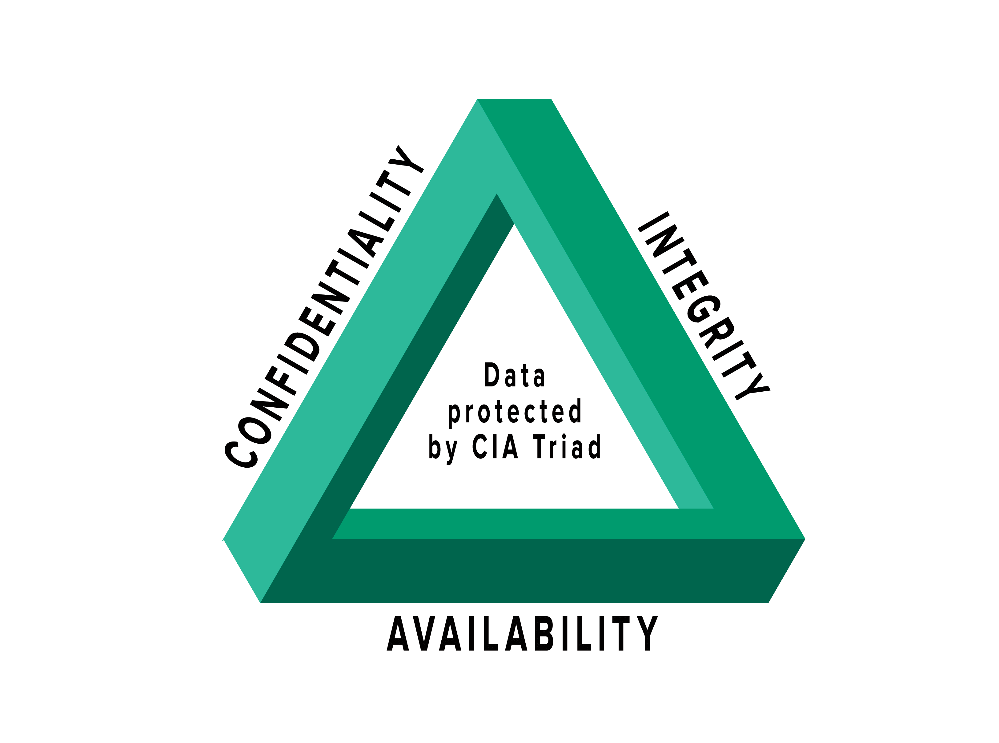

# The CIA of Security

Part of the **MaharTech – Network Security** course.
Reference: [Mahara-Tech: Introduction to Network Security](https://maharatech.gov.eg/mod/hvp/view.php?id=1354)

## Overview

The **CIA Triad** is the foundational model used to guide security policy and design in any organization. It stands for **Confidentiality, Integrity, and Availability** — the three core properties that any secure system must protect.

## 1. Confidentiality

Confidentiality means ensuring that information is accessible only to those authorized to see it. It's about keeping data private and preventing unauthorized disclosure.

**How it's achieved:**
- Encryption (data at rest and in transit)
- Access control lists (ACLs) and permissions
- Authentication mechanisms (passwords, MFA)
- Data classification policies

**Example threat:** An attacker intercepting unencrypted traffic to read sensitive data (eavesdropping/sniffing).

## 2. Integrity

Integrity ensures that data is accurate, consistent, and has not been tampered with — whether in storage, in transit, or during processing. Only authorized parties should be able to modify data.

**How it's achieved:**
- Hashing (e.g., SHA-256) to detect changes
- Digital signatures
- Checksums and version control
- Strict access/change control

**Example threat:** An attacker modifying a file in transit (man-in-the-middle attack) so the recipient receives altered data.

## 3. Availability

Availability ensures that systems, data, and services are accessible to authorized users whenever needed. Security controls should never come at the cost of legitimate access.

**How it's achieved:**
- Redundancy and failover systems
- Regular backups and disaster recovery plans
- DDoS protection
- Regular maintenance and patching

**Example threat:** A Denial-of-Service (DoS) attack that overwhelms a server, making a service unreachable.

## Why the CIA Triad Matters

Every security control, policy, or tool in network security ultimately maps back to protecting one or more of these three pillars. When designing a secure network, engineers constantly balance trade-offs between the three — for example, stronger encryption (confidentiality) can add processing overhead that affects availability.

| Pillar | Goal | Common Attack | Common Defense |
|---|---|---|---|
| Confidentiality | Prevent unauthorized disclosure | Sniffing, eavesdropping | Encryption, access control |
| Integrity | Prevent unauthorized modification | Man-in-the-middle, tampering | Hashing, digital signatures |
| Availability | Ensure reliable access | DoS/DDoS | Redundancy, backups |

---
**Course:** MaharTech – Network Security
**Topic:** The CIA of Security
