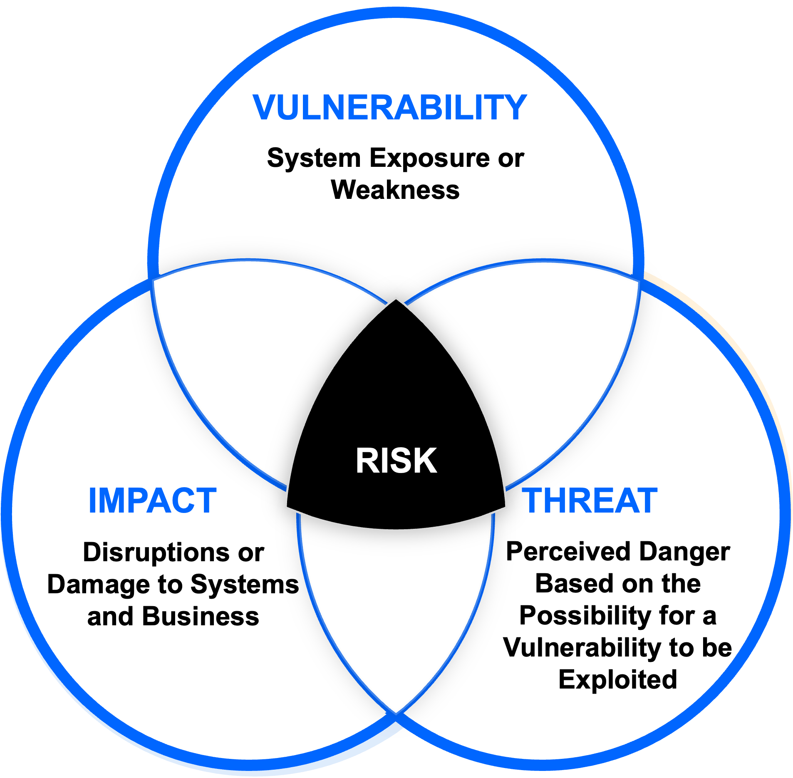

# Risk Assessment

Part of the **MaharTech – Network Security** course.

## Overview

Risk assessment is the process of identifying, analyzing, and evaluating the security risks facing an organization's systems and data. It sits at the intersection of three core concepts: **Vulnerability**, **Threat**, and **Impact**.

## 1. Vulnerability

A vulnerability is a system exposure or weakness — a flaw in software, hardware, configuration, or process that could be exploited.

**Examples:**
- Unpatched software
- Weak passwords or misconfigured access controls
- Open, unused network ports

## 2. Threat

A threat is the perceived danger based on the possibility that a vulnerability could be exploited. Threats can be intentional (attackers) or unintentional (human error, natural disasters).

**Examples:**
- Malware or ransomware campaigns
- Insider threats
- Phishing attacks

## 3. Impact

Impact refers to the disruption or damage caused to systems and the business if a threat successfully exploits a vulnerability.

**Examples:**
- Financial loss
- Reputational damage
- Downtime and loss of productivity
- Regulatory penalties (data breach fines)

## Risk = Vulnerability × Threat × Impact

**Risk** is the point where these three factors overlap: it represents the likelihood that a threat will exploit a vulnerability, combined with the resulting impact if it does.

A simplified way to think about it:

> **Risk** exists only when a **Threat** can act on a **Vulnerability** and cause a meaningful **Impact**. Remove any one of the three, and the risk disappears.

## Why Risk Assessment Matters

Security teams can't fix everything at once. Risk assessment helps prioritize:
- Which vulnerabilities matter most (based on exploitability and exposure)
- Which threats are most realistic for the organization
- Where investment in defenses will reduce the most business impact

| Factor | Question it Answers | Example Control |
|---|---|---|
| Vulnerability | Where are we weak? | Patch management, hardening |
| Threat | Who/what could exploit that weakness? | Threat intelligence, monitoring |
| Impact | What happens if they succeed? | Business continuity planning |
| Risk | How urgently must we act? | Risk-based prioritization |

---
**Course:** MaharTech – Network Security
**Topic:** Risk Assessment
