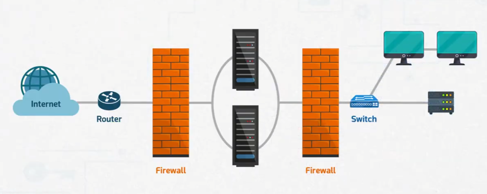
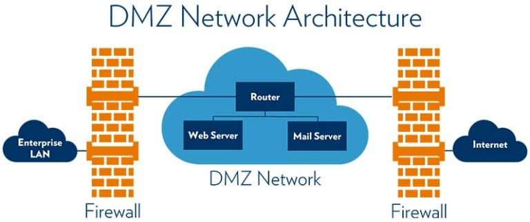

# Designing Network Security (Defense in Depth)

Part of the **MaharTech – Network Security** course.

## Overview

Secure network design isn't about relying on a single control — it's about layering multiple defenses so that if one fails, others still protect the network. This principle is called **Defense in Depth (DID)**. A well-designed network segments traffic, isolates critical assets, and forces attackers to pass through multiple barriers before reaching sensitive systems.

## 1. Layered Firewall Design

A typical secure network places firewalls at multiple points rather than just one at the perimeter:

- **Router** — first point of contact with the Internet, handles basic packet filtering and routing.
- **Firewall (outer)** — filters traffic entering from the Internet before it reaches internal servers.
- **Internal servers** — sit between two firewalls, isolated from both the Internet and the internal LAN.
- **Firewall (inner)** — filters traffic between the server segment and the internal network.
- **Switch** — connects internal workstations and internal servers on the trusted LAN.

This layered approach means a single compromised device or misconfigured rule doesn't expose the entire network — an attacker would need to bypass multiple firewalls to move from the Internet to internal systems.

## 2. DMZ Network Architecture

A **DMZ (Demilitarized Zone)** is a buffer network placed between the trusted internal LAN and the untrusted Internet. It hosts public-facing services — like web servers and mail servers — so that if one of them is compromised, the attacker still doesn't have a direct path into the internal network.

**Structure:**
- **Enterprise LAN** — the trusted internal network, protected behind a firewall.
- **Firewall (internal)** — separates the enterprise LAN from the DMZ.
- **DMZ Network** — contains public-facing services (web server, mail server) connected through a router.
- **Firewall (external)** — separates the DMZ from the public Internet.
- **Internet** — the untrusted external network.

**Why use a DMZ:**
- Public services are isolated from sensitive internal systems.
- A breach of a DMZ server does not automatically grant access to the internal LAN.
- Traffic between the Internet and internal LAN is never direct — it must pass through the DMZ's controls.

## Key Principles of Defense in Depth

| Principle | Description |
|---|---|
| Segmentation | Divide the network into zones (Internet, DMZ, internal LAN) with different trust levels |
| Redundant controls | Use multiple firewalls/checkpoints rather than a single point of enforcement |
| Least privilege | Only allow the minimum access needed between zones |
| Isolation of public services | Keep Internet-facing servers separate from internal, sensitive systems |
| Fail-safe design | If one layer fails or is bypassed, other layers still limit damage |

---
**Course:** MaharTech – Network Security
**Topic:** Designing Network Security (Defense in Depth)
