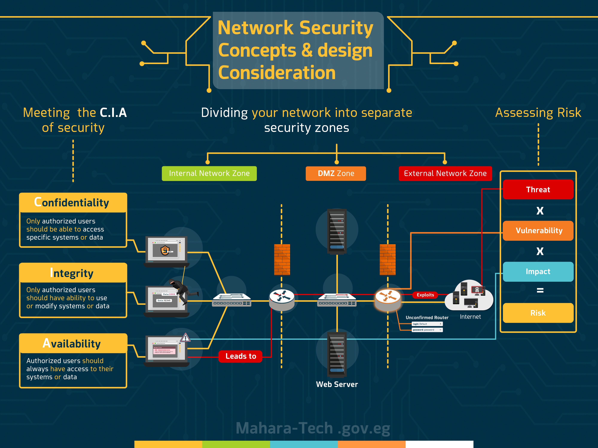

# Chapter 1 Summary — Network Security Concepts & Design Considerations

Part of the **MaharTech – Network Security** course.

## Overview

This chapter ties together the three foundational ideas covered so far — **the CIA triad**, **network security zones**, and **risk assessment** — into a single design framework for building secure networks.

## 1. Meeting the C.I.A of Security

Every security decision maps back to protecting one of three properties:

- **Confidentiality** — only authorized users should be able to access specific systems or data.
- **Integrity** — only authorized users should be able to use or modify systems or data.
- **Availability** — authorized users should always have access to their systems or data.

Failures in any of these (unauthorized access, data tampering, or service errors) directly threaten the business.

## 2. Dividing the Network into Separate Security Zones

A secure network design separates traffic into distinct trust zones so that access between them is controlled and limited:

- **Internal Network Zone** — the trusted LAN, where internal workstations and switches live.
- **DMZ Zone** — a buffer zone hosting public-facing services like the web server, sitting between two firewalls.
- **External Network Zone** — the untrusted Internet-facing side of the network, including routers exposed to the outside world.

Traffic must pass through firewalls at each zone boundary. In the diagram, a router with weak, unconfirmed credentials is exploited from the Internet — showing how a single weak point in the external zone can become an entry path if zones aren't properly isolated.

## 3. Assessing Risk

Risk assessment quantifies how urgently a weakness needs to be addressed:

**Risk = Threat × Vulnerability × Impact**

- **Threat** — the potential danger (e.g., an attacker exploiting a router).
- **Vulnerability** — the weakness that enables it (e.g., default/weak login credentials).
- **Impact** — the resulting damage to systems or business if exploited.

In the diagram, the attacker exploits an **unconfirmed router** using default credentials, gaining a path from the Internet toward internal systems — this chain illustrates exactly how a threat exploiting a vulnerability leads to impact, and ultimately, risk.

## Putting It All Together

| Concept | Purpose |
|---|---|
| CIA Triad | Defines *what* we are protecting (confidentiality, integrity, availability) |
| Security Zones | Defines *where* trust boundaries exist in the network |
| Risk Assessment | Defines *how urgently* a given weakness must be fixed |

A well-designed network applies all three together: it protects the CIA properties, enforces zone separation with firewalls, and continuously assesses risk to prioritize defenses — as shown by the "Leads to" and "Exploits" paths in the diagram, where a lapse in one area (e.g., default router credentials) cascades into a real security incident.

---
**Source:** [Mahara-Tech.gov.eg](https://maharatech.gov.eg)
**Course:** MaharTech – Network Security
**Topic:** Chapter 1 Summary
