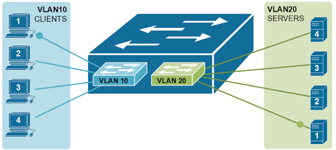
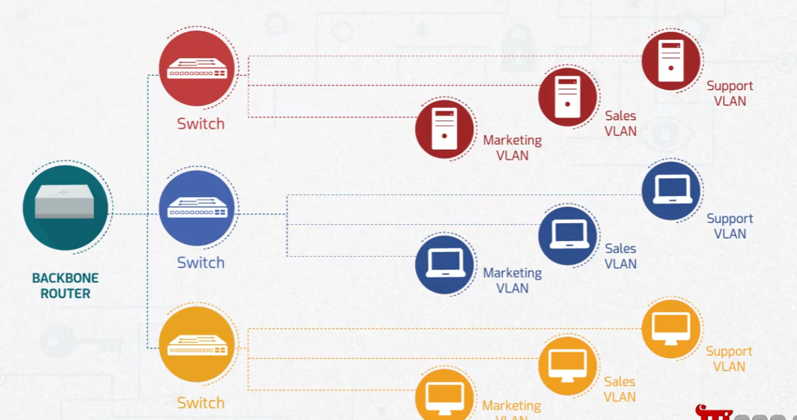
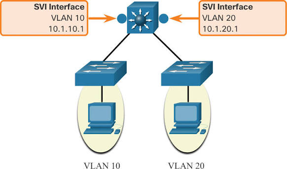
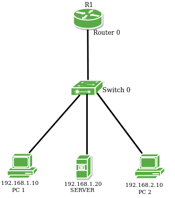

# Virtual LANs (VLANs)

Part of the **MaharTech – Network Security** course.
Reference: [Mahara-Tech: Virtual LANs (VLANs)](https://maharatech.gov.eg/mod/hvp/view.php?id=1357)

## Overview

A **VLAN (Virtual LAN)** is a logical grouping of devices on a network that behaves as if it were on its own separate physical LAN — even though the devices may be connected to the same physical switch. VLANs let you segment traffic for security, performance, and manageability without needing separate physical hardware for each group.

## 1. Segmenting a Switch into Multiple VLANs

A single physical switch can be logically divided into multiple VLANs. In this example:
- **VLAN 10 (Clients)** — client machines 1–4 are grouped together.
- **VLAN 20 (Servers)** — server machines 1–4 are grouped together.

Even though all devices connect through the same switch hardware, devices in VLAN 10 cannot directly communicate with devices in VLAN 20 unless traffic is explicitly routed between them. This isolates client traffic from server traffic at Layer 2.

## 2. VLANs Across Multiple Switches

VLANs aren't limited to a single switch — the same VLAN can span multiple switches across a network, all connected through a **backbone router**. In this example, each switch carries the same three VLANs:
- **Marketing VLAN**
- **Sales VLAN**
- **Support VLAN**

This means a device in the Marketing VLAN on one switch can communicate with another Marketing VLAN device on a different switch, as if they were on the same physical LAN — regardless of physical location.

## 3. Routing Between VLANs (SVI)

Since VLANs isolate traffic by design, a **Switched Virtual Interface (SVI)** is used to allow routing between VLANs when needed. In this example:
- **VLAN 10** has an SVI with IP `10.1.10.1`
- **VLAN 20** has an SVI with IP `10.1.20.1`

These SVIs act as the gateway for each VLAN, enabling a Layer 3 device (like a multilayer switch or router) to route traffic between otherwise isolated VLANs in a controlled way — this is often called **inter-VLAN routing**.

## 4. Simple VLAN Topology Example

A basic topology showing how VLAN concepts apply in practice:
- **R1 (Router 0)** — connects the LAN to other networks.
- **Switch 0** — connects the local devices.
- **PC1** (`192.168.1.10`) and **Server** (`192.168.1.20`) share the same subnet.
- **PC2** (`192.168.2.10`) is on a different subnet.

This illustrates how devices on different subnets (potentially different VLANs) still need to be connected through a router to communicate — reinforcing that VLANs separate broadcast domains, and routing is required to bridge them.

## Why Use VLANs?

| Benefit | Description |
|---|---|
| Security | Isolates sensitive traffic (e.g., servers) from general user traffic |
| Performance | Reduces broadcast domain size, cutting down unnecessary traffic |
| Flexibility | Groups devices logically regardless of physical location |
| Manageability | Simplifies applying policies to a specific group of devices |

---
**Course:** MaharTech – Network Security
**Topic:** Virtual LANs (VLANs)
