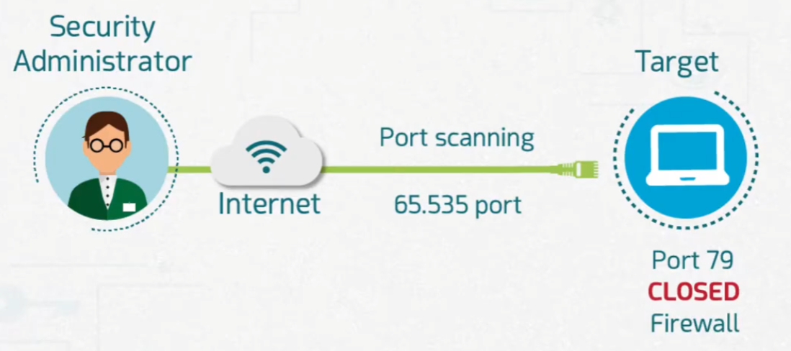
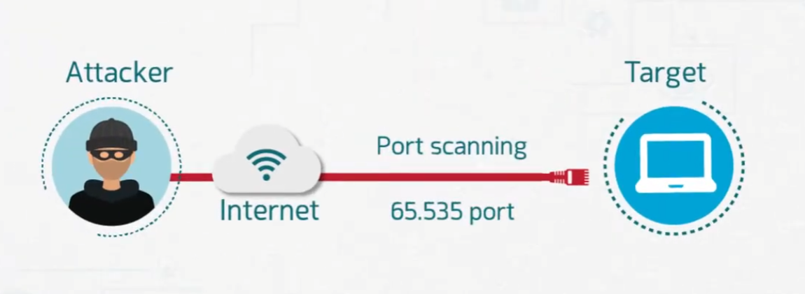
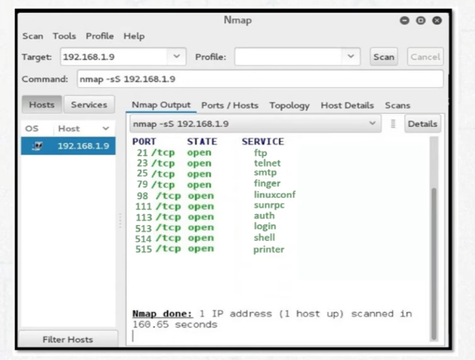

# Port Scanning and Tools

Part of the **MaharTech – Network Security** course.

## Overview

**Port scanning** is the process of probing a target system's network ports to discover which ones are open, closed, or filtered. It's a core reconnaissance technique — used both by attackers looking for a way in, and by security administrators auditing their own systems for exposure.

## 1. Legitimate Use: Security Administrator Scanning



A security administrator scans their own systems across the full port range (**0–65,535**) to verify which ports are actually reachable from outside. In this example, **port 79** is shown as **CLOSED** by the firewall — meaning the administrator has confirmed that an unnecessary or risky service isn't exposed. This is a normal, proactive part of maintaining a secure network posture: you can't defend a port you don't know is open.

## 2. Malicious Use: Attacker Scanning



The exact same technique — scanning all 65,535 ports over the Internet — can be used by an **attacker** for reconnaissance before an attack. The attacker is looking for the opposite of what the administrator wants: **open** ports running vulnerable or unnecessary services that can be exploited to gain a foothold on the target.

This highlights an important security principle: **port scanning itself is neutral** — it's a tool. What matters is who's using it and why. Organizations should assume that if they can scan their own network, an attacker can too.

## 3. Port Scanning Tools: Nmap



**Nmap** (Network Mapper) is the industry-standard tool for port scanning. In the example scan:

```
nmap -sS 192.168.1.9
```

The scan (`-sS` = TCP SYN scan) reveals multiple **open** ports and their associated services:

| Port | Service | Risk Note |
|---|---|---|
| 21/tcp | ftp | Often unencrypted, credentials can be sniffed |
| 23/tcp | telnet | Unencrypted remote access — high risk |
| 25/tcp | smtp | Mail relay, can be abused if misconfigured |
| 79/tcp | finger | Legacy service, discloses user info |
| 98/tcp | linuxconf | Remote admin, dangerous if exposed |
| 111/tcp | sunrpc | Historically exploited (RPC vulnerabilities) |
| 113/tcp | auth | Identifies users, minor info disclosure |
| 513/tcp | login | Legacy remote login (rlogin) — unencrypted |
| 514/tcp | shell | Legacy remote shell (rsh) — unencrypted |
| 515/tcp | printer | Print service, occasionally exploitable |

A result like this — many open legacy, unencrypted services — is exactly what both an administrator and an attacker would want to find, for opposite reasons: the administrator to lock it down, the attacker to exploit it.

## Why Port Scanning Matters in Network Security

- **For defenders:** Regularly scan your own network to catch unnecessarily open ports before attackers do.
- **For attackers:** Port scanning is typically the *first* step of reconnaissance in an attack lifecycle.
- **Mitigation:** Close/disable unused services, use firewalls to restrict access to only necessary ports, and monitor for scanning activity (which can itself be a sign of an imminent attack).

---
**Course:** MaharTech – Network Security
**Topic:** Port Scanning and Tools
