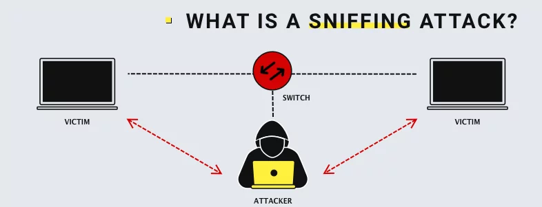
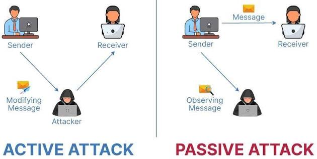

# Sniffing

Part of the **MaharTech – Network Security** course.

## Overview

**Sniffing** is the act of capturing and inspecting data packets as they travel across a network. It's a fundamental network monitoring technique — used legitimately by administrators for troubleshooting, but also a common attack technique for stealing data in transit.

## 1. What Is a Sniffing Attack?

In a sniffing attack, traffic between two victims passes through a shared network device, such as a **switch**. An attacker positioned on the same network segment can capture the traffic flowing between the two victims — even though the communication was never intended for them.

**How it typically works:**
- The attacker places a device (or software) in a position to intercept traffic passing through the switch.
- All data exchanged between the two victims can potentially be captured, including sensitive information like credentials, if it isn't encrypted.
- This is especially dangerous on shared or poorly segmented networks, where traffic isn't isolated between hosts.

## 2. Active vs. Passive Attacks

Sniffing-related attacks generally fall into one of two categories:

### Active Attack
- The attacker intercepts a message **and modifies it** before it reaches the receiver.
- Example: Sender sends a message intended for the Receiver, but the attacker intercepts it and alters the content before (or instead of) passing it along.
- This compromises **integrity** — the receiver may act on tampered data without knowing it.

### Passive Attack
- The attacker **observes** the message as it travels from Sender to Receiver, without modifying it.
- The message still reaches the Receiver unchanged, but the attacker has secretly captured a copy.
- This compromises **confidentiality** — sensitive data (passwords, personal information) may be exposed without anyone noticing an attack occurred.

## Key Difference

| Aspect | Active Attack | Passive Attack |
|---|---|---|
| Data integrity | Compromised (message altered) | Preserved (message unchanged) |
| Detectability | Easier to detect (message changes) | Harder to detect (silent observation) |
| Primary risk | Integrity | Confidentiality |
| Example | Modifying a transaction request | Capturing login credentials |

## Defending Against Sniffing

- **Encryption** — use TLS/HTTPS, SSH, and encrypted protocols so captured traffic is unreadable.
- **Network segmentation** — limit how much traffic is visible to any single point.
- **Switch security** — use port security and features like Dynamic ARP Inspection to prevent traffic redirection.
- **Monitoring** — detect abnormal devices or traffic patterns that suggest sniffing activity.

---
**Course:** MaharTech – Network Security
**Topic:** Sniffing
