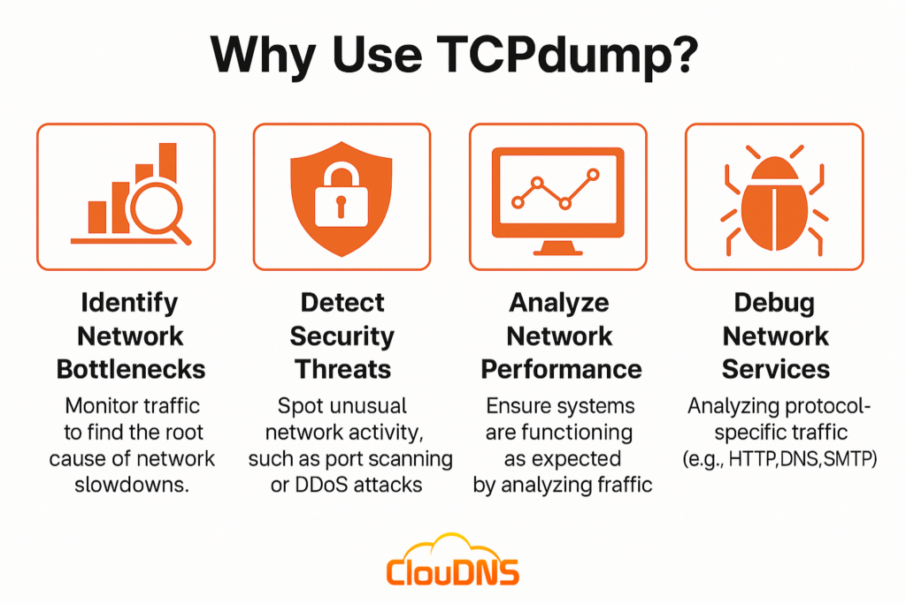
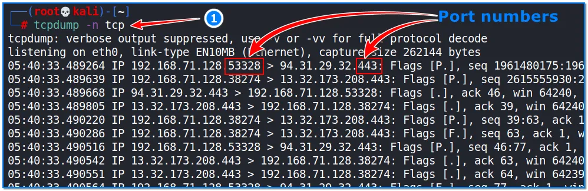
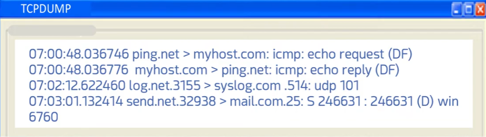
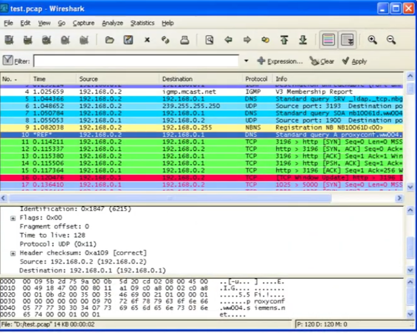

# Sniffing Tools

## Overview
Sniffing tools are used in network security to capture and inspect traffic traveling across a network. They allow analysts to observe packets in real time, identify communication patterns, and detect suspicious or malicious activity. This topic covers two of the most widely used sniffing tools: **TCPdump** and **Wireshark**.

## Objective
- Understand why sniffing tools are used in network security.
- Learn how to capture and read packet-level data using TCPdump.
- Learn how to identify ports and protocols within captured traffic.
- Learn how to analyze captured packets visually using Wireshark.

## Tools Used
- **TCPdump** — command-line packet analyzer
- **Wireshark** — GUI-based network protocol analyzer
- **Kali Linux** — testing environment

## Why Use TCPdump?
TCPdump is a lightweight, command-line packet capture tool commonly used to:
- Identify network bottlenecks by monitoring traffic to find the root cause of slowdowns.
- Detect security threats such as port scanning or DDoS attacks.
- Analyze network performance to ensure systems are functioning as expected.
- Debug network services by analyzing protocol-specific traffic (e.g., HTTP, DNS, SMTP).

## Reading TCPdump Output
Each line of TCPdump output represents a captured packet, showing the timestamp, source, destination, protocol, and flags. Below is an example of raw TCPdump output showing ICMP echo requests/replies, UDP syslog traffic, and a TCP SYN packet.

## Identifying Ports in TCPdump
When running `tcpdump -n tcp`, the output displays IP addresses along with port numbers (e.g., `192.168.71.128.53328 > 94.31.29.32.443`). The port number appears after the IP address, separated by a dot, and helps identify which service or application the traffic belongs to (e.g., port 443 for HTTPS).

## Analyzing Traffic with Wireshark
Wireshark provides a graphical interface for the same kind of packet analysis, but with added filtering, coloring, and protocol breakdown features. In the example below, a captured `.pcap` file shows a mix of IGMP, DNS, NBNS, and TCP packets, each color-coded by protocol type. The lower pane displays a detailed breakdown of a selected packet's header fields (flags, checksum, source/destination IP).

## Conclusion
Sniffing tools like TCPdump and Wireshark are essential for network security professionals. TCPdump offers a fast, scriptable way to capture traffic from the command line, while Wireshark provides a more visual and detailed approach to packet inspection. Together, they help identify bottlenecks, detect threats, and troubleshoot network issues effectively.
