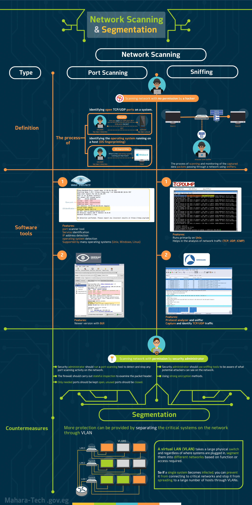

# 09. Chapter 2 Summary — Network Segmentation and Monitoring

## Overview
This chapter summarizes two core areas of network security: **Network Scanning** (Port Scanning and Sniffing) and **Network Segmentation**. It covers how attackers scan and monitor networks, the tools used on both the offensive and defensive sides, and how segmentation via VLANs limits the damage of a compromised system.

## Objective
- Understand the two main types of network scanning: port scanning and sniffing.
- Learn the tools used to perform and detect each type of scanning.
- Understand how a security administrator defends against unauthorized scanning.
- Learn how network segmentation (VLANs) reduces the impact of a compromised host.

## Network Scanning

### 1. Port Scanning
**Definition:** The process of identifying open TCP/UDP ports on a system, and identifying the operating system running on a host (OS fingerprinting).

- A hacker probes a target (e.g., asking if a UDP port is open) using SYN/ACK and RST packets to determine open ports.
- OS fingerprinting identifies details like the exact operating system version running on the host.

**Software Tools:**
| Tool | Features |
|---|---|
| **Nmap** | Port scanner tool, service identification, IP address detection, operating system detection, supported by many operating systems (Unix, Windows, Linux) |
| **Zenmap** | Newer version of Nmap with a GUI |

### 2. Sniffing
**Definition:** The process of scanning and monitoring captured data packets passing through a network using sniffers.

- An attacker with a sniffer can capture packets traveling between hosts on the network (e.g., Host A to Host B) by monitoring traffic at a switch or hub.

**Software Tools:**
| Tool | Features |
|---|---|
| **TCPdump** | Runs primarily on Unix, helps in the analysis of network traffic (TCP, UDP, ICMP) |
| **Wireshark** | Protocol analyzer and sniffer, captures and identifies TCP/UDP traffic |

## Countermeasures (Scanning with Permission)
When a security administrator scans the network legitimately (with permission), the following defensive practices apply:

**Against Port Scanning:**
- Run a port scanning tool to detect and stop any port scanning activity on the network.
- The firewall should carry out stateful inspection to examine the packet header.
- Only needed ports should be kept open; unused ports should be closed.

**Against Sniffing:**
- Use sniffing tools to be aware of what potential attackers can see on the network.
- Use strong encryption methods to protect data in transit.

## Network Segmentation

More protection can be provided by **separating critical systems on the network through VLANs**.

A **Virtual LAN (VLAN)** takes a large physical switch and, regardless of where systems are plugged in, segments them into different networks based on function or access required.

**Key benefit:** If a single system becomes infected, VLANs help prevent it from connecting to critical networks and stop the infection from spreading to a large number of hosts.

## Conclusion
Network scanning (port scanning and sniffing) can be used both by attackers to reconnoiter a network and by security administrators to audit and defend it. Combining proper scan detection, strict port management, encryption, and network segmentation through VLANs significantly reduces the risk and impact of a network compromise.
