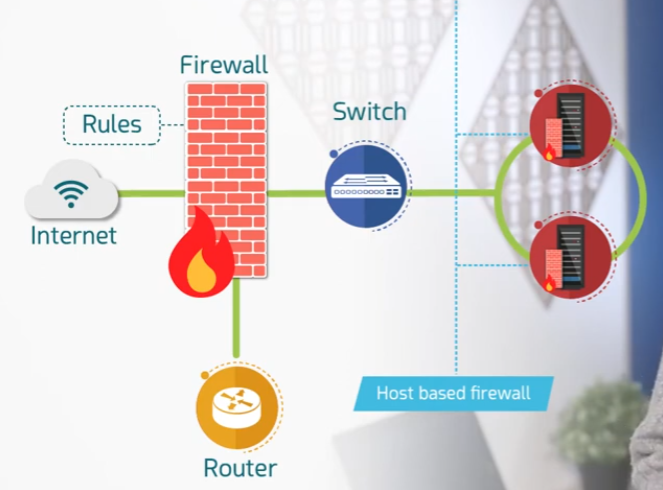
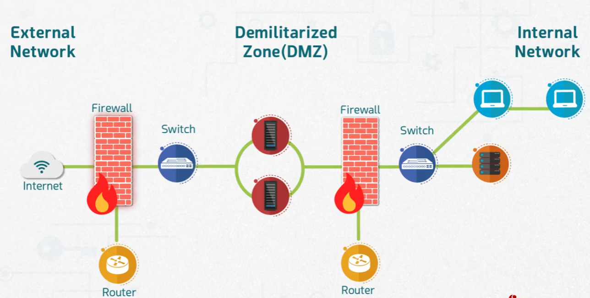

# Introduction to Firewall

## Overview
A firewall is a network security device that monitors and controls incoming and outgoing traffic based on a defined set of rules. It sits between trusted and untrusted networks — such as between the internet and an internal network — to block unauthorized access while allowing legitimate communication through.

## Objective
- Understand the basic role and placement of a firewall in a network.
- Understand the difference between a network-based firewall and a host-based firewall.
- Learn how a Demilitarized Zone (DMZ) is used to separate external, semi-trusted, and internal networks.

## Basic Firewall Placement
In a typical network setup, traffic from the **Internet** passes through a **Router**, then a **Firewall** that enforces a set of **rules**, and finally a **Switch** before reaching internal servers. A **host-based firewall** can also be applied directly on individual servers, providing an additional layer of protection beyond the network firewall.

## Demilitarized Zone (DMZ)
A more advanced setup separates the network into three zones:
- **External Network** — the internet, untrusted and outside the organization's control.
- **Demilitarized Zone (DMZ)** — a buffer zone between two firewalls where public-facing servers are placed. These servers are accessible from the internet but isolated from the internal network.
- **Internal Network** — the trusted, private network containing internal workstations and servers.

Traffic from the internet must pass through the first firewall and switch to reach the DMZ servers. To reach the internal network, traffic must then pass through a second firewall and switch, adding an extra layer of protection for internal systems.

## Conclusion
Firewalls are a foundational layer of network defense, controlling traffic flow based on rules and separating trust zones. Using a layered approach — combining network firewalls, host-based firewalls, and a DMZ — significantly reduces the attack surface exposed to the internal network while still allowing necessary public-facing services to operate.
