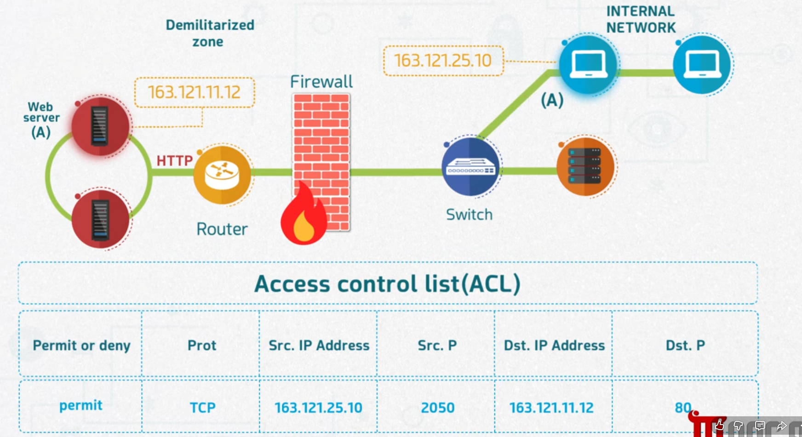
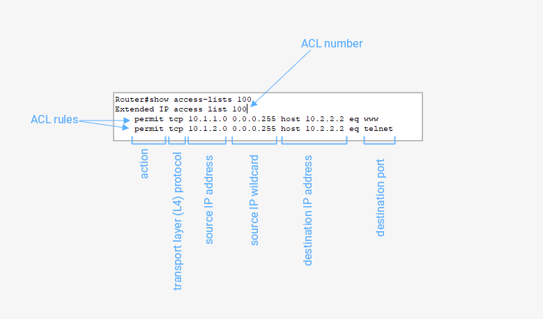
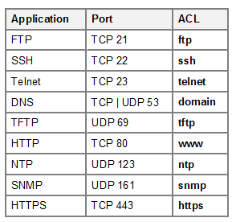

# Configuring Firewall Rules

## Overview
Firewall rules determine which traffic is allowed or denied as it moves between network zones. This is most commonly implemented through an **Access Control List (ACL)** — an ordered set of rules configured on a router or firewall that permits or denies traffic based on protocol, source, and destination.

## Objective
- Understand the fields that make up an ACL rule.
- Learn how an ACL entry controls traffic between a DMZ and an internal network.
- Understand how to read ACL syntax on a router.
- Learn common applications and their associated ports and ACL keywords.

## How an ACL Controls Traffic
In a typical setup, a **Web server (A)** sits in the **Demilitarized Zone (DMZ)**, and internal hosts sit in the **Internal Network**, separated by a **Firewall**. An ACL defines exactly which traffic is permitted or denied between these zones using the following fields:

| Field | Description |
|---|---|
| **Permit or deny** | Whether the matching traffic is allowed or blocked |
| **Prot** | The protocol (e.g., TCP, UDP) |
| **Src. IP Address** | The source IP address of the traffic |
| **Src. P** | The source port |
| **Dst. IP Address** | The destination IP address of the traffic |
| **Dst. P** | The destination port |

For example, a rule permitting a TCP connection from an internal host (163.121.25.10) on port 2050 to the web server (163.121.11.12) on port 80 (HTTP) would allow that specific internal client to reach the web server over HTTP, while all other unmatched traffic is denied by default.



## Reading ACL Syntax on a Router
On a Cisco-style router, ACLs are numbered and displayed with `show access-lists`. Each rule line breaks down into distinct fields:

- **ACL number** — identifies the access list (e.g., 100)
- **Action** — permit or deny
- **Transport layer (L4) protocol** — e.g., tcp
- **Source IP address** — the network or host the traffic originates from
- **Source IP wildcard** — the wildcard mask defining the source range
- **Destination IP address** — the target host
- **Destination port** — the service being accessed (e.g., `eq www`, `eq telnet`)

Example:
```
Router#show access-lists 100
Extended IP access list 100
    permit tcp 10.1.1.0 0.0.0.255 host 10.2.2.2 eq www
    permit tcp 10.1.2.0 0.0.0.255 host 10.2.2.2 eq telnet
```



## Common Applications, Ports, and ACL Keywords
When writing ACL rules, applications are typically referenced by their well-known port and a corresponding ACL keyword:

| Application | Port | ACL Keyword |
|---|---|---|
| FTP | TCP 21 | ftp |
| SSH | TCP 22 | ssh |
| Telnet | TCP 23 | telnet |
| DNS | TCP/UDP 53 | domain |
| TFTP | UDP 69 | tftp |
| HTTP | TCP 80 | www |
| NTP | UDP 123 | ntp |
| SNMP | UDP 161 | snmp |
| HTTPS | TCP 443 | https |



## Conclusion
Configuring firewall rules through ACLs allows precise control over which traffic is allowed to pass between network zones, based on protocol, source, destination, and port. Understanding ACL syntax and common application ports is essential for building rules that permit necessary services while denying everything else by default.
