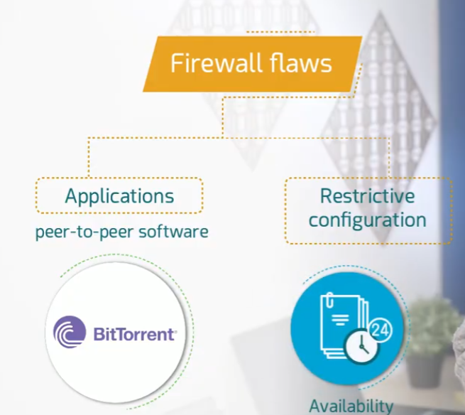
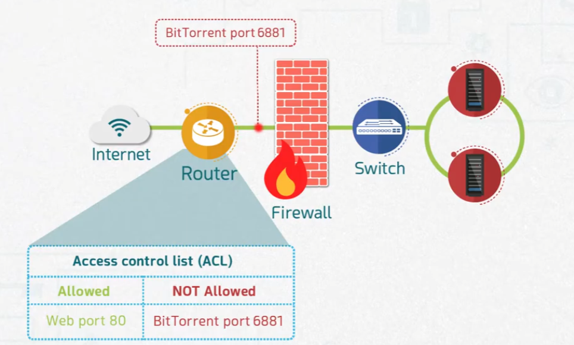
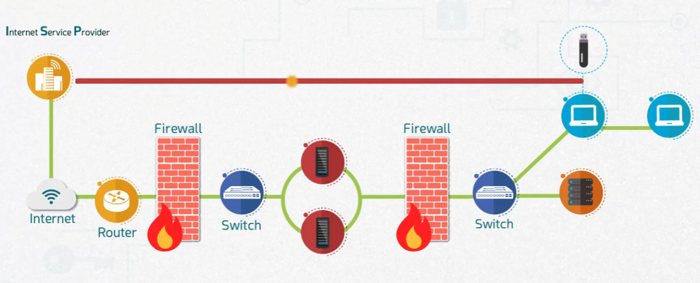

# Bypassing Firewall

## Overview
Even a properly configured firewall can be bypassed. This topic covers common firewall flaws — from misused applications to restrictive configurations — and demonstrates how traffic can slip past a firewall using disguised ports or physical/external access methods that firewalls cannot control.

## Objective
- Understand the two main categories of firewall flaws: application-based and configuration-based.
- Learn how an ACL blocking a specific port (e.g., BitTorrent) can still be bypassed.
- Understand physical and external bypass methods that firewalls have no visibility into.

## Firewall Flaws
Firewall weaknesses generally fall into two categories:

- **Applications** — Peer-to-peer software such as **BitTorrent** can be used to move data in ways that evade traditional firewall rules, since such applications are often designed to tunnel through commonly allowed ports or use dynamic ports.
- **Restrictive configuration** — Overly strict firewall rules can hurt **availability** (e.g., 24/7 access requirements), sometimes pushing administrators or users toward workarounds that weaken security.

## Bypassing an ACL-Based Block
Consider a firewall configured with an ACL that explicitly blocks BitTorrent traffic:

| Allowed | NOT Allowed |
|---|---|
| Web port 80 | BitTorrent port 6881 |

Even though **port 6881** is blocked, this doesn't fully stop peer-to-peer traffic — many P2P applications can be configured to use **allowed ports** (such as port 80, normally used for web traffic) to disguise their traffic and pass through the firewall undetected. This highlights that port-based blocking alone is not a complete defense.

## Physical and External Bypass Methods
Firewalls only control traffic that passes through the network path they monitor. Two common ways to bypass this entirely:

- **ISP-level bypass** — Traffic connected directly through the **Internet Service Provider (ISP)**, bypassing the router and firewall path altogether, can reach internal switches and servers without ever passing through the firewall.
- **Removable media (USB)** — Data introduced via a **USB drive** plugged directly into an internal host bypasses the network firewall entirely, since the firewall has no visibility into physically transferred data.

## Conclusion
Firewalls are not foolproof. Application-level tricks (like disguising P2P traffic over allowed ports), overly restrictive configurations that encourage workarounds, and physical access methods like USB drives or alternate ISP connections can all circumvent firewall protections. Effective security requires layered defenses — endpoint protection, application-aware filtering, and physical security policies — in addition to the firewall itself.
