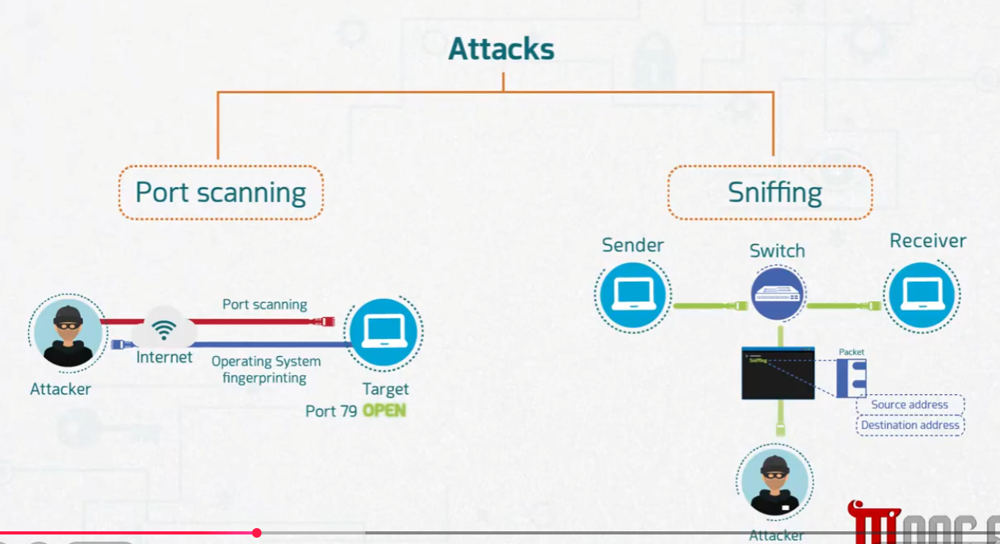
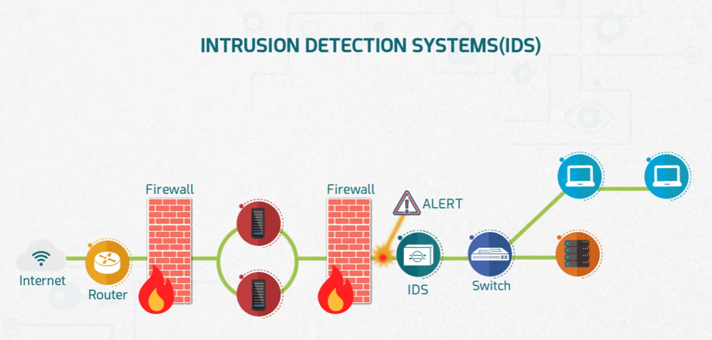
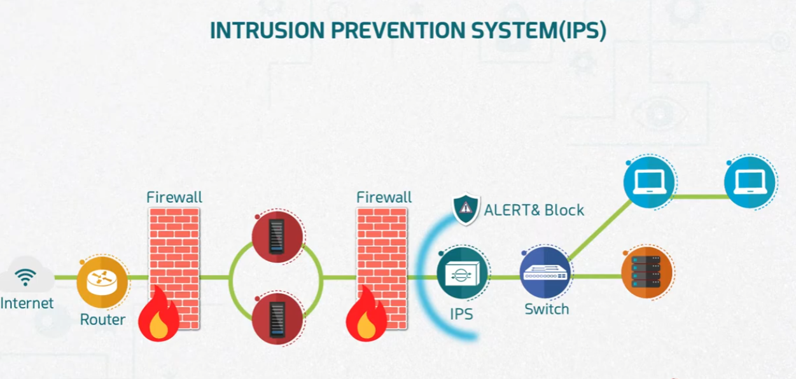
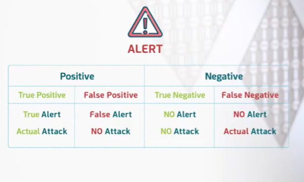
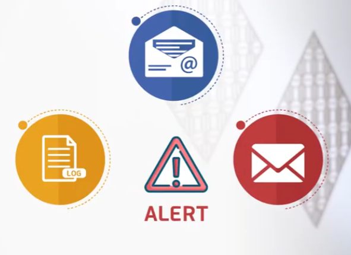

# Intrusion Detection and Prevention Systems (IDS/IPS)

Part of the **MaharTech – Network Security** course.

## Overview

Firewalls filter traffic based on rules, but they can't always recognize the *behavior* of an attack in progress. **IDS** and **IPS** fill that gap by inspecting traffic for known attack patterns — such as **port scanning** and **sniffing** — and either alerting on them or actively blocking them.

## 1. Recap: The Attacks Being Detected

Before looking at IDS/IPS, it helps to recall the two attack types they're commonly deployed to catch:

- **Port scanning** — an attacker probes a target over the Internet, performing **OS fingerprinting** and finding **open ports** (e.g., port 79 open) to identify potential entry points.
- **Sniffing** — an attacker captures packets passing through a switch between a sender and receiver, extracting information like **source address** and **destination address** from intercepted packets.

Both are exactly the kinds of suspicious traffic patterns an IDS/IPS is designed to recognize.

## 2. Intrusion Detection System (IDS)

An **IDS** sits *after* the firewall(s), monitoring traffic passing through to the internal switch and endpoints. When it detects a matching attack pattern, it raises an **ALERT** — but it does **not** block the traffic itself. It's a **passive, monitoring-only** device.

**Position in the network:**
`Internet → Router → Firewall → (servers) → Firewall → IDS → Switch → Internal hosts/servers`

**Key trait:** Detects and alerts, but traffic still reaches its destination — a human or automated system must act on the alert.

## 3. Intrusion Prevention System (IPS)

An **IPS** sits in the same position in the network path as an IDS, but is an **active, inline** device. When it detects a matching attack pattern, it doesn't just alert — it can **ALERT & Block** the malicious traffic in real time, before it reaches the internal network.

**Key trait:** Can stop an attack immediately, but because it sits inline, a misconfiguration or false positive can also block legitimate traffic.

| | IDS | IPS |
|---|---|---|
| Position | Out-of-band (monitors a copy of traffic) | Inline (traffic passes through it) |
| Action on detection | Alert only | Alert **and** block |
| Risk of false positives | Alert noise only | Can disrupt legitimate traffic |

## 4. Alert Accuracy: Positive vs Negative

Not every alert is correct, and not every non-alert is safe. IDS/IPS alerts are typically classified using four outcomes:

| | Positive (Alert Raised) | Negative (No Alert) |
|---|---|---|
| **True** | **True Positive** — Alert raised, and it *is* an actual attack | **True Negative** — No alert, and there *is* no attack |
| **False** | **False Positive** — Alert raised, but there is *no* actual attack | **False Negative** — No alert, but there *is* an actual attack |

- **True Positive** and **True Negative** are the desired, accurate outcomes.
- **False Positive** wastes analyst time investigating non-issues.
- **False Negative** is the most dangerous outcome — a real attack goes undetected entirely.

Tuning an IDS/IPS is largely about minimizing false positives and false negatives while keeping true positive detection high.

## 5. Where Alerts Go

Once an alert is generated, it needs to reach someone (or something) that can act on it. Common alert destinations include:

- **Log files** — alerts are recorded for later review, auditing, and correlation with other events.
- **Email** — alerts are sent to security team inboxes for review.
- **SMS/text message** — used for urgent, time-sensitive alerts that need immediate attention.

Choosing the right destination(s) depends on how quickly a response is needed — logs support after-the-fact analysis, while email/SMS support real-time incident response.

## Key Takeaways

| Concept | Main Point |
|---|---|
| IDS | Detects and alerts on attacks like port scanning/sniffing, but doesn't block traffic |
| IPS | Detects **and** blocks attacks inline, in real time |
| False Positive | Alert with no real attack — wastes time |
| False Negative | Real attack with no alert — the most dangerous failure mode |
| Alert destinations | Logs for records, email/SMS for time-sensitive response |

---
**Course:** MaharTech – Network Security
**Topic:** Intrusion Detection and Prevention Systems (IDS/IPS)
