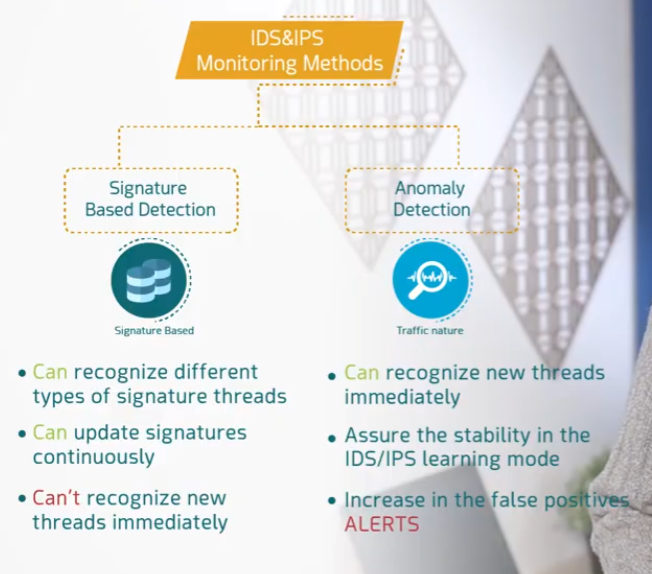
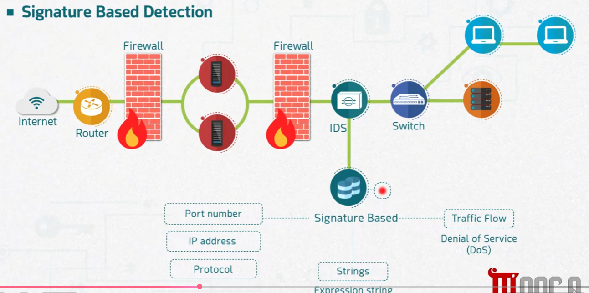

# IDS & IPS Monitoring Methods

Part of the **MaharTech – Network Security** course.

## Overview

IDS and IPS devices need a method for actually recognizing malicious traffic. There are two main monitoring methods: **Signature Based Detection** and **Anomaly Detection**. Each has different strengths and trade-offs.

| | Signature Based Detection | Anomaly Detection |
|---|---|---|
| Basis | Known signature threads (patterns) | Traffic nature / behavior |
| Can recognize new threats immediately? | ❌ No — needs a matching signature first | ✅ Yes — flags anything abnormal |
| Can update definitions continuously? | ✅ Yes, signatures can be updated as new attacks are identified | Learns and adapts based on observed traffic |
| Main weakness | Can't recognize brand-new (unknown) threats | Increase in **false positive** alerts |

## 1. Signature Based Detection

Signature based detection works like antivirus software: the IDS/IPS maintains a database of known attack **signatures** — specific patterns such as:

- **Port number**
- **IP address**
- **Protocol**
- **Strings / expression strings** (specific byte patterns or text in packet payloads)

When traffic passing through the IDS matches one of these signatures — for example, matching the traffic pattern of a **Denial of Service (DoS)** attack based on unusual **traffic flow** — it's flagged.

**Strengths:**
- Very accurate at recognizing *known* attack types.
- Signature databases can be updated continuously as new attacks are discovered.

**Weakness:**
- Cannot recognize a brand-new attack type that doesn't yet have a matching signature — meaning zero-day or novel attacks can slip through undetected.

## 2. Anomaly Detection

Anomaly detection takes a different approach: instead of matching known patterns, it learns what **normal traffic** looks like for a network — for example, a company network that's typically active from **9 AM to 5 PM** — and then flags deviations from that baseline.

In the diagram, the IDS is in a **learning mode**, tracking traffic flow over time. When traffic spikes unexpectedly outside the normal pattern (e.g., a surge continuing all the way to **9:00 PM**, well past the usual 9-5 window), it triggers an **ALERT** — because the behavior doesn't match the established baseline, even though it may not match any known attack signature.

**Strengths:**
- Can recognize brand-new threats immediately, since it doesn't rely on a pre-existing signature.
- Helps ensure stability by continuously learning the network's normal behavior (IDS/IPS learning mode).

**Weakness:**
- Prone to a higher rate of **false positive alerts** — unusual but legitimate activity (e.g., a late-night software deployment) can be mistaken for an attack.

## Choosing Between the Two

In practice, most modern IDS/IPS solutions use **both methods together**:
- **Signature based detection** catches known, well-documented attacks reliably and with low false positives.
- **Anomaly detection** catches novel or unknown attacks that no signature yet exists for, at the cost of more false alarms to investigate.

| Scenario | Better Fit |
|---|---|
| Detecting a known malware variant | Signature Based |
| Detecting a brand-new, unseen attack pattern | Anomaly Detection |
| Minimizing analyst alert fatigue | Signature Based |
| Catching zero-day style behavior | Anomaly Detection |

---
**Course:** MaharTech – Network Security
**Topic:** IDS & IPS Monitoring Methods
