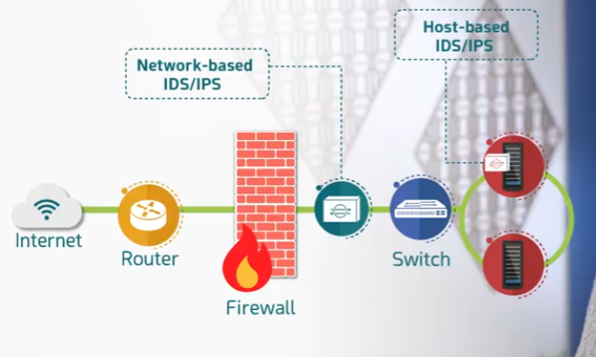
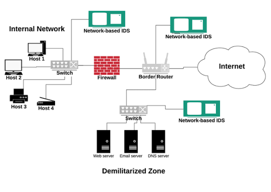

# Network-based vs. Host-based IDS/IPS

Part of the **MaharTech – Network Security** course.

## Overview

IDS and IPS devices can be deployed in two fundamentally different ways: monitoring traffic across the whole **network**, or monitoring activity on an individual **host**. Each placement gives visibility into a different part of the environment.

## 1. Network-based vs. Host-based Placement

- **Network-based IDS/IPS (NIDS/NIPS)** — placed after the firewall, inline with the switch, monitoring **all traffic** flowing between the Internet and the internal network. It sees traffic for every device on that network segment.
- **Host-based IDS/IPS (HIDS/HIPS)** — installed directly on individual servers, monitoring activity **on that specific host** only (e.g., file changes, system calls, local logs).

**Key difference:** network-based devices see traffic *between* systems; host-based devices see activity *on* a system, even traffic that never crosses the network (like local privilege escalation).

## 2. IDS in the Corporate Network

A more detailed view of how an IDS fits into everyday corporate infrastructure:

- Traffic from the **Internet** passes through the **Firewall**, then the **Switch**, before reaching the **Corporate Network**.
- The **IDS** connects to the switch, giving it visibility into traffic destined for internal assets like the **Web Server** and **E-mail Server**.
- The IDS reports to a **Management System**, which is where security staff review alerts, tune detection rules, and manage the IDS itself — separating the *detection* function from the *management/response* function.

## 3. Network-based IDS Placement Across Zones

In a more complete network, it's common to deploy **multiple Network-based IDS sensors** at different points, not just one:

- **Internal Network** — Hosts 1–4 connect through a switch, firewall, and out to the **Border Router**. A Network-based IDS here monitors traffic *within* the internal network.
- **Border Router** — sits at the edge, connecting the internal network and DMZ to the **Internet**. Another Network-based IDS here monitors traffic crossing the network boundary.
- **Demilitarized Zone (DMZ)** — hosts the **Web server**, **Email server**, and **DNS server**, each reachable from the Internet through the border router. A third Network-based IDS monitors this zone specifically, since DMZ servers are the most exposed to external traffic.

**Why multiple sensors:** each zone has a different risk profile and different "normal" traffic pattern. A single IDS at one point can't give visibility into all of them — internal traffic, DMZ traffic, and border traffic each deserve their own monitoring point.

## Summary

| Aspect | Network-based (NIDS/NIPS) | Host-based (HIDS/HIPS) |
|---|---|---|
| Visibility | All traffic on a network segment | Activity on one specific host |
| Deployment | Inline/tap at a network chokepoint (e.g., after the firewall, at the border router, in the DMZ) | Installed as software on the endpoint |
| Detects | Network-level attacks (scanning, DoS, exploits in transit) | Host-level attacks (malware execution, file tampering, local privilege escalation) |
| Typical use | Monitoring boundaries between zones (Internet ↔ internal, DMZ, etc.) | Protecting individual critical servers |

Most mature security architectures use **both**: network-based sensors at key boundaries (border router, DMZ, internal network) plus host-based agents on the most critical servers, so nothing that happens purely on a host (without crossing the network) goes unnoticed.

---
**Course:** MaharTech – Network Security
**Topic:** Network-based vs. Host-based IDS/IPS
