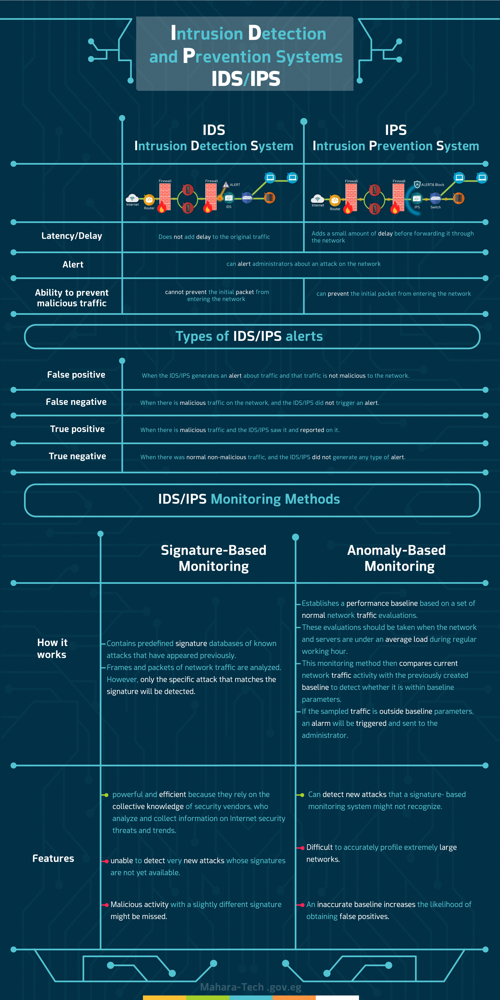

# Chapter 4 Summary — Intrusion Detection and Prevention Systems (IDS/IPS)

Part of the **MaharTech – Network Security** course.

## Overview

This chapter ties together everything on IDS and IPS: how they compare directly, how alerts are classified, and the two core monitoring methods behind them.

## 1. IDS vs. IPS — Direct Comparison

| | **IDS** (Intrusion Detection System) | **IPS** (Intrusion Prevention System) |
|---|---|---|
| **Latency/Delay** | Does **not** add delay to the original traffic | Adds a small amount of delay before forwarding it through the network |
| **Alert** | Can alert administrators about an attack on the network | Can alert administrators about an attack on the network |
| **Ability to prevent malicious traffic** | **Cannot** prevent the initial packet from entering the network | **Can** prevent the initial packet from entering the network |

The core trade-off: an IDS is passive and adds no delay, but by the time it alerts, the malicious packet has already gotten through. An IPS sits inline and can actually block the packet — at the cost of adding a small amount of processing delay to all traffic passing through it.

## 2. Types of IDS/IPS Alerts

| Alert Type | Meaning |
|---|---|
| **False Positive** | The IDS/IPS generates an alert about traffic, but that traffic is **not actually malicious**. |
| **False Negative** | There **is** malicious traffic on the network, but the IDS/IPS did **not** trigger an alert. |
| **True Positive** | There is malicious traffic, and the IDS/IPS correctly saw it and reported on it. |
| **True Negative** | There was normal, non-malicious traffic, and the IDS/IPS correctly did **not** generate any alert. |

**False negatives** are the most dangerous outcome (a real attack goes unnoticed), while **false positives** are the most disruptive to operations (wasting analyst time on non-issues).

## 3. IDS/IPS Monitoring Methods

### Signature-Based Monitoring

**How it works:**
- Contains predefined signature databases of known attacks that have appeared previously.
- Frames and packets of network traffic are analyzed — but only the specific attack that matches an existing signature will be detected.

**Features:**
- ✅ Powerful and efficient, since it relies on the collective knowledge of security vendors who analyze and collect information on Internet security threats and trends.
- ❌ Unable to detect very new attacks whose signatures aren't yet available.
- ❌ Malicious activity with a slightly different signature might be missed entirely.

### Anomaly-Based Monitoring

**How it works:**
- Establishes a **performance baseline** based on a set of normal network traffic evaluations.
- These evaluations should be taken when the network and servers are under an **average load** during regular working hours.
- Current network traffic activity is compared against that baseline to check whether it falls within expected parameters.
- If sampled traffic falls **outside** baseline parameters, an alarm is triggered and sent to the administrator.

**Features:**
- ✅ Can detect new attacks that a signature-based system might not recognize.
- ❌ Difficult to accurately profile extremely large networks.
- ❌ An inaccurate baseline increases the likelihood of false positives.

## Chapter Takeaways

| Concept | Key Point |
|---|---|
| IDS | Detects and alerts, but can't stop the first malicious packet |
| IPS | Detects **and** blocks, at the cost of added latency |
| False Positive | Alert without a real attack — wastes analyst time |
| False Negative | Real attack, no alert — the most dangerous failure |
| Signature-Based | Reliable for known attacks, blind to brand-new ones |
| Anomaly-Based | Catches novel attacks, but prone to false positives if the baseline is wrong |

---
**Course:** MaharTech – Network Security
**Topic:** Chapter 4 Summary — Intrusion Detection and Prevention Systems (IDS/IPS)
