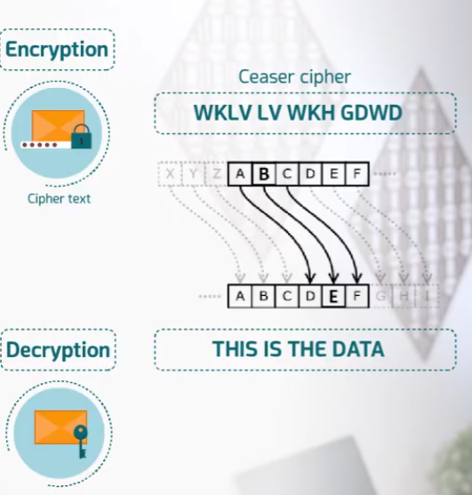
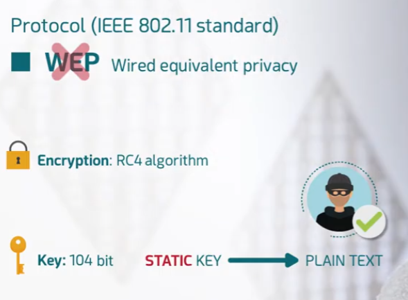
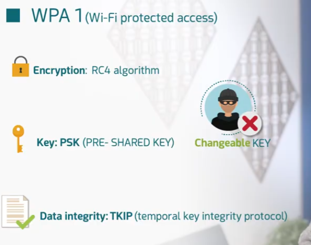
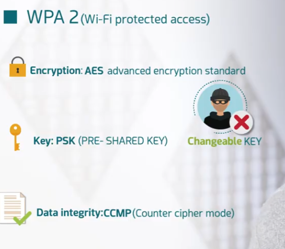
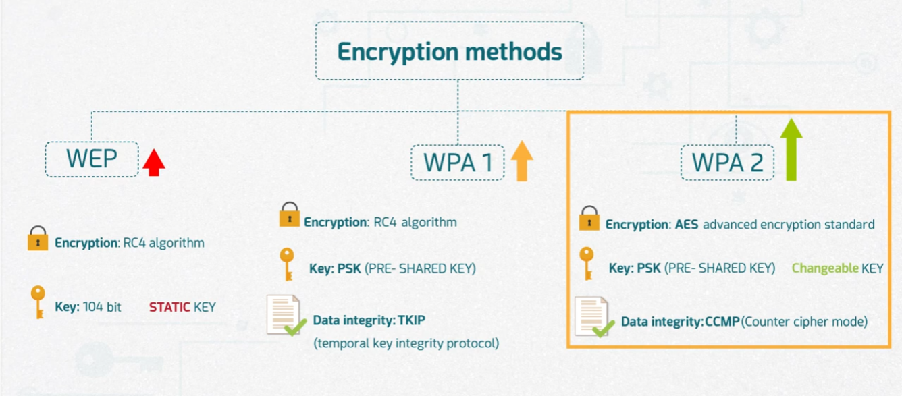

# Wireless Encryption

Part of the **MaharTech – Network Security** course.

## Overview

Wireless networks broadcast data through the air, making them inherently easier to intercept than wired connections. **Wireless encryption** protocols exist to scramble that data so that even if it's captured, it can't be read without the correct key. This topic covers how encryption works conceptually, and the evolution of wireless security protocols: **WEP → WPA1 → WPA2**.

## 1. Encryption in a Wireless Network

In a typical wireless setup:

`Internet → Router → Access Point → (wireless) → Client devices`

Traffic between the access point and connected devices travels wirelessly and is encrypted into **cipher text** before transmission. Without the right key, anyone intercepting the wireless signal only sees scrambled data rather than the original content.

## 2. Encryption & Decryption — The Basic Concept

At its core, encryption transforms readable data (**plaintext**) into unreadable **cipher text**, and decryption reverses that transformation back to plaintext using a key.

The classic **Caesar cipher** illustrates this simply: each letter is shifted by a fixed number of positions in the alphabet.
- Plaintext: `THIS IS THE DATA`
- Shifted cipher text: `WKLV LV WKH GDWD`

Real wireless encryption protocols use far more complex algorithms than a simple letter shift, but the underlying principle — transforming data with a key so it's unreadable without that key — is the same.

## 3. WEP — Wired Equivalent Privacy

**WEP** was the original wireless security protocol under the IEEE 802.11 standard.

- **Encryption:** RC4 algorithm
- **Key:** 104-bit **static key** — the same key is used continuously and never changes automatically.

**Why it's broken:** because the key is static, an attacker who captures enough traffic can eventually derive the key and decrypt it back to plain text. WEP is considered obsolete and insecure today.

## 4. WPA1 — Wi-Fi Protected Access

**WPA1** was introduced as an improvement over WEP.

- **Encryption:** still RC4 algorithm (same underlying cipher as WEP)
- **Key:** PSK (Pre-Shared Key) — but unlike WEP, the key is **changeable**
- **Data integrity:** TKIP (Temporal Key Integrity Protocol) — periodically changes the encryption key during a session

**Improvement over WEP:** the changeable key via TKIP makes it significantly harder for an attacker to capture enough consistent traffic to break the encryption, even though the underlying RC4 algorithm is the same.

## 5. WPA2 — Wi-Fi Protected Access 2

**WPA2** is the stronger, modern successor.

- **Encryption:** AES (Advanced Encryption Standard) — a much stronger algorithm than RC4
- **Key:** PSK (Pre-Shared Key) — also changeable
- **Data integrity:** CCMP (Counter Cipher Mode with block chaining message authentication) — replaces TKIP with a more robust integrity check

**Why it's stronger:** combining AES encryption with CCMP integrity checking makes WPA2 far more resistant to the kinds of attacks that broke WEP and weakened WPA1.

## 6. Comparing All Three

| | **WEP** | **WPA1** | **WPA2** |
|---|---|---|---|
| Encryption | RC4 | RC4 | AES |
| Key | 104-bit, **static** | PSK, changeable | PSK, changeable |
| Data Integrity | None (no dedicated mechanism) | TKIP | CCMP |
| Security level | Weakest (easily broken) | Improved, but still limited by RC4 | Strongest of the three |

## Key Takeaway

Wireless security has evolved from a **weak, static-key system (WEP)**, to an **improved but still limited system (WPA1)**, to a **strong, modern standard (WPA2)** built on AES encryption and CCMP integrity. When configuring any wireless network today, **WPA2 (or its successor, WPA3, where available)** should always be used — WEP and WPA1 are considered insecure by modern standards.

---
**Course:** MaharTech – Network Security
**Topic:** Wireless Encryption
