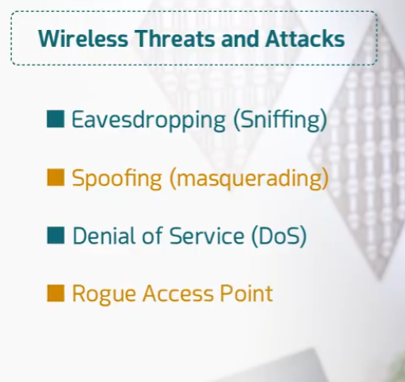
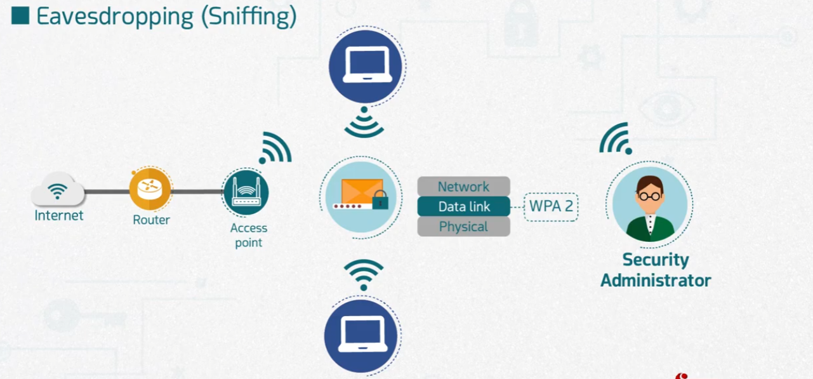
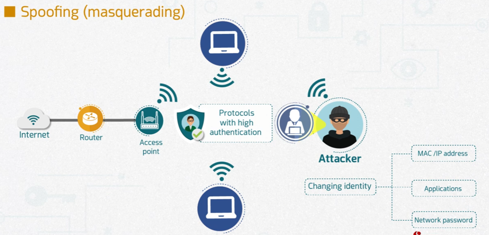
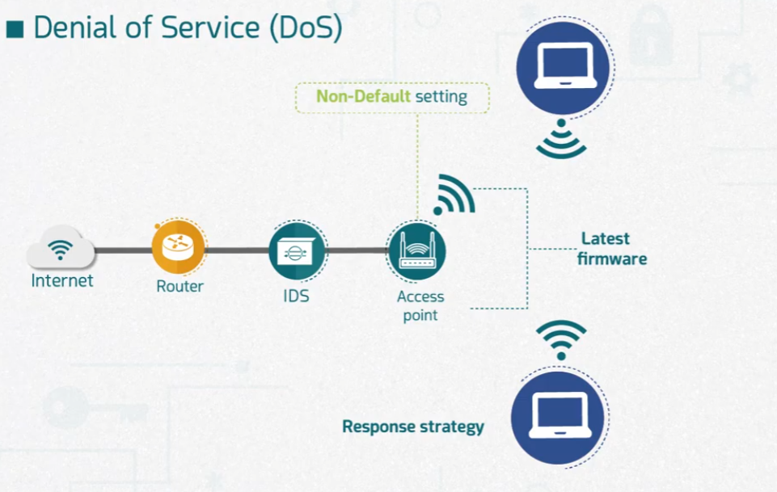
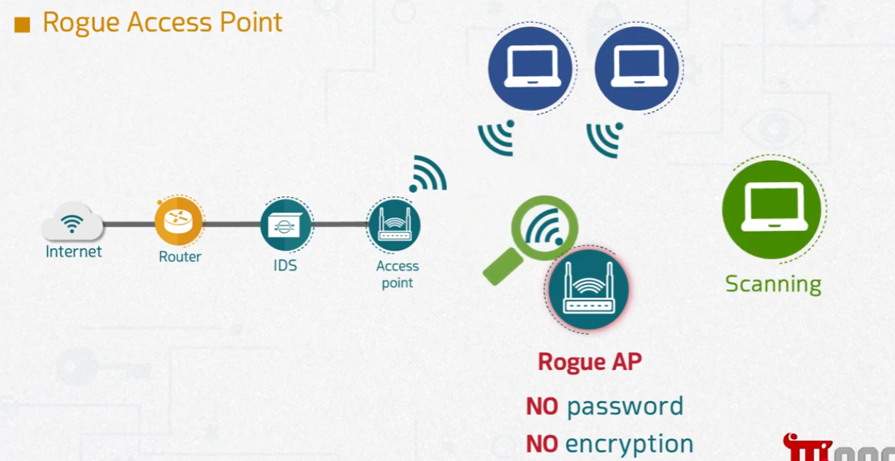
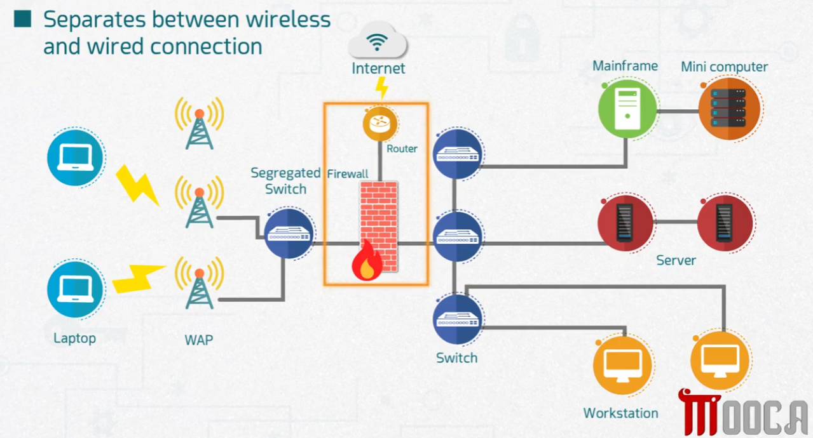

# Wireless Threats and Attacks

Part of the **MaharTech – Network Security** course.

## Overview

Wireless networks introduce attack surfaces that wired networks don't have — since the signal travels through open air, anyone nearby can potentially intercept, impersonate, disrupt, or exploit it. This topic covers four major categories of wireless threats.

- **Eavesdropping (Sniffing)**
- **Spoofing (masquerading)**
- **Denial of Service (DoS)**
- **Rogue Access Point**

## 1. Eavesdropping (Sniffing)

Eavesdropping involves silently capturing wireless traffic as it travels between devices and the access point. Traffic normally flows across the **Physical**, **Data Link**, and **Network** layers — and even with encryption in place (e.g., **WPA2**), the traffic is still traveling through open air, meaning it's exposed to anyone within range who can capture the signal.

A **Security Administrator** monitors this activity, since encryption alone doesn't stop someone from capturing packets — it only prevents them from reading the contents without the key. Weak or outdated encryption (like WEP or WPA1, covered in the Wireless Encryption topic) makes this a much more serious risk.

## 2. Spoofing (Masquerading)

Spoofing occurs when an **attacker disguises themselves as a legitimate user or device** to gain access to the network. This is typically done by changing identity in one of a few ways:

- **MAC/IP address** — impersonating a device already trusted on the network
- **Applications** — mimicking a legitimate service or process
- **Network password** — using stolen or guessed credentials to appear as an authorized user

**Defense:** using **protocols with high authentication** helps ensure that devices and users connecting to the network can be verified as genuine, making it harder for an attacker to successfully masquerade as someone else.

## 3. Denial of Service (DoS)

A DoS attack aims to disrupt the availability of the wireless network itself — for example, by flooding the access point with traffic or exploiting a weakness so legitimate users can't connect.

**Key defenses shown:**
- **Non-default settings** — changing default configurations on the access point removes an easy, well-known target for attackers.
- **Latest firmware** — keeping the access point's firmware updated patches known vulnerabilities that could otherwise be exploited to cause a DoS condition.
- **Response strategy** — having a plan in place for how to detect and respond to a DoS attack when it happens, rather than reacting without a plan.

## 4. Rogue Access Point

A **Rogue Access Point** is an unauthorized wireless access point connected to the network — sometimes set up by an attacker, sometimes even unintentionally by an employee. In the diagram, a **Rogue AP** is identified with:

- **NO password**
- **NO encryption**

This makes it a dangerous back door: since it lacks both authentication and encryption, anyone (attacker or otherwise) can connect to it and potentially reach the internal network without going through the organization's normal security controls.

**Defense:** regular **scanning** of the wireless environment helps detect unauthorized access points before they can be exploited — as shown by the "Scanning" device actively identifying the rogue AP.

## 5. Segregating Wireless and Wired Connections

A key architectural defense against all four threats above is **network segregation**: keeping the wireless side of the network physically and logically separate from the wired core.

In the diagram:
- **Laptops** connect wirelessly through **WAPs (Wireless Access Points)** into a **Segregated Switch**.
- That segregated switch sits behind its own **Firewall** and **Router**, forming an isolated zone dedicated to wireless traffic — before it's allowed to reach the wired internal network.
- Only after passing through this segregated, firewalled zone can traffic reach the internal **Switch**, and from there the **Mainframe**, **Mini computer**, **Server**, and **Workstation** on the trusted wired side.

**Why this matters:** since wireless traffic is inherently more exposed to eavesdropping, spoofing, DoS, and rogue devices, isolating it behind its own switch and firewall means that even if the wireless segment is compromised, the attacker still has to get through an additional firewall boundary before reaching the wired core — the same defense-in-depth principle covered in "Designing Network Security."

## Summary

| Threat | What Happens | Key Defense |
|---|---|---|
| Eavesdropping (Sniffing) | Traffic captured silently over the air | Strong encryption (e.g., WPA2), limit signal exposure |
| Spoofing (Masquerading) | Attacker impersonates a trusted identity | High-authentication protocols |
| Denial of Service (DoS) | Network/service availability disrupted | Non-default settings, updated firmware, response plan |
| Rogue Access Point | Unauthorized AP with no password/encryption | Regular wireless scanning |
| (Architectural) | Wireless segment is inherently more exposed | Segregate wireless traffic behind its own switch/firewall before it reaches the wired network |

---
**Course:** MaharTech – Network Security
**Topic:** Wireless Threats and Attacks
