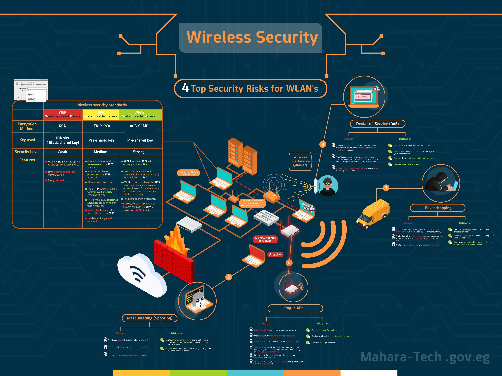

# Chapter 5 Summary — Wireless Security

Part of the **MaharTech – Network Security** course.

## Overview

This chapter ties together wireless encryption standards and the top real-world WLAN security risks, showing not just *what* each threat is, but concrete **mitigations** for each.

## 1. Wireless Security Standards — Full Comparison

| | **WEP** (Wired Equivalent Privacy) | **WPA** (Wi-Fi Protected Access) | **WPA2** (Wi-Fi Protected Access II) |
|---|---|---|---|
| **Encryption Method** | RC4 | TKIP, RC4 | AES, CCMP |
| **Key Used** | 104 bits (static shared key) | Pre-shared key | Pre-shared key |
| **Security Level** | Weak | Medium | Strong |

**WEP Features:**
- Uses RC4 key encryption to encrypt communications.
- Uses a **static** shared-key authentication.
- Easily **cracked**.

**WPA Features:**
- Created to fix several weaknesses in the WEP standard, providing much more protection.
- Uses a pre-shared key, and **TKIP** for improved data integrity checking.
- TKIP dynamically generates a **new key for each packet**.
- Still **vulnerable** to many of the same attacks as WEP; hardware change isn't required to adopt it.

**WPA2 Features:**
- Replaces WPA with a stronger encryption: **AES** (Advanced Encryption Standard) replaces RC4.
- **CCMP** replaces TKIP — a much more secure protocol for authenticating and protecting data within packets.
- Requires a **hardware change** to support.
- Even WPA2 isn't immune: in 2017, researchers released a viable hack against it known as the **KRACK Attack**.

## 2. The 4 Top Security Risks for WLANs

### ① Eavesdropping

**Threats:**
- Access to the network can be gained from hundreds of feet away (e.g., a parking lot or nearby street).
- An attacker with a wireless sniffer can search the airwaves for network traffic and capture packets.
- An attacker can gain access to confidential information this way.

**Mitigation:**
- Use strong encryption at the lowest layer protocol possible.
- Minimize the coverage area when designing wireless networks.
- Audit your network with a packet sniffer to know exactly what an attacker could see.

### ② Masquerading (Spoofing)

**Threats:**
- An attacker spoofs the identity of a legitimate access point.
- Tricks authorized users into giving up sensitive information.
- Tricks an access point into authenticating malicious users.

**Mitigation:**
- Deploy a strong mechanism to authenticate users to an access point, and authenticate the access point to the user (mutual authentication).
- Educate users about the dangers of ignoring invalid certificate warnings.

### ③ Denial-of-Service (DoS)

**Threats:**
- An attacker disables wireless networks or services with the intent of denying service to authorized users.
- An attacker with a powerful transceiver can generate enough radio interference to stress-test and attack wireless frequencies.
- Vulnerabilities in WiFi card firmware have led to real DoS attacks against networks.

**Mitigation:**
- Upgrade the firmware of faulty WiFi cards.
- Understand the impact a DoS attack could have on your specific environment.
- Deploy wireless intrusion detection systems.
- Prepare a response strategy ahead of time.

### ④ Rogue Access Points

**Threats:**
- Unauthorized APs get connected to a private network.
- Often installed with default settings and no security.
- Permits full access to the network for an unauthorized user.
- Authorized users can be fooled into thinking they're joining the company's legitimate network, when they're actually joining a hacker's network.
- Once connected, the hacker can collect usernames and passwords — enough information to log onto the real network as a legitimate user.

**Mitigation:**
- Perform rogue AP detection regularly.
- Deploy wireless intrusion detection systems.
- Deploy a strong wireless LAN (proper encryption, authentication, and segmentation).

## Chapter Takeaways

| Concept | Key Point |
|---|---|
| WEP | Weak — static key, RC4, easily cracked |
| WPA | Medium — dynamic TKIP keys, but still shares RC4's weaknesses |
| WPA2 | Strong — AES + CCMP, though even it was broken by KRACK in 2017 |
| Eavesdropping | Mitigated by strong encryption + minimizing coverage area |
| Masquerading | Mitigated by mutual authentication + user education |
| DoS | Mitigated by firmware updates + wireless IDS + a response plan |
| Rogue APs | Mitigated by regular detection + wireless IDS + strong WLAN configuration |

---
**Course:** MaharTech – Network Security
**Topic:** Chapter 5 Summary — Wireless Security
