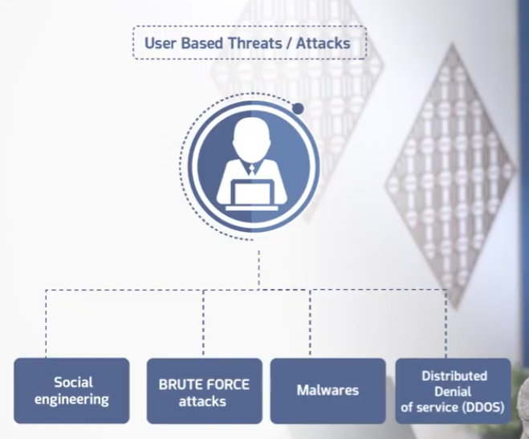

# User-Based Threats and Attacks

Part of the **MaharTech – Network Security** course.

## Overview

Not every attack targets network infrastructure directly — many target the **user** instead, exploiting human trust, weak credentials, or simply tricking the user's system into running malicious code. This topic covers four major categories of user-based threats.

- **Social Engineering**
- **Brute Force Attacks**
- **Malware**
- **Distributed Denial of Service (DDoS)**

## 1. Social Engineering

Social engineering doesn't rely on exploiting a technical flaw — it relies on exploiting **human trust**. An attacker manipulates a user into voluntarily giving up sensitive information, such as a username and password, often by impersonating someone trustworthy or creating a false sense of urgency.

**Why it works:** even the strongest technical defenses can be bypassed if a user is convinced to hand over their own credentials directly.

## 2. Brute Force Attacks

A brute force attack uses **software** to systematically try every possible password combination until the correct one is found. In the example, a 4-digit numeric password has **10,000 possible combinations** (`0000` through `9999`), and brute-force software will simply try them all until it lands on the right one (e.g., `2580`).

**Why it works:** short or simple passwords have a small enough combination space that automated tools can try all of them in a feasible amount of time.

## 3. Malware

**Malware** is malicious software delivered to a user's system, often blocking or corrupting normal access (as shown by the Internet connection marked with an ❌ once malware has taken hold). Malware comes in several forms:

- **Spyware Software** — secretly monitors user activity and collects information without consent.
- **Cookies** — while often legitimate, can be abused to track users or hijack sessions if not properly secured.
- **Trojan Horse** — disguises itself as legitimate software while performing malicious actions in the background.
- **Viruses** — malicious code that attaches to legitimate files/programs and spreads when they're executed.
- **Worm** — self-replicating malware that spreads across systems and networks without needing a host program or user action.

## 4. Distributed Denial of Service (DDoS)

Unlike a simple DoS attack from one source, a **DDoS** attack uses **multiple systems** (often compromised machines controlled by the attacker) to flood a target simultaneously. In the diagram, traffic from several attacker-controlled devices converges on the target's servers, overwhelming them until the user sees an error like **"500 Internal Server Error"** — the service becomes unavailable to legitimate users.

**Why it's more dangerous than DoS:** distributing the attack across many sources makes it much harder to block, since traffic isn't coming from a single identifiable point.

## Summary

| Threat | What Happens | Key Risk |
|---|---|---|
| Social Engineering | Attacker manipulates the user into giving up credentials/info | Bypasses technical security entirely |
| Brute Force | Software tries every password combination | Weak/short passwords are quickly cracked |
| Malware | Malicious software (spyware, trojans, viruses, worms) compromises the user's system | Data theft, monitoring, system damage, spreading |
| DDoS | Multiple systems flood a target simultaneously | Service becomes unavailable; hard to block due to many sources |

---
**Course:** MaharTech – Network Security
**Topic:** User-Based Threats and Attacks
