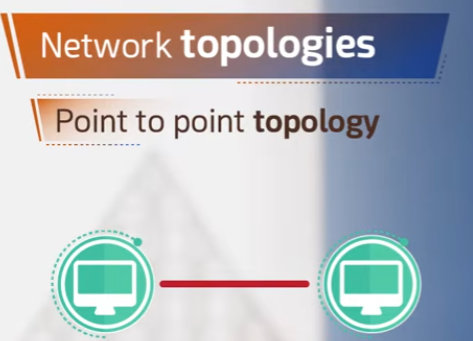
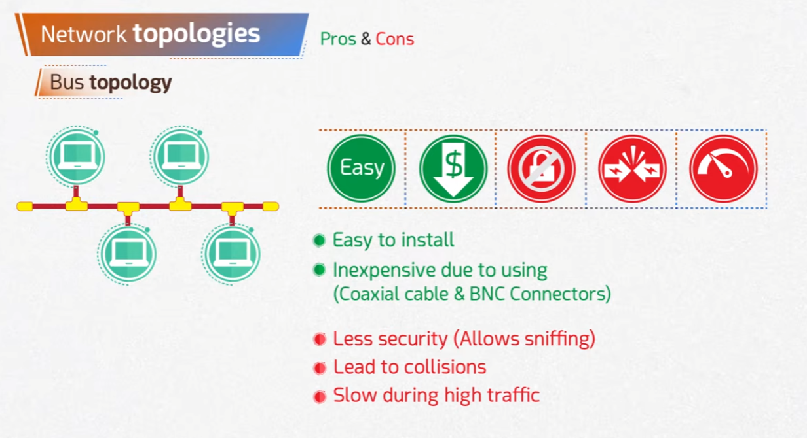
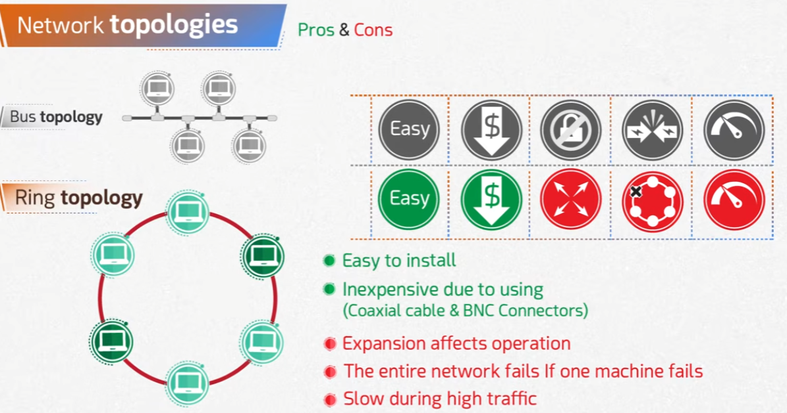
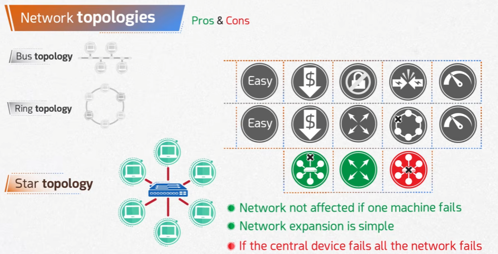
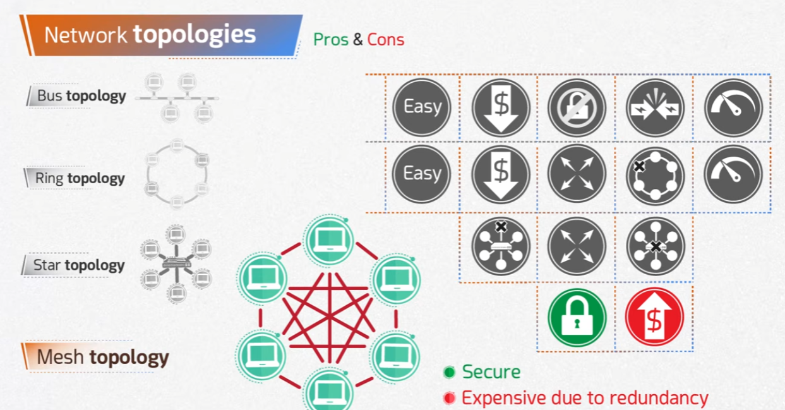

# Chapter 2 Summary — Network Topologies

Part of the **MaharTech – Computer Network Fundamentals** course.

## Overview

A network topology is the arrangement in which devices are physically or logically connected to each other. This chapter covers five core topologies — **Point-to-Point**, **Bus**, **Ring**, **Star**, and **Mesh** — and compares their trade-offs in cost, ease of installation, security, fault tolerance, and performance.

## 1. Point-to-Point Topology

The simplest possible topology: a single, direct link between exactly two devices.

- One dedicated connection, one sender, one receiver.
- Forms the basic building block that more complex topologies (bus, ring, star, mesh) are built from.

## 2. Bus Topology

All devices connect to a single shared cable (the "bus").

**Pros:**
- Easy to install
- Inexpensive (uses coaxial cable & BNC connectors)

**Cons:**
- Less secure (allows sniffing of traffic on the shared cable)
- Prone to collisions
- Slow during high traffic

## 3. Ring Topology

Each device connects to exactly two neighbors, forming a closed loop.

**Pros:**
- Easy to install
- Inexpensive

**Cons:**
- Expansion affects operation
- The entire network fails if one machine fails
- Slow during high traffic

## 4. Star Topology

All devices connect individually to a central device (e.g., a switch).

**Pros:**
- Network is not affected if one machine fails
- Network expansion is simple

**Cons:**
- If the central device fails, the whole network fails

## 5. Mesh Topology

Every device connects directly to every other device.

**Pros:**
- Secure — no single shared cable to sniff, multiple paths between any two devices

**Cons:**
- Expensive due to the redundancy of connections required

## Putting It All Together

| Topology | Ease of Install | Cost | Security | Fault Tolerance | Performance |
|---|---|---|---|---|---|
| Point-to-Point | Easy | Low | High (dedicated link) | Fails if the single link fails | Good |
| Bus | Easy | Low | Low (sniffable) | Whole segment affected by cable issues | Degrades under high traffic |
| Ring | Easy | Low | Low | One failed node breaks the whole ring | Degrades under high traffic |
| Star | Easy | Moderate | Moderate | Resilient to single-node failure, but central device is a single point of failure | Good |
| Mesh | Hard | High | High | Very resilient — multiple redundant paths | Good |

Choosing a topology is a trade-off: bus and ring are cheap and simple but fragile and less secure; star is a good balance for most networks but depends entirely on the central device; mesh gives the strongest security and fault tolerance at the highest cost.

---
**Source:** [Mahara-Tech.gov.eg](https://maharatech.gov.eg)
**Course:** MaharTech – Computer Network Fundamentals
**Topic:** Chapter 2 Summary — Network Topologies
