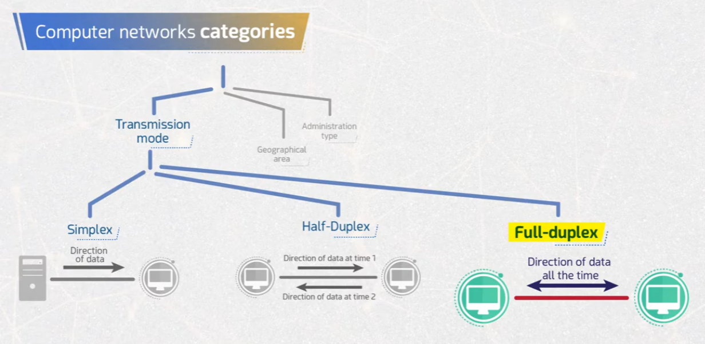
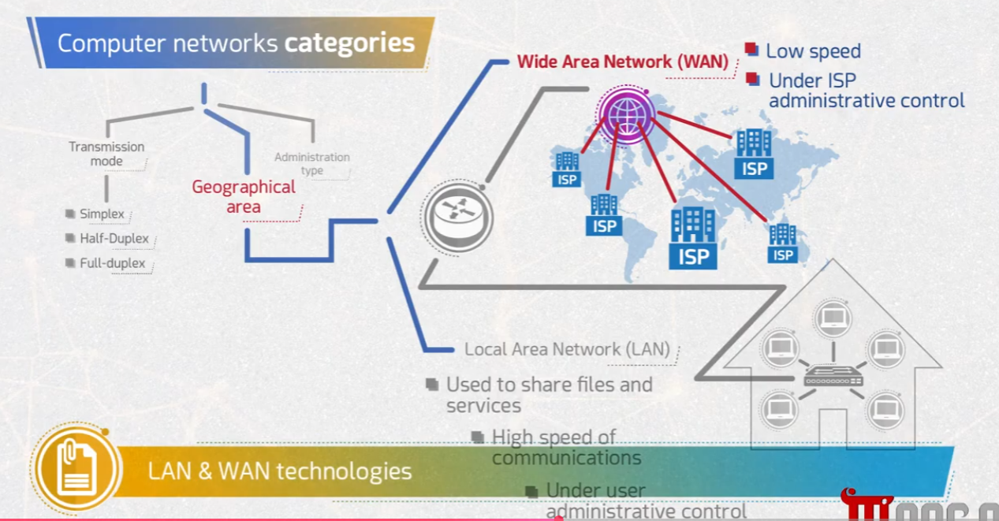
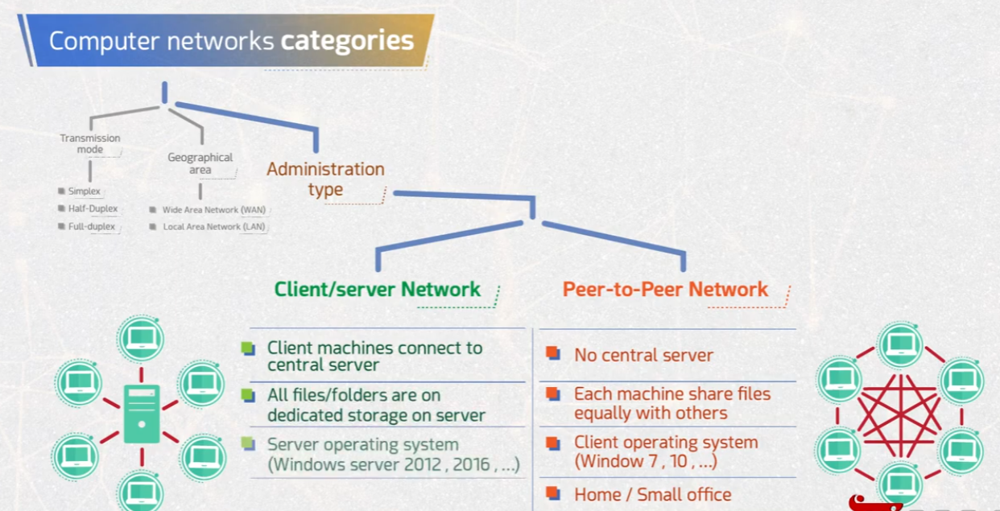

# Computer Networks Categories

This repository summarizes the main ways computer networks are classified: by **transmission mode**, **geographical area**, and **administration type**.

## 📡 1. Transmission Mode

Networks can be classified based on the direction in which data flows between devices.



- **Simplex** – Data flows in only one direction (e.g., server → client only).
- **Half-Duplex** – Data flows in both directions, but only one direction at a time.
- **Full-Duplex** – Data flows in both directions simultaneously, all the time.

## 🌍 2. Geographical Area

Networks can be classified based on the physical/geographical scope they cover.



- **Local Area Network (LAN)**
  - Used to share files and services within a limited area (e.g., a home or office).
  - High speed of communications.
  - Under user administrative control.
- **Wide Area Network (WAN)**
  - Spans large geographical areas, connecting multiple LANs, often through ISPs.
  - Comparatively lower speed than LAN.
  - Under ISP (Internet Service Provider) administrative control.

## 🖥️ 3. Administration Type

Networks can also be classified based on how they are managed/administered.



- **Client/Server Network**
  - Client machines connect to a central server.
  - All files/folders are stored on dedicated storage on the server.
  - Runs a server operating system (e.g., Windows Server 2012, 2016, ...).
- **Peer-to-Peer Network**
  - No central server; all machines have equal status.
  - Each machine shares files equally with others.
  - Runs a client operating system (e.g., Windows 7, 10, ...).
  - Common in home/small office setups.

## 📁 Repository Structure

```
.
├── README.md
├── task1-transmission-modes.png
├── task2-geoghraphical-area.png
└── task3-Administrative-types.png
```
