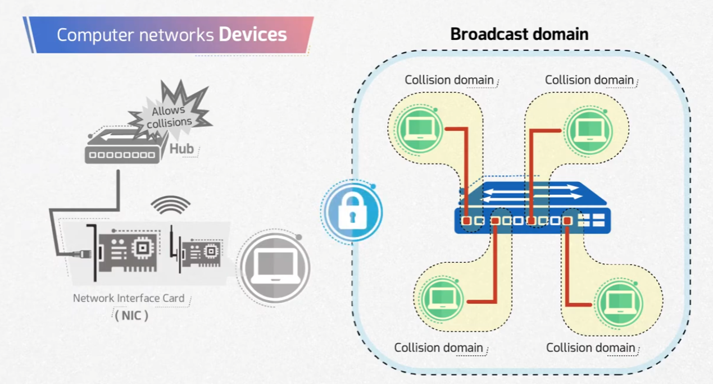
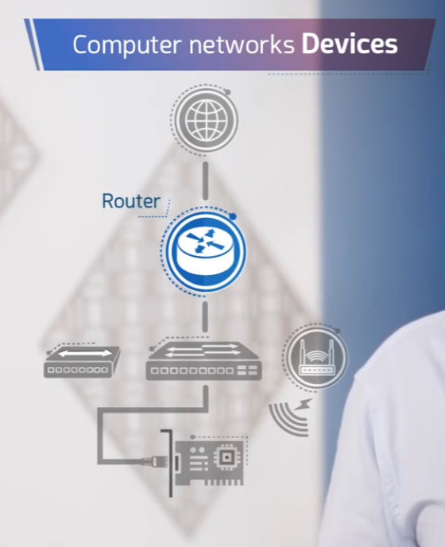

# Computer Networks Devices

This repository covers the main hardware devices used to build computer networks, and the concepts of **collision domain** and **broadcast domain**.

## 🔌 Network Devices Overview

Data typically flows from the internet through a router, then a switch, and finally to end devices via their Network Interface Cards (NICs) — with wireless access points offering an alternative wireless path into the same network.



- **Router** – Connects different networks together (e.g., a local network to the internet) and routes traffic between them.
- **Switch** – Connects multiple devices on the same network, forwarding traffic intelligently between connected ports.
- **Wireless Access Point** – Provides wireless connectivity into the network.
- **Network Interface Card (NIC)** – Connects a computer to the network, either via cable or wirelessly.

## 📶 Collision Domain vs Broadcast Domain



- **Network Interface Card (NIC)** – The hardware component that lets a device connect to a network (wired or wireless).
- **Hub** – A basic device that connects multiple devices together but **allows collisions**, since all connected devices share a single collision domain.
- **Switch** – Connects multiple devices while giving each connected port its **own collision domain**, avoiding the collisions seen with hubs. All ports on the switch still belong to the same **broadcast domain**.
- **Collision Domain** – A network segment where two devices transmitting at the same time can cause a data collision. Switch ports each have their own collision domain.
- **Broadcast Domain** – A group of devices that all receive each other's broadcast traffic. A switch does not separate broadcast domains — only a router (or VLANs) can do that.

## 📁 Repository Structure

```
.
├── README.md
├── task1-network-devices.png
└── task2-router.png
```
