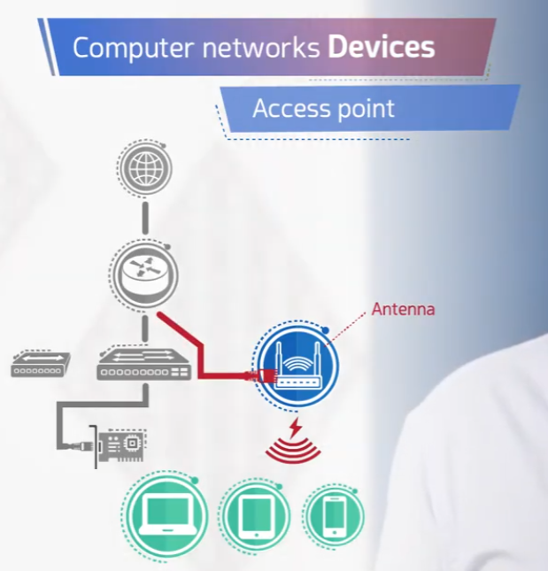
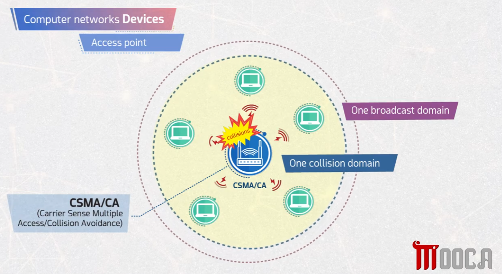
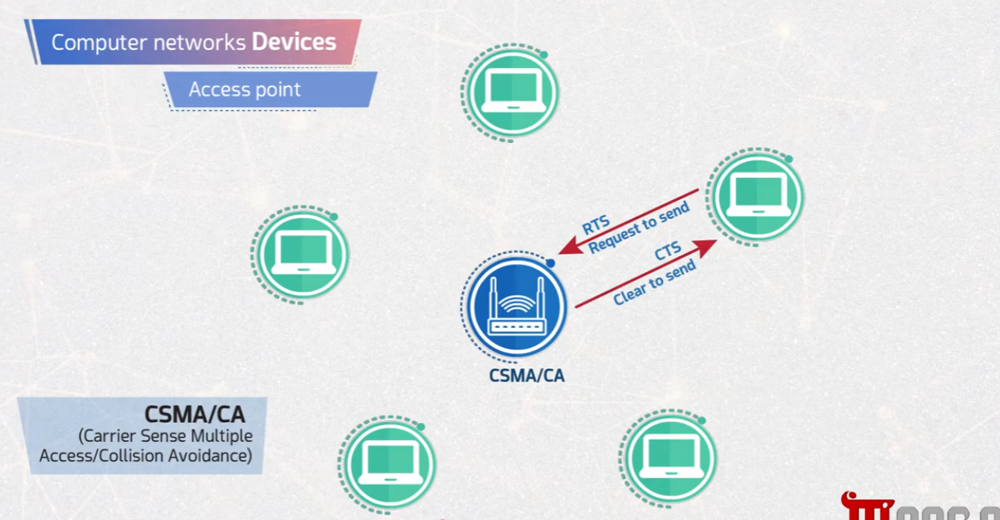
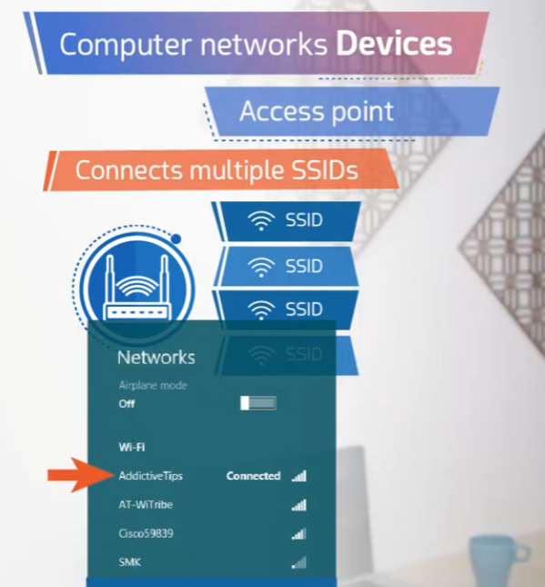
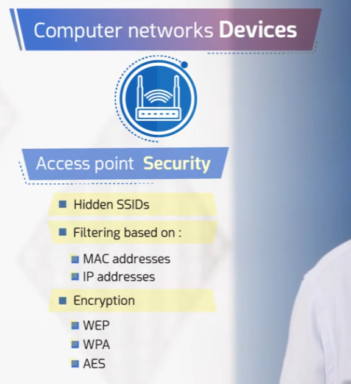

# Computer Networks Devices — Access Point

This repository covers the **Access Point (AP)**: what it is, how it handles collisions, how it connects multiple SSIDs, and how it can be secured.

## 📶 1. What is an Access Point?

An access point connects wired network infrastructure to wireless client devices using an antenna.



- Sits after the router/switch in the network chain: **Internet → Router → Switch → Access Point → Wireless clients**.
- Uses an **antenna** to broadcast a wireless signal.
- Allows laptops, tablets, and phones to join the network without a physical cable.

## 💥 2. Collision & Broadcast Domain

All wireless devices connected to the same access point share the same collision and broadcast domain, since they all transmit over the same shared medium.



- **One collision domain** – Every device connected to the AP can potentially collide with any other device's transmission.
- **One broadcast domain** – All connected devices receive each other's broadcast traffic.
- **CSMA/CA** (Carrier Sense Multiple Access/Collision Avoidance) is used to manage access to the shared wireless medium and avoid collisions.

## 🤝 3. CSMA/CA (Collision Avoidance)

Since wireless devices can't reliably detect collisions the way wired devices can, Wi-Fi uses a *collision avoidance* mechanism based on a request/clear handshake.



- **RTS (Request To Send)** – A device asks the access point for permission to transmit.
- **CTS (Clear To Send)** – The access point grants permission, signaling other devices to wait.
- This RTS/CTS handshake reduces the chance of two devices transmitting at the same time.

## 📡 4. Multiple SSIDs

A single access point can broadcast several separate wireless networks (SSIDs) at once.



- Each **SSID** (Service Set Identifier) appears as a distinct Wi-Fi network name to end users.
- Useful for separating traffic, e.g., a guest network vs. a staff network, all served by the same physical AP.

## 🔒 5. Access Point Security

Access points support several mechanisms to control and secure access to the wireless network.



- **Hidden SSIDs** – The network name is not broadcast publicly, requiring clients to know it in advance.
- **Filtering** based on:
  - **MAC addresses** – Only allow/deny specific device hardware addresses.
  - **IP addresses** – Only allow/deny specific IP addresses.
- **Encryption** protocols:
  - **WEP** (Wired Equivalent Privacy) – Older, weak encryption standard.
  - **WPA** (Wi-Fi Protected Access) – Stronger encryption than WEP.
  - **AES** (Advanced Encryption Standard) – Modern, strong encryption used in WPA2/WPA3.

## 📁 Repository Structure

```
.
├── README.md
├── task1-access-point.png
├── task2-collision.png
├── task3-csma-ca.png
├── task4-multipe-ssid.png
└── task5-AP-security.png
```
