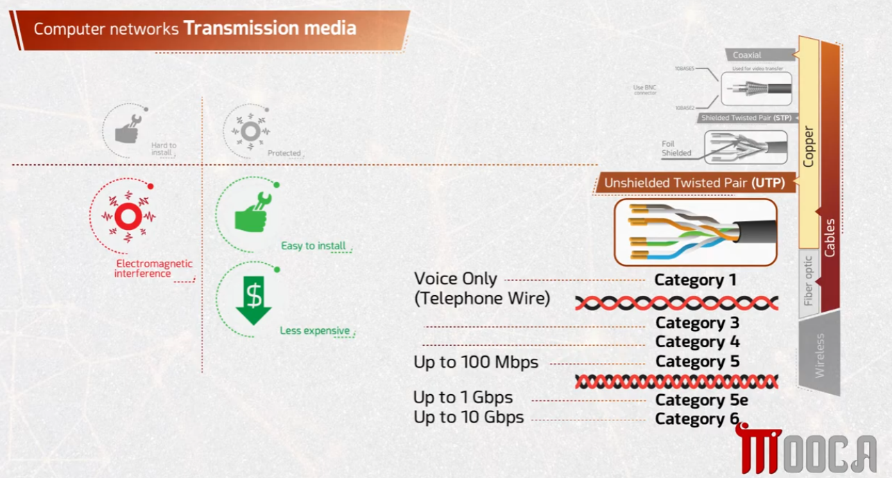
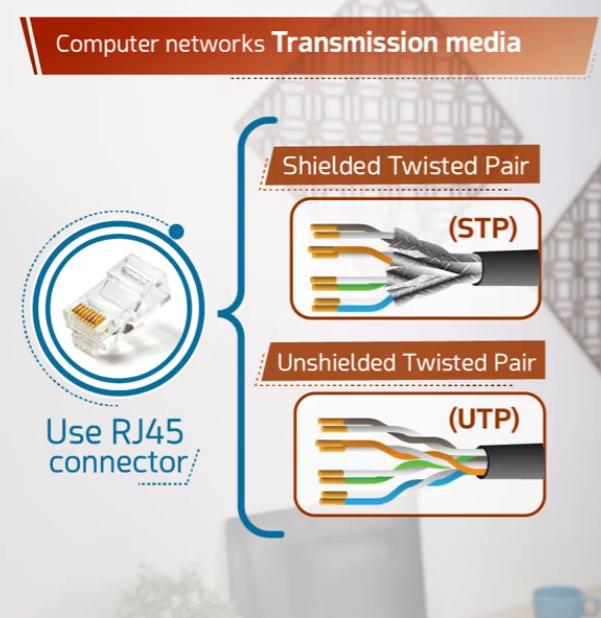
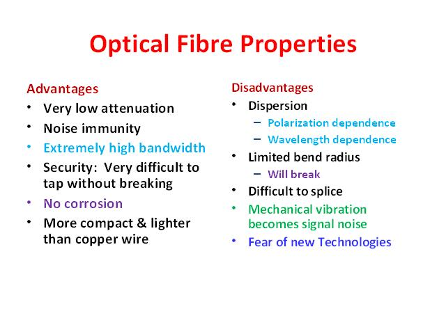
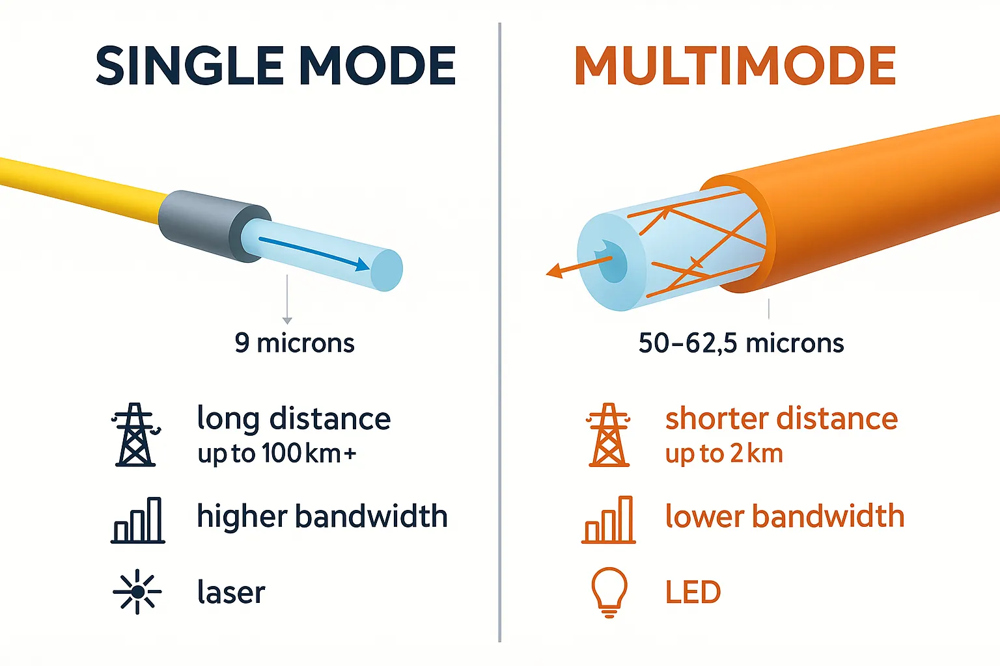

# Computer Networks — Transmission Media

This repository covers the physical media used to transmit data across a network: **copper cables (twisted pair)**, **fiber optic cables**, and the trade-offs between them.

## 🧵 1. Transmission Media Overview

Cables are broadly divided into **Copper**, **Fiber optic**, and **Wireless**. Copper cabling includes coaxial and twisted pair (STP/UTP), each with different categories and speeds.



- **Copper cables**
  - **Coaxial** – Uses a BNC connector, historically used for video transfer.
  - **Shielded Twisted Pair (STP)** – Foil-shielded to reduce interference.
  - **Unshielded Twisted Pair (UTP)** – The most common cable type, categorized by performance:
    | Category | Typical Use |
    |---|---|
    | Category 1 | Voice only (telephone wire) |
    | Category 3 / 4 | Early data networking |
    | Category 5 | Up to 100 Mbps |
    | Category 5e | Up to 1 Gbps |
    | Category 6 | Up to 10 Gbps |
- **Copper trade-offs**
  - ❌ Susceptible to **electromagnetic interference**.
  - ❌ Harder to install than wireless.
  - ✅ Easy to install compared to fiber.
  - ✅ Less expensive than fiber optic cabling.
- **Fiber optic** and **Wireless** are the other two major categories, covered in more detail below.

## 🔌 2. Twisted Pair Cabling (STP vs UTP)

Both twisted pair cable types use an **RJ45 connector** to terminate and connect to network devices.



- **Shielded Twisted Pair (STP)** – Wrapped in a foil/braided shield around the twisted wire pairs to reduce electromagnetic interference.
- **Unshielded Twisted Pair (UTP)** – No additional shielding; relies only on the twisting of the wire pairs to reduce interference. Cheaper and more common in typical LAN installations.
- Both use the same **RJ45 connector** for termination into switches, routers, and NICs.

## 💡 3. Fiber Optic Cable Properties

Fiber optic cables transmit data as light signals, offering different advantages and disadvantages compared to copper.



**Advantages**
- Very low attenuation (signal loss over distance).
- Strong noise immunity (not affected by electromagnetic interference).
- Extremely high bandwidth.
- High security — very difficult to tap without breaking the cable.
- No corrosion.
- More compact and lighter than copper wire.

**Disadvantages**
- Dispersion (polarization and wavelength dependence).
- Limited bend radius — will break if bent too much.
- Difficult to splice.
- Mechanical vibration can become signal noise.
- Adoption can be slowed by unfamiliarity with the technology.

## 🔬 4. Single-Mode vs Multimode Fiber

Fiber optic cables come in two main types, differing in core size, light source, and distance/bandwidth capability.



| | Single Mode | Multimode |
|---|---|---|
| Core size | ~9 microns | ~50–62.5 microns |
| Distance | Long distance, up to 100 km+ | Shorter distance, up to ~2 km |
| Bandwidth | Higher bandwidth | Lower bandwidth |
| Light source | Laser | LED |

- **Single mode** fiber sends one light path straight down a very narrow core — ideal for long-haul, high-bandwidth links (e.g., between cities or ISP backbones).
- **Multimode** fiber allows light to bounce along multiple paths within a wider core — cheaper and suited for shorter runs like within a building or data center.

## 📁 Repository Structure

```
.
├── README.md
├── task1-transmission-media.png
├── task2-twisted-pair.png
├── task3-fiber-optics-cable.jpg
└── task4-single-vs-multimode.webp
```
