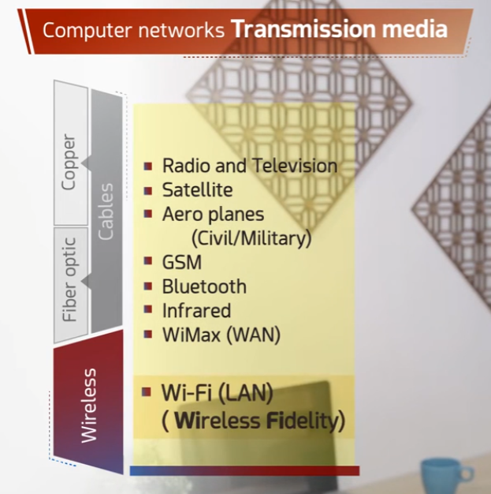
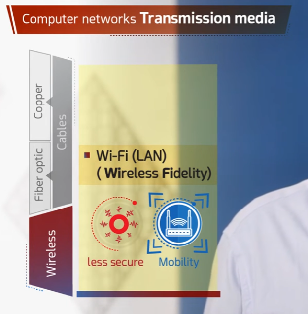
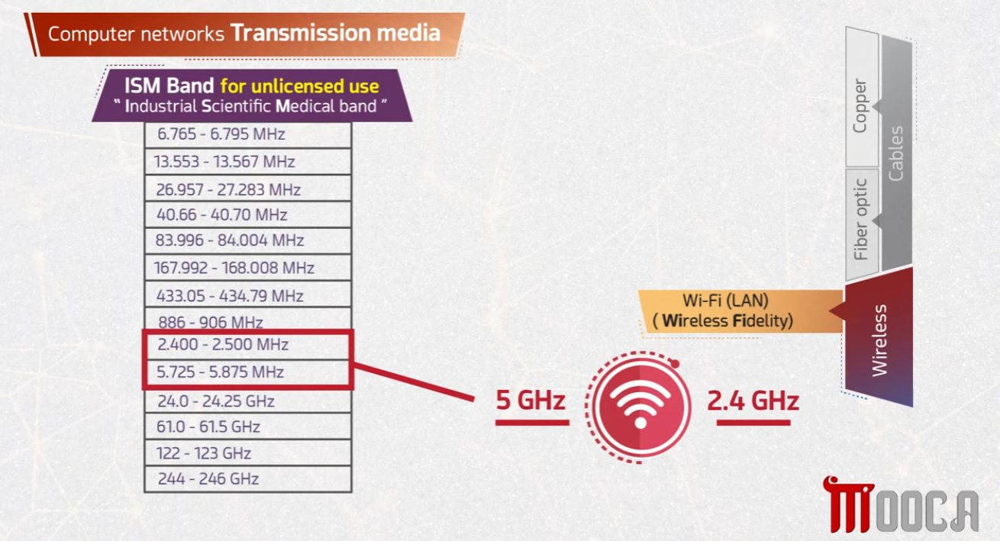
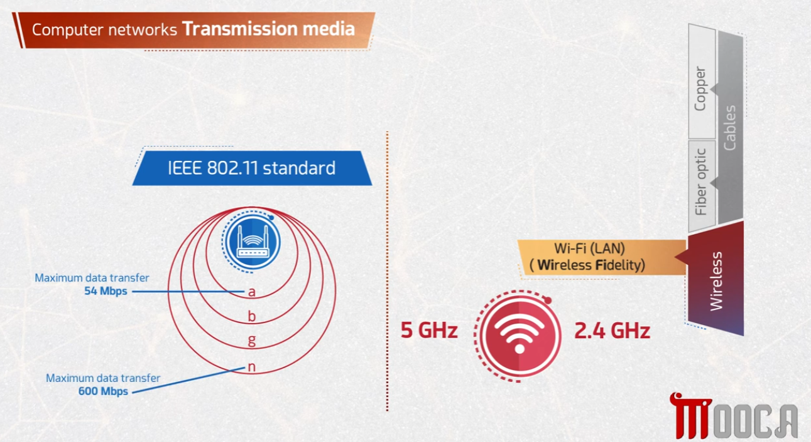
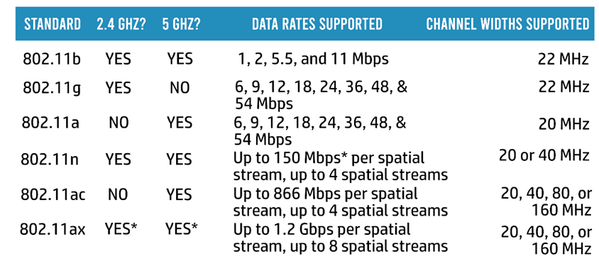

# Computer Networks — Wireless Transmission Media (Wi-Fi)

This repository covers **wireless transmission media**, focusing on **Wi-Fi (Wireless Fidelity)**: its examples, frequency bands, and the IEEE 802.11 standards.

## 📡 1. Wireless Media Overview

Wireless is one of the three main categories of transmission media (alongside copper and fiber optic cables), covering a wide range of technologies beyond just Wi-Fi.



Examples of wireless transmission media include:
- Radio and Television
- Satellite
- Aeroplanes (Civil/Military)
- GSM
- Bluetooth
- Infrared
- WiMax (WAN)
- **Wi-Fi (LAN)** — the focus of this repository

## 📶 2. What is Wi-Fi?

Wi-Fi (**Wireless Fidelity**) is a wireless LAN technology that trades some security for mobility.



- **Less secure** – Wireless signals can be intercepted more easily than signals confined to a physical cable.
- **Mobility** – Devices can connect and move freely within range of the access point, without being tied to a cable.

## 📊 3. Wi-Fi Frequency Bands

Wi-Fi operates in unlicensed frequency ranges known as the **ISM band** (Industrial, Scientific, Medical band), specifically at **2.4 GHz** and **5 GHz**.



- The ISM band includes many unlicensed frequency ranges, but Wi-Fi specifically uses:
  - **2.400 – 2.500 MHz** → the **2.4 GHz** band
  - **5.725 – 5.875 MHz** → the **5 GHz** band
- Because these bands are unlicensed, no special license is required to operate Wi-Fi devices within them.

## 📐 4. IEEE 802.11 Standard (Range & Speed)

Wi-Fi is standardized under **IEEE 802.11**, with different amendments (a, b, g, n, ...) offering different ranges and maximum data transfer speeds.



- **802.11a** – Maximum data transfer of **54 Mbps**, smaller range.
- **802.11b** – Larger range but lower data rates.
- **802.11g** – Backward compatible improvement over 802.11b.
- **802.11n** – Maximum data transfer of **600 Mbps**, larger range than earlier standards.
- Generally, higher-lettered/newer standards trade off range and speed differently, with newer ones offering higher throughput.

## 📋 5. 802.11 Standards Comparison Table

A more complete comparison of 802.11 standards, their supported frequency bands, data rates, and channel widths:



| Standard | 2.4 GHz? | 5 GHz? | Data Rates Supported | Channel Widths Supported |
|---|---|---|---|---|
| 802.11b | Yes | Yes | 1, 2, 5.5, and 11 Mbps | 22 MHz |
| 802.11g | Yes | No | 6, 9, 12, 18, 24, 36, 48, 54 Mbps | 22 MHz |
| 802.11a | No | Yes | 6, 9, 12, 18, 24, 36, 48, 54 Mbps | 20 MHz |
| 802.11n | Yes | Yes | Up to 150 Mbps per spatial stream, up to 4 spatial streams | 20 or 40 MHz |
| 802.11ac | No | Yes | Up to 866 Mbps per spatial stream, up to 4 spatial streams | 20, 40, 80, or 160 MHz |
| 802.11ax | Yes* | Yes* | Up to 1.2 Gbps per spatial stream, up to 8 spatial streams | 20, 40, 80, or 160 MHz |

## 📁 Repository Structure

```
.
├── README.md
├── task1-wireless-media.png
├── task2-WIFI.png
├── task3-WIFI-requency-band.png
├── task4-WIFI-standard.png
└── task5-802dot11.png
```
