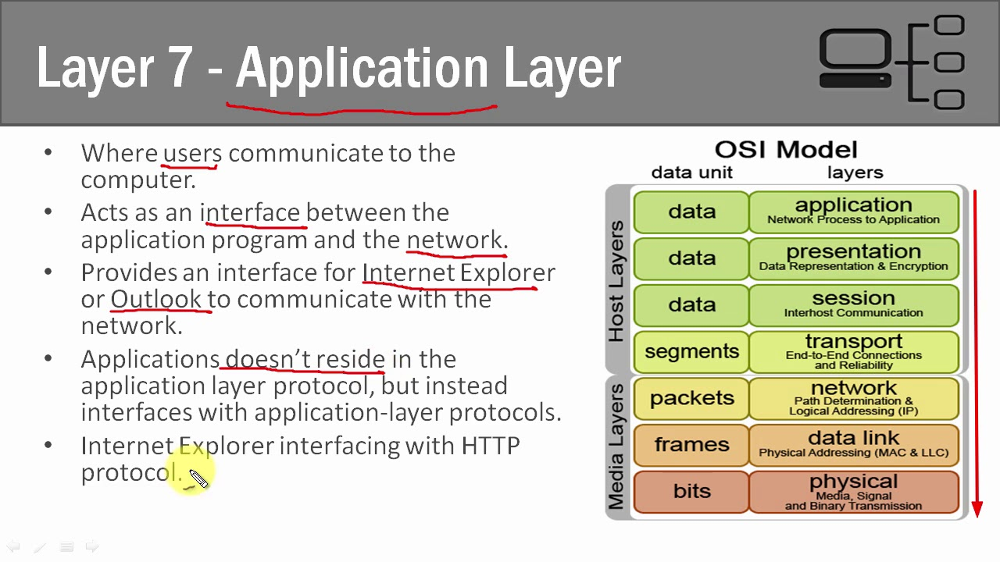
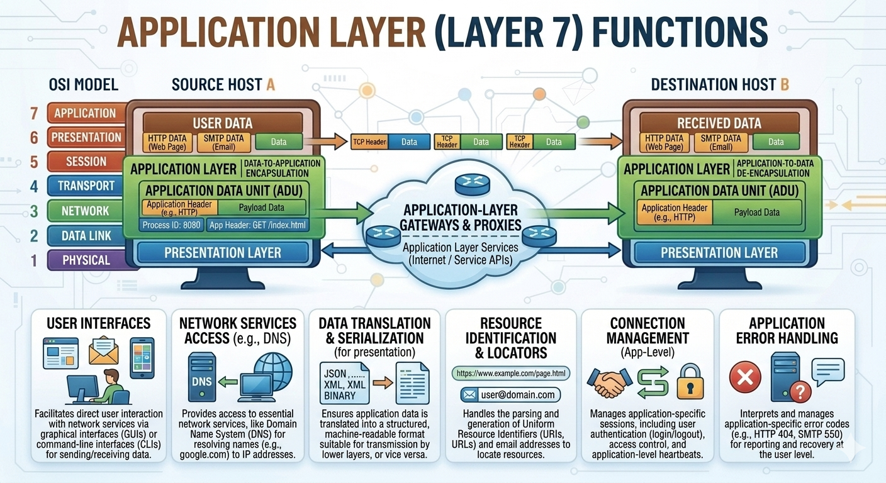
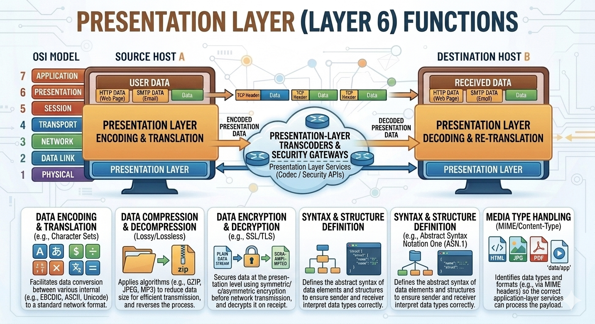
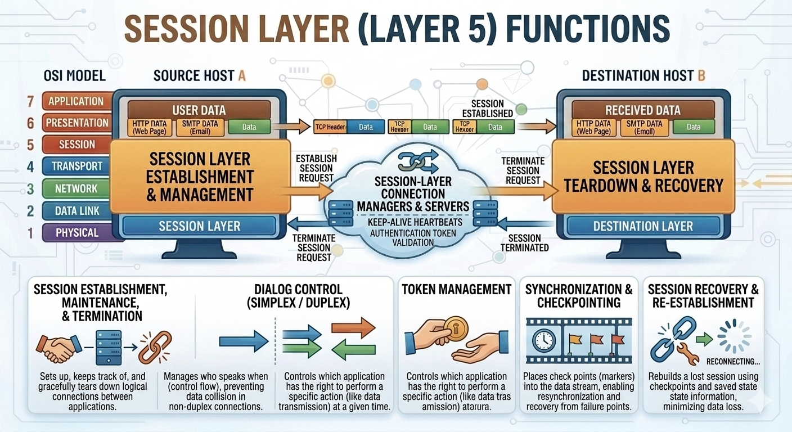
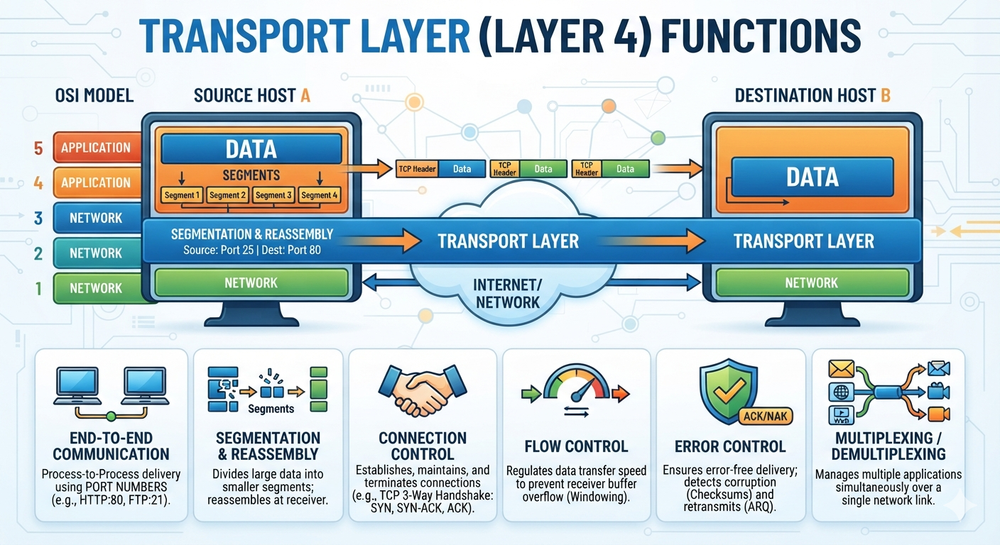
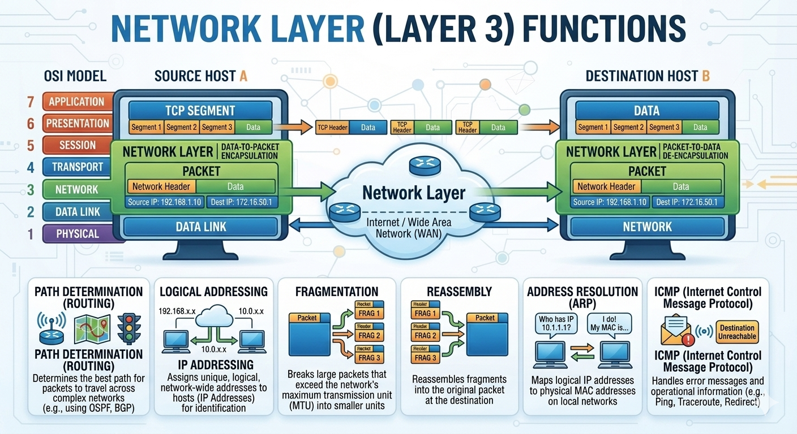
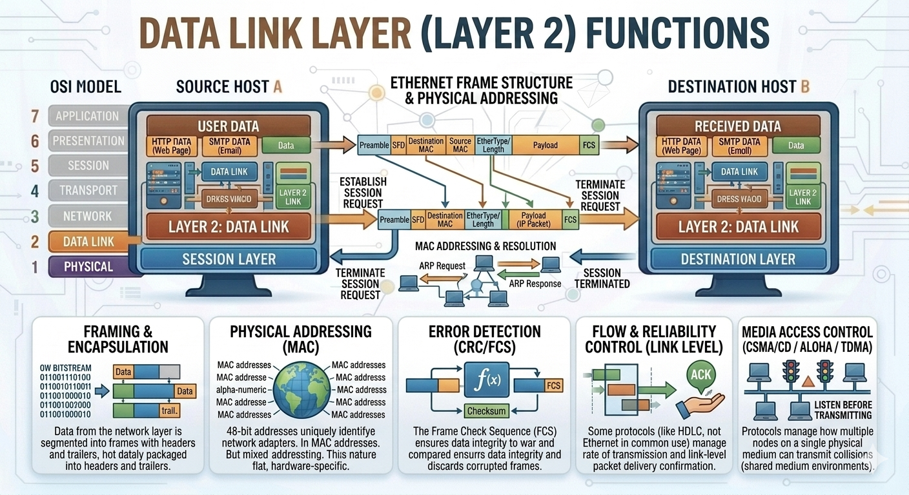
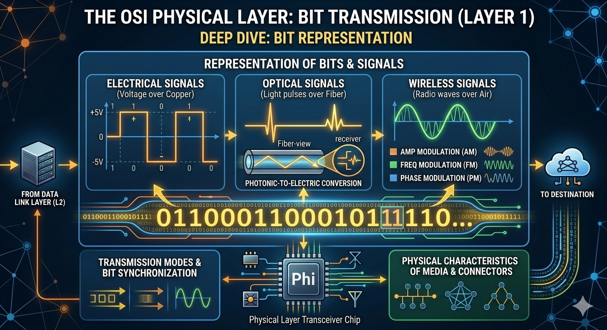

# The OSI 7-Layer Model

This repository covers the **OSI (Open Systems Interconnection) Model**, its 7 layers, and a detailed breakdown of the functions performed at each layer.

## 🌐 OSI Model Overview

The OSI model divides network communication into 7 layers, split into **Host Layers** (Application, Presentation, Session, Transport) and **Media Layers** (Network, Data Link, Physical), each working with a different data unit.


| Layer | Name | Data Unit | Function |
|---|---|---|---|
| 7 | Application | Data | Network process to application |
| 6 | Presentation | Data | Data representation & encryption |
| 5 | Session | Data | Interhost communication |
| 4 | Transport | Segments | End-to-end connections and reliability |
| 3 | Network | Packets | Path determination & logical addressing (IP) |
| 2 | Data Link | Frames | Physical addressing (MAC & LLC) |
| 1 | Physical | Bits | Media, signal, and binary transmission |

A quick-reference summary of what each layer is responsible for:

| # | Layer | Description |
|---|---|---|
| 7 | Application Layer | Human-computer interaction layer, where applications can access the network services |
| 6 | Presentation Layer | Ensures that data is in a usable format and is where data encryption occurs |
| 5 | Session Layer | Maintains connections and is responsible for controlling ports and sessions |
| 4 | Transport Layer | Transmits data using transmission protocols including TCP and UDP |
| 3 | Network Layer | Decides which physical path the data will take |
| 2 | Data Link Layer | Defines the format of data on the network |
| 1 | Physical Layer | Transmits raw bit stream over the physical medium |

---

## 7️⃣ Layer 7 — Application Layer

The Application layer is where **users** communicate with the computer, acting as the interface between application programs (e.g., Internet Explorer, Outlook) and the network. Applications themselves don't reside *in* the layer — they interface *with* application-layer protocols (e.g., a browser interfacing with HTTP).





Key functions:
- **User Interfaces** – Direct user interaction via GUIs or CLIs for sending/receiving data.
- **Network Services Access (e.g., DNS)** – Access to services like the Domain Name System, resolving names (e.g., google.com) to IP addresses.
- **Data Translation & Serialization** – Converts application data into structured, machine-readable formats (JSON, XML, binary) for transmission.
- **Resource Identification & Locators** – Parses/generates URIs, URLs, and email addresses to locate resources.
- **Connection Management (App-Level)** – Manages application-specific sessions: authentication (login/logout), access control, heartbeats.
- **Application Error Handling** – Interprets and manages application-specific error codes (e.g., HTTP 404, SMTP 550).

---

## 6️⃣ Layer 6 — Presentation Layer

The Presentation layer ensures data is in a usable format for the receiving application, and is where **encryption/decryption** typically occurs.



Key functions:
- **Data Encoding & Translation** – Converts between internal formats (e.g., EBCDIC, ASCII, Unicode) and a standard network format.
- **Data Compression & Decompression** – Applies algorithms (e.g., GZIP, JPEG, MP3) to reduce data size for efficient transmission, and reverses the process.
- **Data Encryption & Decryption** – Secures data (e.g., SSL/TLS) before transmission and decrypts it on receipt.
- **Syntax & Structure Definition** – Defines the abstract syntax of data elements (e.g., ASN.1) so sender and receiver interpret data types consistently.
- **Media Type Handling (MIME/Content-Type)** – Identifies data types/formats (HTML, JPG, PDF) so the correct application-layer service processes the payload.

---

## 5️⃣ Layer 5 — Session Layer

The Session layer establishes, maintains, and tears down logical connections ("sessions") between applications, and controls which side can transmit at a given time.



Key functions:
- **Session Establishment, Maintenance & Termination** – Sets up, tracks, and gracefully tears down connections between applications.
- **Dialog Control (Simplex/Duplex)** – Manages who speaks when (control flow), preventing data collisions in non-duplex connections.
- **Token Management** – Controls which application has the right to perform a specific action (e.g., transmitting data) at a given time.
- **Synchronization & Checkpointing** – Places checkpoints into the data stream, enabling resynchronization and recovery from failure points.
- **Session Recovery & Re-establishment** – Rebuilds a lost session using checkpoints and saved state information, minimizing data loss.

---

## 4️⃣ Layer 4 — Transport Layer

The Transport layer provides end-to-end, process-to-process communication (via port numbers), breaking data into segments and ensuring reliable delivery.



Key functions:
- **End-to-End Communication** – Process-to-process delivery using port numbers (e.g., HTTP:80, FTP:21).
- **Segmentation & Reassembly** – Divides large data into smaller segments and reassembles them at the receiver.
- **Connection Control** – Establishes, maintains, and terminates connections (e.g., TCP 3-way handshake: SYN, SYN-ACK, ACK).
- **Flow Control** – Regulates data transfer speed to prevent receiver buffer overflow (windowing).
- **Error Control** – Ensures error-free delivery; detects corruption (checksums) and retransmits (ARQ).
- **Multiplexing/Demultiplexing** – Manages multiple applications simultaneously sharing a single network link.

---

## 3️⃣ Layer 3 — Network Layer

The Network layer handles logical addressing and determines the best path for packets to travel from source to destination across interconnected networks.



Key functions:
- **Path Determination (Routing)** – Determines the best path for packets across complex networks (e.g., using OSPF, BGP).
- **Logical Addressing (IP Addressing)** – Assigns unique, logical, network-wide addresses to hosts for identification.
- **Fragmentation** – Breaks large packets that exceed the network's Maximum Transmission Unit (MTU) into smaller units.
- **Reassembly** – Reassembles fragments into the original packet at the destination.
- **Address Resolution (ARP)** – Maps logical IP addresses to physical MAC addresses on local networks.
- **ICMP (Internet Control Message Protocol)** – Handles error messages and operational information (e.g., Ping, Traceroute, Destination Unreachable).

---

## 2️⃣ Layer 2 — Data Link Layer

The Data Link layer handles framing, physical (MAC) addressing, and reliable node-to-node delivery over a shared physical medium.



Key functions:
- **Framing & Encapsulation** – Segments data from the network layer into frames with headers and trailers.
- **Physical Addressing (MAC)** – Uses 48-bit MAC addresses to uniquely identify network adapters.
- **Error Detection (CRC/FCS)** – The Frame Check Sequence (FCS) ensures data integrity; corrupted frames are discarded.
- **Flow & Reliability Control (Link Level)** – Some protocols (e.g., HDLC) manage rate of transmission and link-level delivery confirmation.
- **Media Access Control (CSMA/CD / ALOHA / TDMA)** – Manages how multiple nodes on a shared medium take turns transmitting, avoiding collisions ("listen before transmitting").

---

## 1️⃣ Layer 1 — Physical Layer

The Physical layer transmits the raw bitstream as actual signals — electrical, optical, or wireless — over the physical medium.



Key functions:
- **Electrical Signals (Voltage over Copper)** – Represents bits as voltage levels (e.g., +5V/-5V) on copper cabling.
- **Optical Signals (Light Pulses over Fiber)** – Represents bits as light pulses, converted photonic-to-electric at the receiver.
- **Wireless Signals (Radio Waves over Air)** – Represents bits using modulation techniques: AM (Amplitude), FM (Frequency), PM (Phase).
- **Transmission Modes & Bit Synchronization** – Coordinates timing so sender and receiver interpret the bitstream correctly.
- **Physical Characteristics of Media & Connectors** – Covers physical topology and connector/media properties (bus, mesh, tree, etc.).

---

## 📁 Repository Structure

```
.
├── README.md
├── OSI-7-layers.jpg
├── application-layer.png
├── Application-layer.jpg
├── presentation-layer.png
├── session-layer.png
├── transport-layer.png
├── network-layer.png
├── Data-link-layer.png
└── physical-layer.png
```
