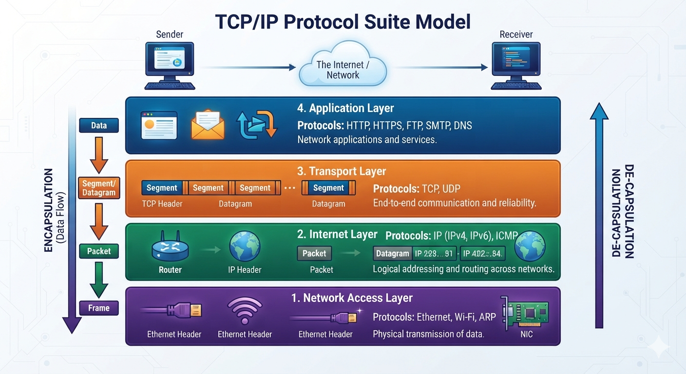

# TCP/IP Protocol Suite Model

A visual overview of the **TCP/IP Protocol Suite**, its 4 layers, the encapsulation/de-encapsulation process, and the data unit at each layer as data travels from sender to receiver over the internet/network.



---

## 🔄 Encapsulation & De-encapsulation

As data flows down the stack on the **sender's** side, it is progressively wrapped (**encapsulated**) into different data units:

```
Data → Segment/Datagram → Packet → Frame
```

On the **receiver's** side, the process runs in reverse (**de-encapsulation**), stripping headers back off as data flows up the stack from Frame → Packet → Segment/Datagram → Data.

---

## 4️⃣ Application Layer

- **Protocols:** HTTP, HTTPS, FTP, SMTP, DNS
- Provides network applications and services (e.g., web browsing, email, file transfer, name resolution) directly to the user.

## 3️⃣ Transport Layer

- **Protocols:** TCP, UDP
- Handles end-to-end communication and reliability.
- Breaks data into **segments** (TCP) or **datagrams** (UDP), each carrying a **TCP header** for tracking and delivery.

## 2️⃣ Internet Layer

- **Protocols:** IP (IPv4, IPv6), ICMP
- Handles logical addressing and routing across networks.
- Wraps segments/datagrams into **packets**, adding an **IP header** with source and destination IP addresses (e.g., `223.x.x.91` → `402.x.x.84`) so routers can forward them correctly.

## 1️⃣ Network Access Layer

- **Protocols:** Ethernet, Wi-Fi, ARP
- Handles the physical transmission of data over the local network medium (wired or wireless).
- Wraps packets into **frames**, adding an **Ethernet header**, and transmits them via the **NIC (Network Interface Card)**.

---

## 📊 TCP/IP vs OSI (Quick Reference)

| TCP/IP Layer | Roughly Maps to OSI Layer(s) |
|---|---|
| Application | Application, Presentation, Session |
| Transport | Transport |
| Internet | Network |
| Network Access | Data Link, Physical |

---

## 📁 Repository Structure

```
.
├── README.md
└── tcp-ip.png
```
