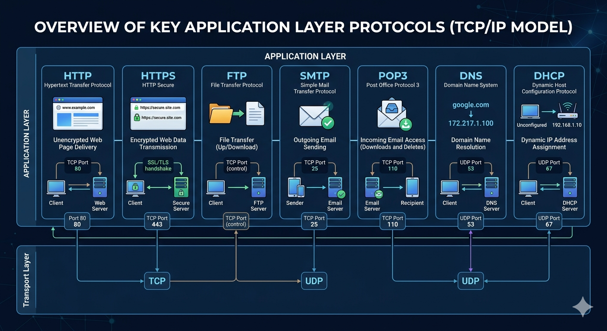

# Overview of Key Application Layer Protocols (TCP/IP Model)

A visual overview of the most common **Application Layer** protocols in the TCP/IP model, showing what each protocol does, which port(s) it uses, and whether it rides on **TCP** or **UDP** at the Transport Layer.



---

## 🌐 HTTP — Hypertext Transfer Protocol

- **Function:** Unencrypted web page delivery.
- **Transport:** TCP, **Port 80**
- Client and web server exchange plain-text web page requests/responses.

## 🔒 HTTPS — HTTP Secure

- **Function:** Encrypted web data transmission.
- **Transport:** TCP, **Port 443**
- Client and secure server perform an **SSL/TLS handshake** before exchanging encrypted data.

## 📁 FTP — File Transfer Protocol

- **Function:** File transfer (upload/download) between client and FTP server.
- **Transport:** TCP, **control connection** (commands are sent over TCP; a separate connection handles the actual data transfer).

## 📤 SMTP — Simple Mail Transfer Protocol

- **Function:** Outgoing email sending, from sender to email server.
- **Transport:** TCP, **Port 25**

## 📥 POP3 — Post Office Protocol 3

- **Function:** Incoming email access — downloads and deletes messages from the email server to the recipient.
- **Transport:** TCP, **Port 110**

## 🧭 DNS — Domain Name System

- **Function:** Domain name resolution — translates human-readable domain names into IP addresses (e.g., `google.com` → `172.217.1.100`).
- **Transport:** UDP, **Port 53**

## 🔧 DHCP — Dynamic Host Configuration Protocol

- **Function:** Dynamic IP address assignment — automatically assigns an IP address to a client (e.g., an unconfigured device receiving `192.168.1.10` from the DHCP server).
- **Transport:** UDP, **Port 67**

---

## 📊 Protocol / Port / Transport Quick Reference

| Protocol | Purpose | Port | Transport Layer Protocol |
|---|---|---|---|
| HTTP | Unencrypted web page delivery | 80 | TCP |
| HTTPS | Encrypted web page delivery | 443 | TCP |
| FTP | File transfer | Control connection | TCP |
| SMTP | Sending outgoing email | 25 | TCP |
| POP3 | Retrieving incoming email | 110 | TCP |
| DNS | Domain name resolution | 53 | UDP |
| DHCP | Dynamic IP address assignment | 67 | UDP |

---

## 📁 Repository Structure

```
.
├── README.md
└── application-protocols.png
```
