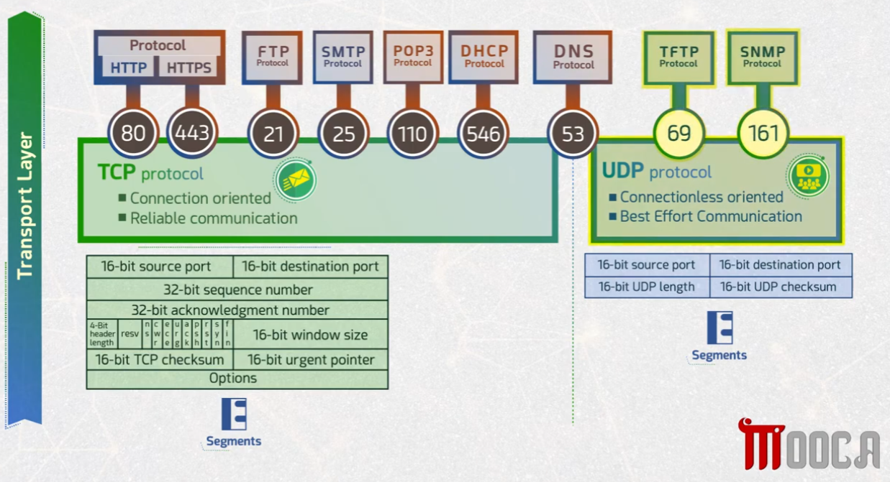
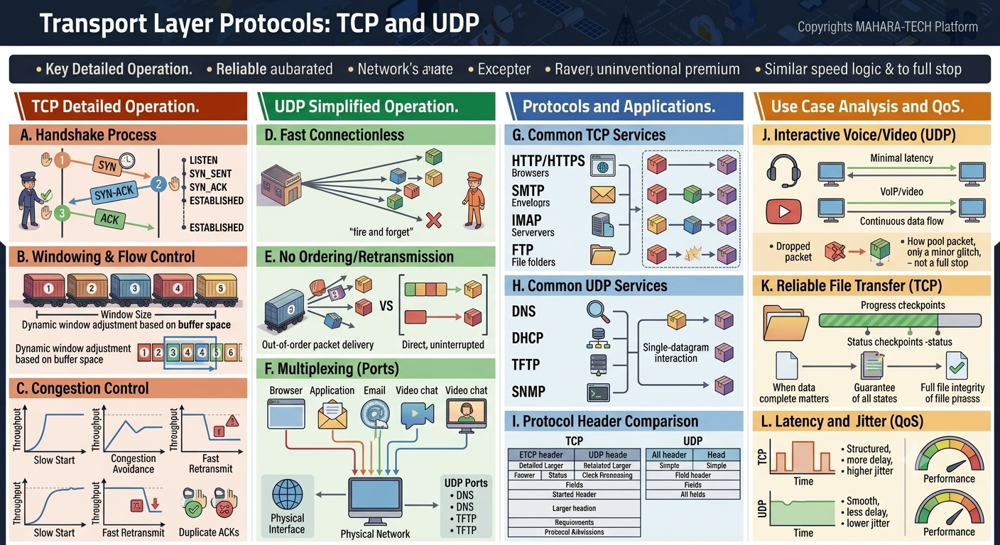

# Transport Layer Protocols: TCP and UDP

This repository covers the **Transport Layer**, focusing on the two core protocols — **TCP** and **UDP** — their well-known ports, header structures, detailed operation, and when to use each.

## 🔌 1. Well-Known Ports & Header Structure

Application layer protocols are mapped to well-known ports, and carried inside either a **TCP** or **UDP** header depending on whether they need reliable, connection-oriented delivery or fast, connectionless delivery.



**TCP protocol** — connection-oriented, reliable communication
| Protocol | Port |
|---|---|
| HTTP | 80 |
| HTTPS | 443 |
| FTP | 21 |
| SMTP | 25 |
| POP3 | 110 |
| DHCP | 546 |
| DNS | 53 |

TCP header fields include: 16-bit source/destination port, 32-bit sequence number, 32-bit acknowledgment number, flags (URG, ACK, PSH, RST, SYN, FIN, etc.), 16-bit window size, 16-bit checksum, urgent pointer, and options.

**UDP protocol** — connectionless-oriented, best-effort communication
| Protocol | Port |
|---|---|
| TFTP | 69 |
| SNMP | 161 |

UDP header fields are much simpler: 16-bit source/destination port, 16-bit UDP length, and 16-bit UDP checksum — no sequencing, acknowledgment, or window fields.

Both TCP and UDP wrap data into **segments** before handing them to the Network layer.

---

## ⚙️ 2. TCP Detailed Operation

TCP guarantees reliable, ordered delivery through several mechanisms:



- **A. Handshake Process** – TCP establishes a connection using the **3-way handshake**: `SYN → SYN-ACK → ACK`, moving through states like `LISTEN`, `SYN_SENT`, `SYN_RECEIVED`, and `ESTABLISHED`.
- **B. Windowing & Flow Control** – Uses a dynamic **window size** that adjusts based on receiver buffer space, controlling how much data can be sent before requiring acknowledgment.
- **C. Congestion Control** – Manages network load using phases like **Slow Start**, **Congestion Avoidance**, and **Fast Retransmit**, reacting to signs of congestion (e.g., duplicate ACKs) by adjusting throughput.

## 🚀 3. UDP Simplified Operation

UDP trades reliability for speed and simplicity:

- **D. Fast Connectionless** – Sends data in a "fire and forget" manner, without first establishing a connection.
- **E. No Ordering/Retransmission** – Packets may arrive out of order, and lost packets are not automatically retransmitted (unlike TCP's ordered, direct delivery).
- **F. Multiplexing (Ports)** – Multiple applications (browser, email, video chat, etc.) share the same physical network interface, distinguished by different **UDP ports** (e.g., DNS, DHCP, TFTP).

## 📋 4. Protocols and Applications

- **Common TCP Services** – HTTP/HTTPS (browsers), SMTP (email), IMAP (mail servers), FTP (file transfer) — all benefit from TCP's ordered, acknowledged delivery.
- **Common UDP Services** – DNS, DHCP, TFTP, SNMP — favor UDP's low-overhead, single-datagram interactions.
- **Protocol Header Comparison** – TCP headers are larger and more detailed (sequence/ack numbers, flags, window size), while UDP headers are minimal (just ports, length, and checksum).

## 📈 5. Use Case Analysis and QoS

- **Interactive Voice/Video (UDP)** – Prioritizes minimal latency and continuous data flow; a dropped packet causes a minor glitch rather than a full stop, which suits real-time VoIP/video.
- **Reliable File Transfer (TCP)** – Prioritizes guaranteed delivery and full file integrity using progress/status checkpoints — essential when data completeness matters.
- **Latency and Jitter (QoS)** – TCP traffic tends to be more structured but can have higher delay/jitter due to retransmissions and ordering; UDP traffic is smoother with lower delay and jitter, at the cost of reliability.

---

## 📊 TCP vs UDP Quick Comparison

| | TCP | UDP |
|---|---|---|
| Connection | Connection-oriented (handshake) | Connectionless |
| Reliability | Reliable, ordered, acknowledged | Best-effort, no guarantee |
| Speed | Slower (overhead of reliability) | Faster (minimal overhead) |
| Header size | Larger, more fields | Smaller, simpler |
| Typical use | Web, email, file transfer | DNS, streaming, VoIP, SNMP |

---

## 📁 Repository Structure

```
.
├── README.md
├── packets-and-ports.png
└── tcp-udp.png
```
