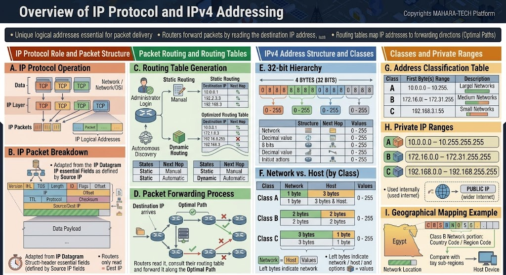

# Overview of IP Protocol and IPv4 Addressing

A visual overview of the **IP Protocol**, how packets are structured and routed, and the structure of **IPv4 addressing**, including address classes and private IP ranges.



Key ideas:
- Unique logical addresses are essential for packet delivery.
- Routers forward packets by reading the destination IP address.
- Routing tables map IP addresses to forwarding directions (optimal paths).

---

## 📦 A. IP Protocol Operation

- Data arrives from the upper layers (e.g., TCP) as multiple TCP segments.
- The **IP layer** wraps each segment into an **IP packet**, adding IP logical addresses (source and destination).
- Packets are then handed down to be transmitted across the network.

## 🧱 B. IP Packet Breakdown

The IP packet (IP Datagram) is made up of a header followed by the data payload. Key header fields include:
- **Version**, **IHL** (Internet Header Length), **TOS** (Type of Service), **Total Length**
- **ID**, **Flags**, **Fragment Offset**
- **TTL** (Time to Live), **Protocol**, **Header Checksum**
- **Source IP address**, **Destination IP address**
- **Data Payload**

---

## 🗺️ C. Routing Table Generation

Routers build **routing tables** that map destination networks to the "next hop" needed to reach them. Routing tables can be generated via:

- **Static Routing** – Manually configured by an administrator, entering fixed destination IP → next hop mappings.
- **Dynamic Routing** – Automatically discovered between routers (autonomous discovery), continuously updating routes as the network changes.

| | Next Hop Determined By |
|---|---|
| Static Routing | Manual |
| Dynamic Routing | Automatic |

## 🔁 D. Packet Forwarding Process

When a packet destined for a certain IP address arrives at a router:
1. The router reads the destination IP address.
2. It consults its routing table.
3. It forwards the packet along the **optimal path** toward its destination.

Routers only read the **destination IP (Dest IP)** to make this forwarding decision — they don't need to inspect the full payload.

---

## 🔢 E. IPv4 Address Structure (32-bit Hierarchy)

An IPv4 address is **32 bits**, divided into **4 bytes (octets)**, each ranging from **0–255** in decimal.

```
Byte 1 . Byte 2 . Byte 3 . Byte 4
 8 bits   8 bits   8 bits   8 bits   =  32 bits total
0-255    0-255    0-255    0-255
```

## 🏠 F. Network vs. Host Portion (by Class)

Each IPv4 address is split into a **Network** portion and a **Host** portion, and the split point depends on the address **class**:

| Class | Network Portion | Host Portion |
|---|---|---|
| Class A | 1 byte | 3 bytes |
| Class B | 2 bytes | 2 bytes |
| Class C | 3 bytes | 1 byte |

- The **left** bytes identify the network.
- The **right** bytes identify the specific host on that network.

---

## 🗂️ G. Address Classification Table

| Class | First Octet Range | Typical Use |
|---|---|---|
| Class A | 1 – 126 | Large networks (few networks, many hosts) |
| Class B | 128 – 191 | Medium networks |
| Class C | 192 – 223 | Small networks (many networks, few hosts each) |

## 🔒 H. Private IP Ranges

Reserved ranges for internal (private) networks, not routable on the public internet:

| Class | Private Range |
|---|---|
| A | 10.0.0.0 – 10.255.255.255 |
| B | 172.16.0.0 – 172.31.255.255 |
| C | 192.168.0.0 – 192.168.255.255 |

- Private IPs are used **internally**, while a **Public IP** is required to communicate with the wider internet.

## 🌍 I. Geographical Mapping Example

Just like IP addressing splits a network hierarchically, geographical/administrative structures can be mapped similarly — e.g., a Class B-style network portion could represent a country/region code, with the host portion representing sub-regions or end devices (illustrated with an example region and its sub-divisions down to individual host devices).

---

## 📁 Repository Structure

```
.
├── README.md
└── IP-protocol.jpg
```
