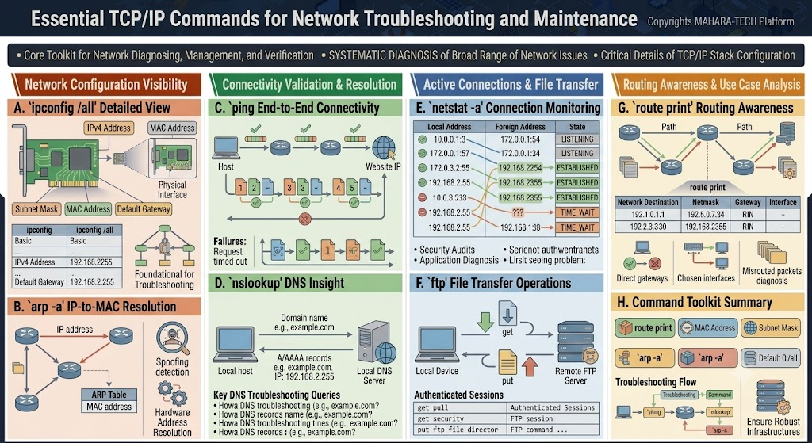

# Essential TCP/IP Commands for Network Troubleshooting and Maintenance

A visual reference covering the core command-line toolkit used for diagnosing, managing, and verifying TCP/IP networks.



Core themes:
- A core toolkit for network diagnosing, management, and verification.
- Systematic diagnosis of a broad range of network issues.
- Critical details of TCP/IP stack configuration.

---

## 🖧 A. `ipconfig /all` — Detailed View

- Shows detailed network configuration for a host, including **IPv4 address**, **MAC address**, **subnet mask**, and **default gateway**.
- `ipconfig` (basic) shows a summary; `ipconfig /all` shows the full detailed view, including physical interface information.
- Considered foundational for troubleshooting — it's usually the first command run to confirm a device's own network configuration.

| Command | Shows |
|---|---|
| `ipconfig` | Basic: IPv4 address, default gateway |
| `ipconfig /all` | Detailed: IPv4 address, MAC address, subnet mask, default gateway |

## 🔗 B. `arp -a` — IP-to-MAC Resolution

- Displays the **ARP table**, mapping known IP addresses to their corresponding **MAC addresses** on the local network.
- Useful for verifying hardware address resolution and detecting **ARP spoofing** (when an IP appears mapped to an unexpected MAC address).

---

## 📶 C. `ping` — End-to-End Connectivity

- Tests basic connectivity between a host and a destination (e.g., a website IP) by sending a sequence of test packets and checking for replies.
- A successful ping shows replies for each packet; a failure typically shows **"Request timed out"**, indicating the destination is unreachable or not responding.

## 🌐 D. `nslookup` — DNS Insight

- Queries DNS servers to resolve a **domain name** (e.g., `example.com`) to its corresponding **A/AAAA record** (IP address, e.g., `192.168.2.255`), via the local DNS server.
- Common DNS troubleshooting queries include checking:
  - Whether a domain resolves at all (e.g., `example.com`)
  - The DNS record name for a domain
  - The DNS record's TTL (time to live)
  - The full set of DNS records for a domain

---

## 📡 E. `netstat -a` — Connection Monitoring

- Lists active network connections, showing **Local Address**, **Foreign Address**, and connection **State** (e.g., `LISTENING`, `ESTABLISHED`, `TIME_WAIT`).
- Useful for:
  - **Security audits** – spotting unexpected or suspicious connections.
  - **Application diagnosis** – confirming whether an application's connections are properly established or stuck.

Example connection states:

| Local Address | Foreign Address | State |
|---|---|---|
| 10.0.1.3 | 172.0.0.154 | LISTENING |
| 192.168.2.55 | 192.168.2.254 | ESTABLISHED |
| 192.168.2.55 | 192.168.138 | TIME_WAIT |

## 📁 F. `ftp` — File Transfer Operations

- Establishes an **authenticated session** with a remote FTP server to transfer files between a local device and a remote FTP server.
- Core commands:
  - `get` – Download a file from the remote server to the local device.
  - `put` – Upload a file from the local device to the remote server.

| Command | Purpose |
|---|---|
| `get` | Retrieve a file from the FTP server |
| `put` | Send a file to the FTP server |

---

## 🛣️ G. `route print` — Routing Awareness

- Displays the local **routing table**, showing how the device forwards traffic across the network via one or more paths.
- Table typically includes: **Network Destination**, **Netmask**, **Gateway**, and **Interface**.
- Useful for diagnosing:
  - Whether the correct gateway/interface is being used for a given destination.
  - **Misrouted packets** — traffic being sent via an unexpected or incorrect path.

## 🧰 H. Command Toolkit Summary

| Command | Purpose |
|---|---|
| `ipconfig /all` | View detailed local network configuration |
| `arp -a` | View IP-to-MAC address mappings |
| `ping` | Test end-to-end connectivity |
| `nslookup` | Query DNS records for a domain |
| `netstat -a` | View active connections and their states |
| `ftp` (get/put) | Transfer files to/from a remote server |
| `route print` | View the local routing table |

A typical troubleshooting flow moves from checking local configuration (`ipconfig`) → testing connectivity (`ping`) → resolving names (`nslookup`) → inspecting active connections (`netstat`) → checking routing (`route print`), helping ensure robust, healthy network infrastructure.

---

## 📁 Repository Structure

```
.
├── README.md
└── tcp-ip-commands.jpg
```
