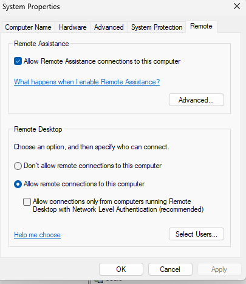
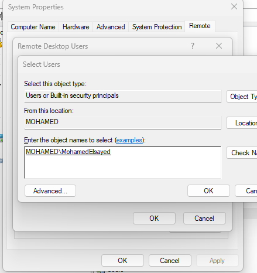
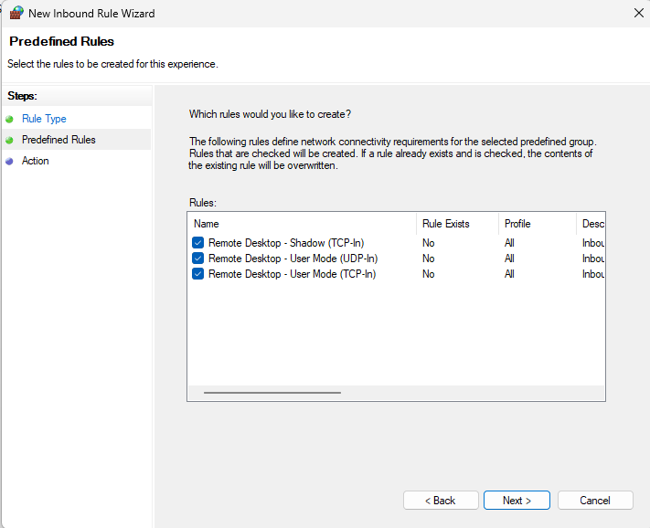
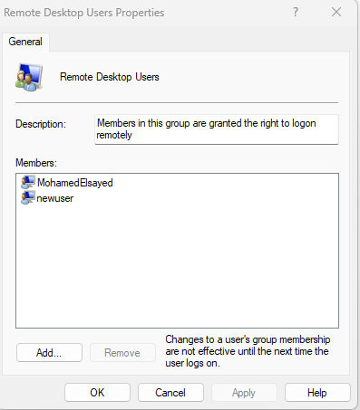
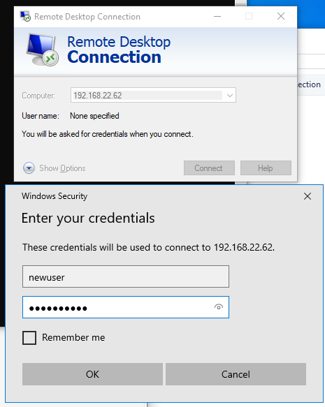

# Enabling and Configuring Remote Desktop (RDP) on Windows

A step-by-step walkthrough of enabling **Remote Desktop Protocol (RDP)** on a Windows machine, granting specific users access, allowing RDP through the firewall, and connecting from a remote client.

---

## 1️⃣ Enable Remote Desktop

In **System Properties → Remote**, select **"Allow remote connections to this computer"** to enable RDP on the local machine.



- **Remote Assistance** can also be enabled separately, allowing others to view/assist with the desktop.
- Optionally check **"Allow connections only from computers running Remote Desktop with Network Level Authentication (recommended)"** for stronger security.
- Click **Select Users...** to choose which accounts are allowed to connect remotely.

## 2️⃣ Add Users to the Remote Desktop Users Group

Use **Select Users** to add specific accounts (beyond the built-in Administrator) that should be allowed to connect via RDP.



- Enter the object name in the format `DOMAIN\Username` or `COMPUTERNAME\Username` (e.g., `MOHAMED\MohamedElsayed`).
- Use **Check Names** to validate the entry, then click **OK** to add the user.

## 3️⃣ Allow RDP Through the Windows Firewall (Port 3389)

In **Windows Firewall with Advanced Security → New Inbound Rule Wizard**, select the predefined **Remote Desktop** rules to open the necessary ports (RDP uses **TCP port 3389**).



Predefined rules typically enabled:
- **Remote Desktop – Shadow (TCP-In)**
- **Remote Desktop – User Mode (UDP-In)**
- **Remote Desktop – User Mode (TCP-In)**

## 4️⃣ Verify Remote Desktop Users Group Membership

Check the **Remote Desktop Users** local group to confirm which accounts are granted the right to log on remotely.



- Members shown here (e.g., `MohamedElsayed`, `newuser`) are permitted to connect via RDP.
- Note: changes to group membership only take effect the next time the user logs on.
- Use **Add...** / **Remove** to manage membership further.

## 5️⃣ Connect via Remote Desktop Connection

From the client machine, open **Remote Desktop Connection**, enter the target computer's IP address, and authenticate with a permitted user account.



- Enter the target machine's IP (e.g., `192.168.22.62`) in the **Computer** field.
- When prompted, enter valid credentials (e.g., `newuser` and password) for an account that is a member of the **Remote Desktop Users** group.
- Click **OK** to establish the remote session.

---

## ✅ Summary Checklist

- [ ] Enable "Allow remote connections to this computer" on the host.
- [ ] Add the desired user account(s) to the Remote Desktop Users group.
- [ ] Ensure the firewall allows Remote Desktop traffic (TCP/UDP port 3389).
- [ ] Confirm group membership includes the intended users.
- [ ] Connect from a remote client using the host's IP address and valid credentials.

---

## 📁 Repository Structure

```
.
├── README.md
├── task1-rdp-enable.png
├── task2-add-users-to-rdp.png
├── task2-allow-rdp-on-firewall-port-3389.png
├── task3-rdp-users.png
└── task4-rdp-access.png
```
