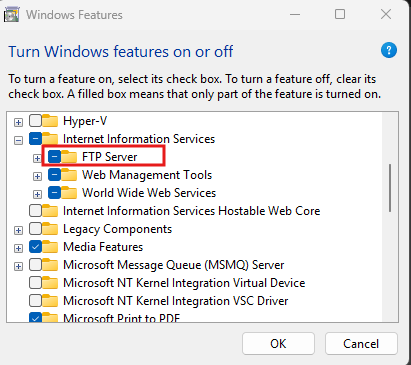
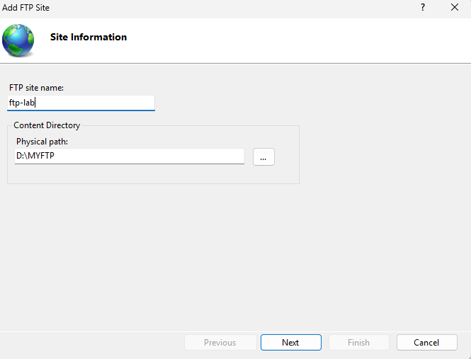
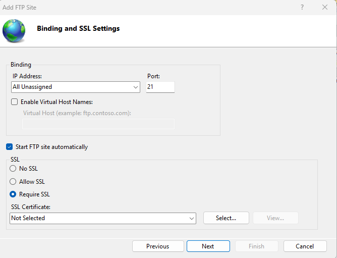
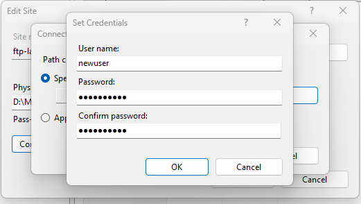
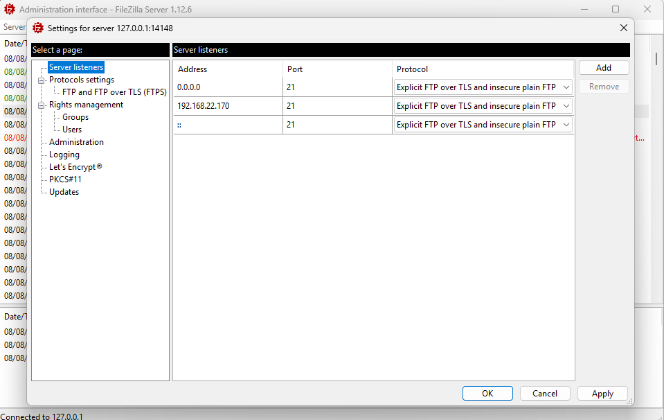
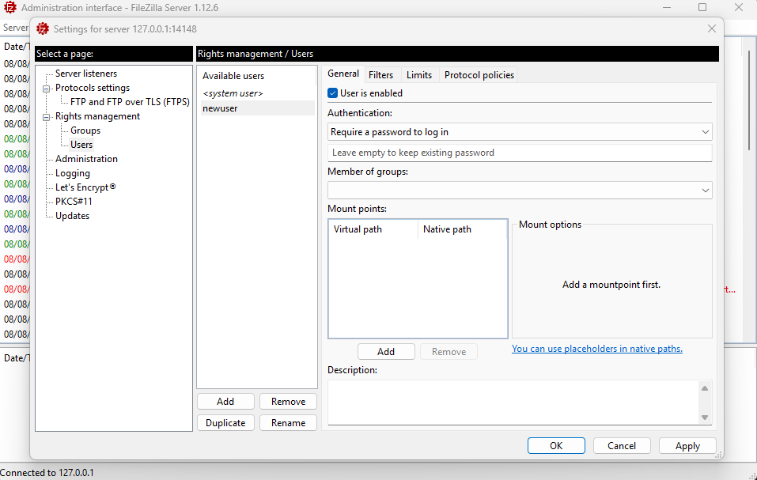
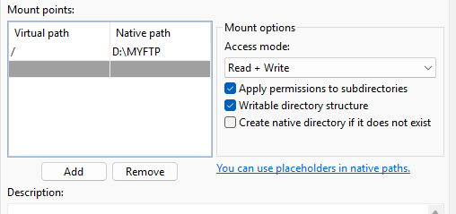
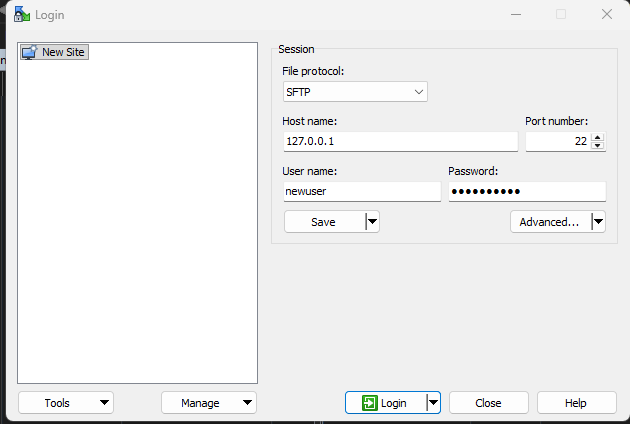
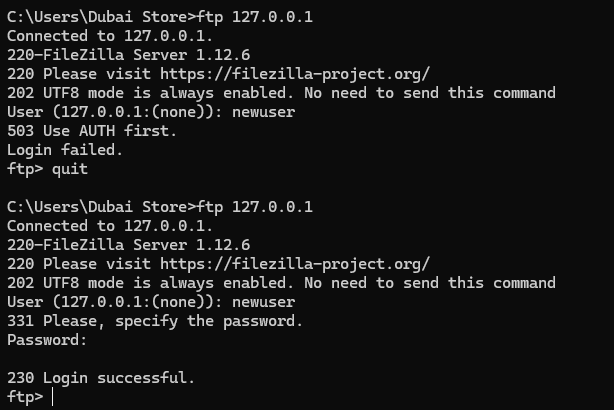

# Setting Up and Accessing an FTP Server (IIS & FileZilla Server)

A step-by-step walkthrough covering two ways to set up an FTP server on Windows — via **IIS FTP Server** and via **FileZilla Server** — followed by accessing the server from a client using an SFTP client and the Windows command line.

---

## 2️⃣ Turn On the FTP Server Feature (Windows Features)

Enable the **FTP Server** role under **Internet Information Services** in *Turn Windows features on or off*.



- Located under **Internet Information Services → FTP Server**.
- Click **OK** to install the feature.

## 3️⃣ Add an FTP Site (IIS)

Create a new FTP site in **IIS Manager**, giving it a name and pointing it to a physical content directory.



- **FTP site name:** e.g., `ftp-lab`
- **Physical path:** e.g., `D:\MYFTP`

## 4️⃣ Configure FTP Binding and SSL Settings

Set the IP address/port binding for the FTP site and configure its SSL requirements.



- **IP Address:** All Unassigned
- **Port:** 21
- **Start FTP site automatically:** enabled
- **SSL:** No SSL / Allow SSL / **Require SSL** (select based on security needs; requires an SSL certificate if enabled)

## 5️⃣ Set User Credentials (FTP Site / FileZilla)

Define the username and password used to authenticate against the FTP site.



- **User name:** e.g., `newuser`
- **Password / Confirm password:** set and confirmed for the account

## 6️⃣ FileZilla Server — Server Listeners

In the **FileZilla Server Administration interface**, configure the **Server listeners** — the addresses/ports the server listens on and which protocol is used.



- Listens on port **21** across addresses `0.0.0.0`, a specific interface (e.g., `192.168.22.170`), and `::` (IPv6).
- Protocol: **Explicit FTP over TLS and insecure plain FTP**.

## 7️⃣ FileZilla Server — Rights Management / Users

Configure individual FTP users, their authentication, and mount points under **Rights management → Users**.



- **Available users:** `<system user>`, `newuser`
- **User is enabled**, with **"Require a password to log in"**.
- **Mount points** must be added before access rights/paths can be configured (a mountpoint maps a virtual path to a native filesystem path).

## 8️⃣ Add a Virtual Path (Mount Point)

Map a **virtual path** to a **native path** on disk, along with access permissions.



- **Virtual path:** `/`
- **Native path:** `D:\MYFTP`
- **Access mode:** Read + Write
- Options: **Apply permissions to subdirectories**, **Writable directory structure**, optionally **Create native directory if it does not exist**.

## 9️⃣ Access the Server via an SFTP Client

Connect to the server from a client machine using an SFTP-capable client (e.g., WinSCP).



- **File protocol:** SFTP
- **Host name:** `127.0.0.1`
- **Port number:** 22
- **User name / Password:** `newuser` / (configured password)
- Click **Login** to connect.

## 🔟 Access the Server via the Command Line (`ftp`)

Connect to the FTP server directly from the Windows command line using the built-in `ftp` client.



```
C:\Users\Dubai Store>ftp 127.0.0.1
Connected to 127.0.0.1.
220-FileZilla Server 1.12.6
220 Please visit https://filezilla-project.org/
202 UTF8 mode is always enabled. No need to send this command
User (127.0.0.1:(none)): newuser
331 Please, specify the password.
Password:
230 Login successful.
ftp>
```

- A first attempt without specifying a password properly can fail with `503 Use AUTH first.` / `Login failed.`
- Providing the correct username and password results in `230 Login successful.`, dropping into the `ftp>` prompt for further commands (e.g., `get`, `put`, `ls`).

---

## ✅ Summary Checklist

- [ ] Enable the FTP Server Windows feature (IIS) — or install FileZilla Server as an alternative.
- [ ] Create an FTP site with a name and physical content directory.
- [ ] Configure IP/port binding and SSL requirements.
- [ ] Set up user credentials for FTP access.
- [ ] (FileZilla) Configure server listeners and user rights/mount points.
- [ ] Map a virtual path to a native path with the correct access permissions.
- [ ] Test access via an SFTP client and/or the `ftp` command line client.

---

## 📁 Repository Structure

```
.
├── README.md
├── task2-turn-ftp-feature.png
├── task3-add-ftp-site.png
├── task4-add-ftp-binding.png
├── task5-set-credentials.png
├── task6-filezilla-server-listeners.png
├── task7-filezilla-users.png
├── task8-add-virtual-path.png
├── task9-access-using-scp.png
└── task10-access-using-cmd.png
```
