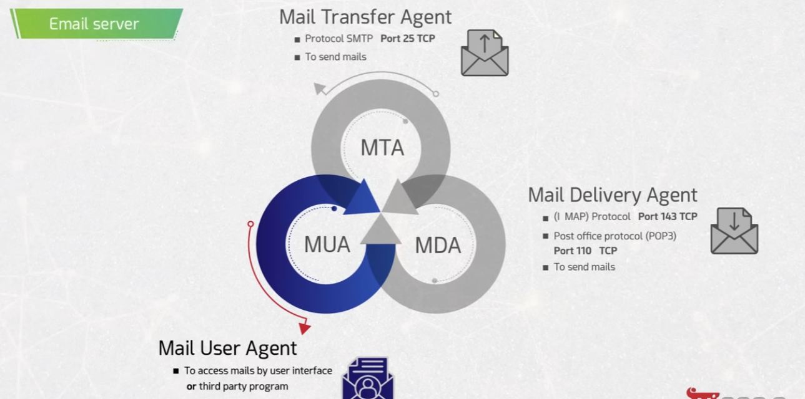
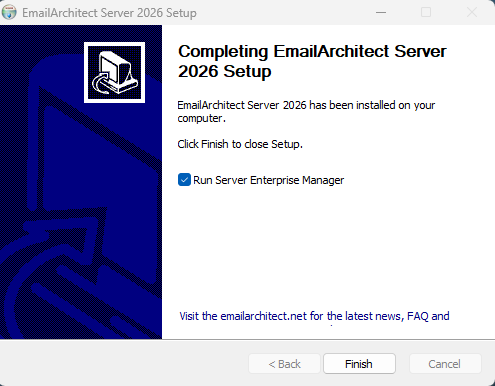
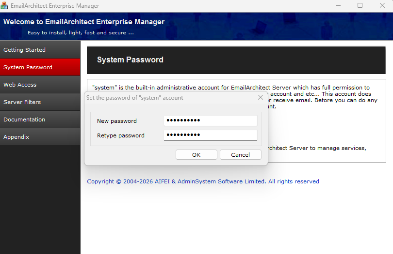
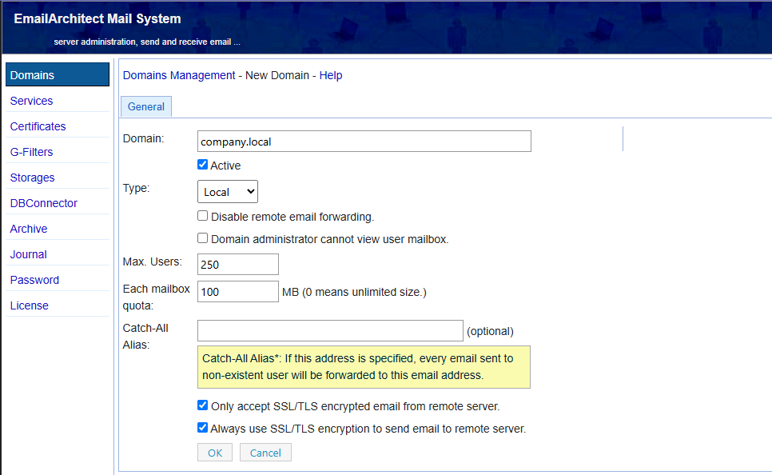
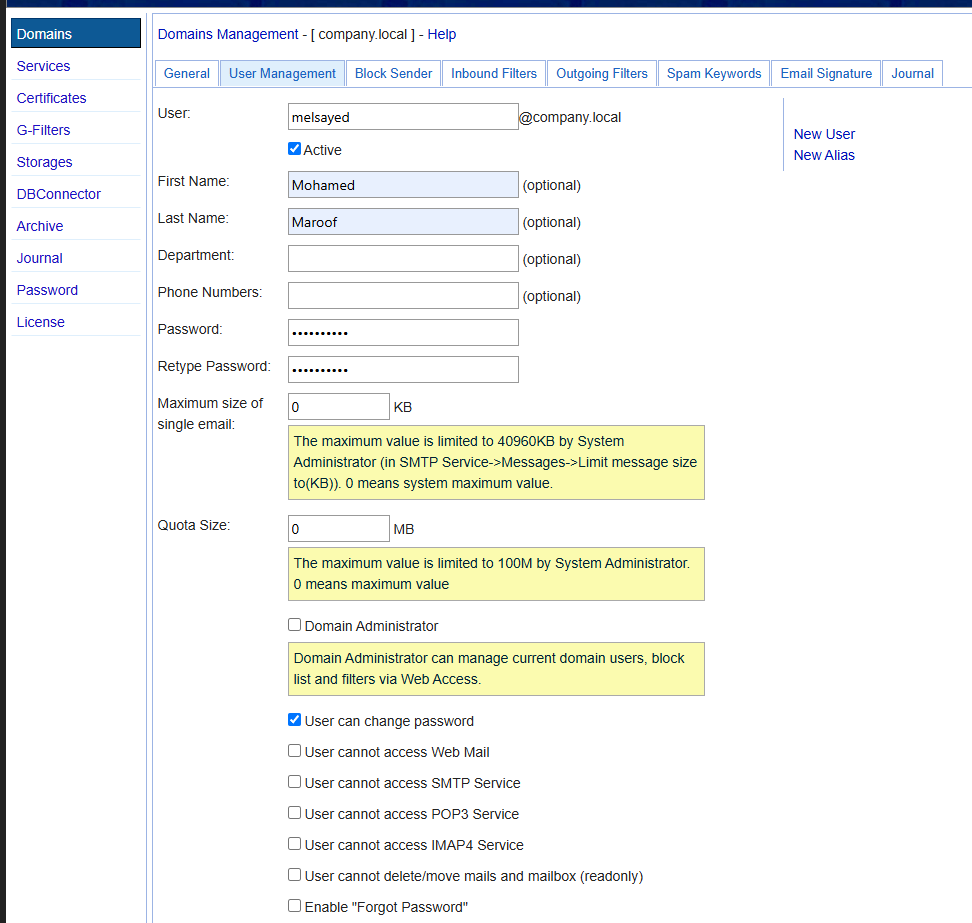
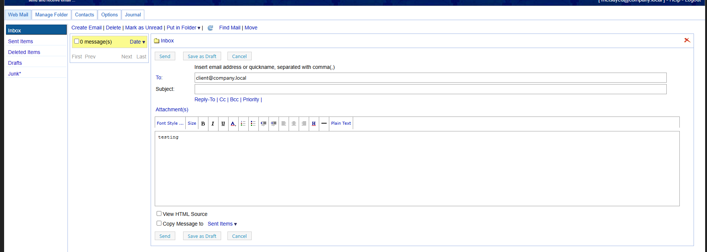
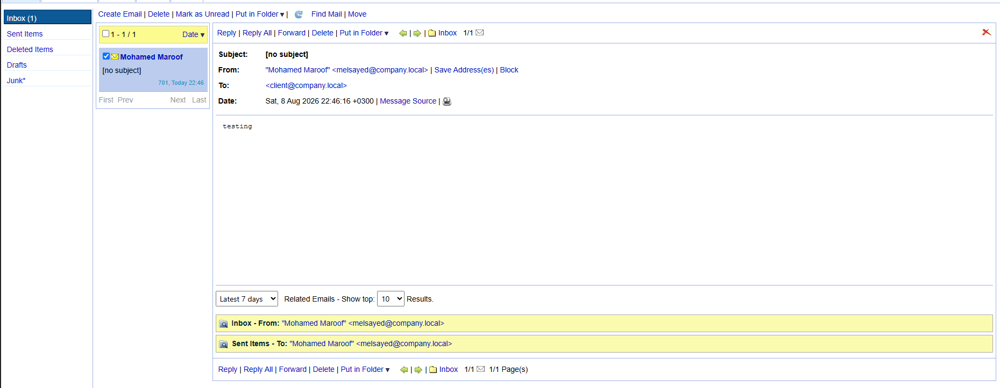

# Setting Up an Email Server (EmailArchitect Mail System)

A conceptual overview of how email servers work, followed by a step-by-step walkthrough of installing and configuring **EmailArchitect Server**, creating a domain and user, and sending/receiving a test email.

---

## 📧 Email Server Concepts

An email system is made up of several cooperating agents, each responsible for a different part of getting mail from sender to recipient.



- **MTA (Mail Transfer Agent)** – Uses **SMTP**, **Port 25 (TCP)**, to send mail between servers.
- **MDA (Mail Delivery Agent)** – Uses **IMAP (Port 143 TCP)** or **POP3 (Port 110 TCP)** to deliver mail into a recipient's mailbox.
- **MUA (Mail User Agent)** – The user interface (webmail or a third-party mail client) used to access mail.

---

## 1️⃣ Install the Mail Server Software

Run the **EmailArchitect Server** setup and complete the installation wizard.



- Once installation finishes, keep **"Run Server Enterprise Manager"** checked and click **Finish** to launch the management console.

## 2️⃣ Set the System Account Password

On first launch, set a password for the built-in **"system"** administrative account, which has full permissions to manage the server.



- Enter and confirm a **New password** for the `system` account, then click **OK**.
- This account is used to log into **Web Access** and manage the server going forward.

## 3️⃣ Create a New Domain

In the **Domains Management** section, create a new mail domain that will host user mailboxes.



- **Domain:** e.g., `company.local`
- **Type:** Local
- **Max. Users:** e.g., 250
- **Each mailbox quota:** e.g., 100 MB (0 = unlimited)
- Optional security settings: **Only accept SSL/TLS encrypted email from remote server**, **Always use SSL/TLS encryption to send email to remote server**.
- An optional **Catch-All Alias** can be set to forward mail sent to non-existent users.

## 4️⃣ Create a User Mailbox

Under the domain's **User Management** tab, create a new mailbox for a user.



- **User:** e.g., `melsayed@company.local`
- **First/Last Name:** e.g., Mohamed Maroof
- **Password / Retype Password:** set the mailbox password
- **Maximum size of single email** and **Quota Size** can be customized (0 = system maximum).
- Access controls available: allow/deny Web Mail, SMTP, POP3, IMAP4 access; allow the user to change their own password; enable/disable "Forgot Password".

## 5️⃣ Compose and Send a Test Email

Log into **Web Mail** as the new user and send a test email to another mailbox on the same domain.



- **To:** e.g., `client@company.local`
- Enter a subject and message body (e.g., "testing"), then click **Send**.

## 6️⃣ Confirm Email Delivery

Log into the recipient's mailbox to confirm the test email was delivered successfully.



- The message appears in the **Inbox**, showing the correct **From**, **To**, and **Date**, confirming the mail server is sending and delivering mail correctly between local mailboxes.

---

## ✅ Summary Checklist

- [ ] Understand the MTA / MDA / MUA roles in an email system.
- [ ] Install the mail server software (e.g., EmailArchitect Server).
- [ ] Set the system administrator account password.
- [ ] Create a mail domain (e.g., `company.local`).
- [ ] Create one or more user mailboxes under the domain.
- [ ] Send a test email between two mailboxes.
- [ ] Confirm the email was delivered to the recipient's inbox.

---

## 📁 Repository Structure

```
.
├── README.md
├── email-server.png
├── install-email-architect.png
├── set-system-password.png
├── create-new-domain.png
├── create-user.png
├── create-mail.png
└── email-delivered.png
```
