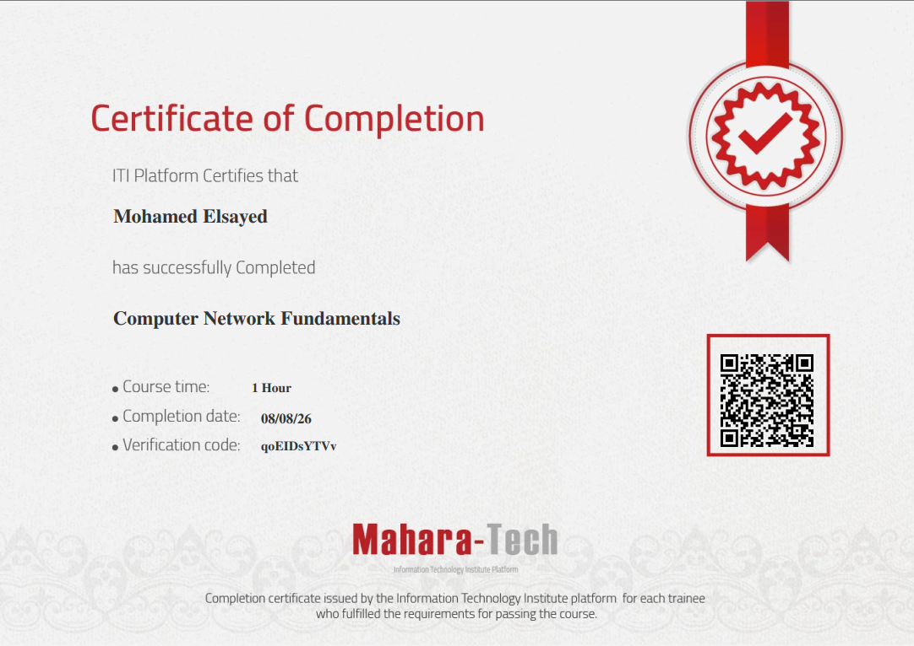

# Computer Network Fundamentals

A complete course repository covering computer networking fundamentals — from core concepts and the OSI/TCP-IP models through hands-on labs for DHCP, DNS, Remote Desktop, FTP, and Email server setup.

Issued by the **Information Technology Institute (ITI) Platform** via **Mahara-Tech**.



---

## 📚 Course Modules

### Chapter 1 — Introduction to Computer Networks

| # | Module | Description |
|---|---|---|
| 01 | [What is a Computer Network](./01.%20What%20is%20a%20Computer%20Network) | Foundational concepts: what a computer network is and why it matters. |
| 02 | [Network Topologies](./02.%20Network%20Topologies) | Point-to-point, bus, ring, star, and mesh topologies — trade-offs of each. |
| 03 | [Computer Networks Categories](./03.%20Computer%20Networks%20Categories) | Classification by transmission mode, geographical area (LAN/WAN), and administration type (client/server vs peer-to-peer). |
| 04 | [Computer Networks Devices](./04.%20Computer%20Networks%20Devices) | NICs, hubs, switches, routers, and collision/broadcast domains. |
| 05 | [Computer Networks Devices — Access Point](./05.%20Computer%20Networks%20Devices%20%E2%80%94%20Access%20Point) | Access points, CSMA/CA, multiple SSIDs, and AP security. |
| 06 | [Wired Transmission Media](./06.%20Wired%20transmission%20media) | Copper cabling (STP/UTP, categories) and fiber optic cables (single-mode vs multimode). |
| 07 | [Wireless Transmission Media (Wi-Fi)](./07.%20Computer%20Networks%20%E2%80%94%20Wireless%20Transmission%20Media%20%28Wi-Fi%29) | Wi-Fi fundamentals, ISM frequency bands, and 802.11 standards. |
| 08 | [Chapter 1 Summary](./08.%20Chapter%201%20Summary%20%E2%80%94%20Introduction%20to%20Computer%20Networks) | One-page recap of transmission media, devices, categories, and topologies. |

### Chapter 2 — The OSI Model

| # | Module | Description |
|---|---|---|
| 09 | [The OSI 7-Layer Model](./09.%20The%20OSI%207-Layer%20Model) | Detailed function breakdown of each OSI layer, Application through Physical. |
| 10 | [Chapter 2 Summary](./10.%20Chapter%202%20Summary%20%E2%80%94%20The%207%20Layers%20of%20the%20ISO%20-%20OSI%20Model) | Visual walkthrough of encapsulation/de-encapsulation across all 7 layers. |

### Chapter 3 — TCP/IP Protocol Suite

| # | Module | Description |
|---|---|---|
| 11 | [TCP/IP Protocol Suite Model](./11.%20TCPIP%20Protocol%20Suite%20Model) | The 4-layer TCP/IP model and its encapsulation process. |
| 12 | [Application Layer Protocols](./12.%20Overview%20of%20Key%20Application%20Layer%20Protocols%20%28TCPIP%20Model%29) | HTTP, HTTPS, FTP, SMTP, POP3, DNS, and DHCP — ports and purpose. |
| 13 | [Transport Layer Protocols: TCP and UDP](./13.%20Transport%20Layer%20Protocols%20TCP%20and%20UDP) | TCP handshake, windowing, congestion control vs UDP's simplified operation. |
| 14 | [IP Protocol and IPv4 Addressing](./14.%20Overview%20of%20IP%20Protocol%20and%20IPv4%20Addressing) | IP packet structure, routing tables, IPv4 classes, and private ranges. |
| 15 | [Essential TCP/IP Commands](./15.%20Essential%20TCPIP%20Commands%20for%20Network%20Troubleshooting%20and%20Maintenance) | `ipconfig`, `arp`, `ping`, `nslookup`, `netstat`, `ftp`, `route print`. |
| 16 | [Chapter 3 Summary](./16.%20Chapter%203%20Summary%20%E2%80%94%20TCPIP%20Protocol) | Full-stack recap from Application Layer down to Network Access Layer. |

### Hands-On Labs

| # | Module | Description |
|---|---|---|
| 17 | [DHCP Server — Installation, Scope & Configuration Lab](./17.%20DHCP%20Server%20%E2%80%94%20Installation%2C%20Scope%20%26%20Configuration%20Lab) | Installing the DHCP role, creating scopes, and configuring options on Windows Server. |
| 18 | [DNS Lab 1 — Windows Server DNS Management](./18.%20DNS%20Lab%201%20%E2%80%94%20Windows%20Server%20DNS%20Management) | Setting up and managing a DNS server on Windows Server. |
| 19 | [DNS Lab 2 — Secondary DNS, Zone Transfers & Conditional Forwarding](./19.%20DNS%20Lab%202%20%E2%80%94%20Secondary%20DNS%2C%20Zone%20Transfers%20%26%20Conditional%20Forwarding) | Configuring secondary DNS servers, zone transfers, and conditional forwarding. |
| 20 | [Enabling and Configuring Remote Desktop (RDP) on Windows](./20.%20Enabling%20and%20Configuring%20Remote%20Desktop%20%28RDP%29%20on%20Windows) | Enabling RDP, managing allowed users, firewall rules, and connecting remotely. |
| 21 | [Setting Up and Accessing an FTP Server (IIS & FileZilla Server)](./21.%20Setting%20Up%20and%20Accessing%20an%20FTP%20Server%20%28IIS%20%26%20FileZilla%20Server%29) | Configuring FTP via IIS and FileZilla Server, then connecting via SFTP client and CLI. |
| 22 | [Setting Up an Email Server (EmailArchitect Mail System)](./22.%20Setting%20Up%20an%20Email%20Server%20%28EmailArchitect%20Mail%20System%29) | Installing EmailArchitect Server, creating domains/users, and sending/receiving test mail. |

---

## 🎓 Certificate

- **Recipient:** Mohamed Elsayed
- **Course:** Computer Network Fundamentals
- **Course time:** 1 Hour
- **Completion date:** 08/08/26
- **Verification code:** `qoEIDsYTVv`
- Issued by the Information Technology Institute (ITI) platform for trainees who fulfill the course requirements.

---

## 📁 Repository Structure

```
.
├── README.md
├── cert.png
├── 01. What is a Computer Network/
├── 02. Network Topologies/
├── 03. Computer Networks Categories/
├── 04. Computer Networks Devices/
├── 05. Computer Networks Devices — Access Point/
├── 06. Wired transmission media/
├── 07. Computer Networks — Wireless Transmission Media (Wi-Fi)/
├── 08. Chapter 1 Summary — Introduction to Computer Networks/
├── 09. The OSI 7-Layer Model/
├── 10. Chapter 2 Summary — The 7 Layers of the ISO - OSI Model/
├── 11. TCPIP Protocol Suite Model/
├── 12. Overview of Key Application Layer Protocols (TCPIP Model)/
├── 13. Transport Layer Protocols TCP and UDP/
├── 14. Overview of IP Protocol and IPv4 Addressing/
├── 15. Essential TCPIP Commands for Network Troubleshooting and Maintenance/
├── 16. Chapter 3 Summary — TCPIP Protocol/
├── 17. DHCP Server — Installation, Scope & Configuration Lab/
├── 18. DNS Lab 1 — Windows Server DNS Management/
├── 19. DNS Lab 2 — Secondary DNS, Zone Transfers & Conditional Forwarding/
├── 20. Enabling and Configuring Remote Desktop (RDP) on Windows/
├── 21. Setting Up and Accessing an FTP Server (IIS & FileZilla Server)/
└── 22. Setting Up an Email Server (EmailArchitect Mail System)/
```

Each module folder contains its own `README.md` with detailed notes and images specific to that topic.
