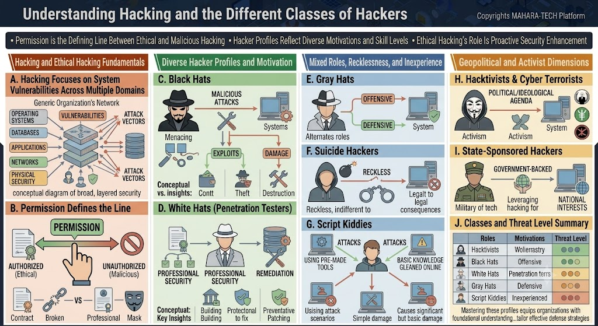

# Understanding Hacking and the Different Classes of Hackers

A visual overview of what hacking is, why **permission** is the defining line between ethical and malicious hacking, and a breakdown of the different hacker profiles by motivation, skill level, and threat level.



Core themes:
- Permission is the defining line between ethical and malicious hacking.
- Hacker profiles reflect diverse motivations and skill levels.
- Ethical hacking's role is proactive security enhancement.

---

## 🔐 A. Hacking Focuses on System Vulnerabilities Across Multiple Domains

Hacking activity generally targets vulnerabilities across a layered set of domains within an organization's network:

- **Operating Systems**
- **Databases**
- **Applications**
- **Networks**
- **Physical Security**

Each domain represents a potential **attack vector** into the broader, layered security of an organization.

## ✋ B. Permission Defines the Line

The single factor that separates **ethical** from **malicious** hacking is **permission**:

| Authorized (Ethical) | Unauthorized (Malicious) |
|---|---|
| Operates under a signed **contract** | Acts with **no permission** |
| Professional engagement | Uses deception (e.g., a "mask" — hidden identity) |

---

## 🎭 C. Black Hats

- **Motivation:** Malicious, offensive attacks against systems.
- **Method:** Exploits vulnerabilities to cause damage.
- **Outcome:** Theft and destruction of data or systems.

## 🤍 D. White Hats (Penetration Testers)

- **Motivation:** Professional, authorized security testing.
- **Method:** Builds and strengthens professional security postures.
- **Outcome:** Remediation — identifying and patching weaknesses preventively.

---

## 🕶️ E. Gray Hats

- **Motivation:** Mixed — alternates between offensive and defensive roles.
- Neither fully malicious nor fully authorized; behavior can shift depending on context or opportunity.

## 💣 F. Suicide Hackers

- **Motivation:** Reckless, indifferent to consequences.
- Willing to face legal consequences, disregarding personal risk in pursuit of an attack.

## 🧑‍💻 G. Script Kiddies

- **Motivation:** Inexperienced, using basic knowledge gleaned online.
- **Method:** Relies on pre-made attack tools rather than original skill.
- **Outcome:** Typically causes simple, limited damage, but can occasionally cause significant harm.

---

## ✊ H. Hacktivists & Cyber Terrorists

- **Motivation:** Political or ideological agenda.
- **Method:** Uses hacking as a form of activism.
- **Outcome:** Targets systems to advance a cause or ideology.

## 🎖️ I. State-Sponsored Hackers

- **Motivation:** Government-backed, serving national interests.
- **Method:** Leverages hacking capabilities on behalf of a state/military.
- **Outcome:** Operates with the backing and resources of a nation-state.

---

## 📊 J. Classes and Threat Level Summary

| Role | Motivation | Relative Threat Level |
|---|---|---|
| Hacktivists | Wollentary (ideological/voluntary) | Medium |
| Black Hats | Offensive | High |
| White Hats | Penetration testing | Low (authorized) |
| Gray Hats | Defensive/offensive (mixed) | Medium |
| Script Kiddies | Inexperienced | Low–Medium |

Mastering these profiles equips organizations with the foundational understanding needed to tailor effective defense strategies.

---

## 📁 Repository Structure

```
.
├── README.md
└── ethics-and-hacking.jpg
```
