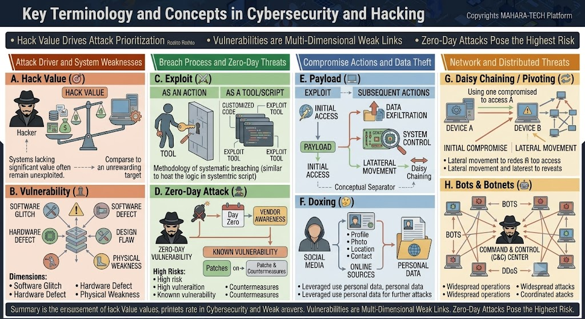

# Key Terminology and Concepts in Cybersecurity and Hacking

A visual glossary of core cybersecurity concepts — from what makes a target attractive (**Hack Value**) through how a single compromised device can be leveraged to attack an entire network (**Botnets**).



Core themes:
- Hack value drives attack prioritization.
- Vulnerabilities are multi-dimensional weak links.
- Zero-day attacks pose the highest risk.

---

## 🎯 A. Hack Value

- The perceived worth of a target to an attacker — systems seen as high-value are more likely to be targeted.
- Systems lacking significant value often remain unexploited, compared to more rewarding, high-value targets.

## 🛡️ B. Vulnerability

A weakness that can be exploited, spanning multiple dimensions:

- **Software Glitch** – Unintended flaw in software behavior.
- **Software Defect** – A flaw introduced during development.
- **Hardware Defect** – A flaw in physical hardware components.
- **Design Flaw** – A weakness rooted in the system's architecture.
- **Physical Weakness** – A gap in physical security controls.

---

## 🗝️ C. Exploit

An exploit can take two forms:

- **As an Action** – Using a **tool** (e.g., a key) to breach a barrier/system.
- **As a Tool/Script** – Customized exploit code or a packaged exploit tool.

Represents the systematic methodology of breaching a system — similar to executing the logic encoded in a script.

## ☠️ D. Zero-Day Attack

- A **zero-day vulnerability** is one that is unknown to the vendor at "Day Zero" — before any patch exists.
- Once discovered, it becomes a **known vulnerability**, prompting **vendor awareness**, and eventually **patches & countermeasures**.
- Considered **high risk** because there is no existing defense at the time of exploitation.

---

## 📦 E. Payload

The sequence of actions carried out after successful exploitation:

1. **Exploit → Initial Access** – Gaining a foothold on the target system.
2. **Payload delivery** – The malicious code/action delivered once access is gained.
3. **Subsequent actions**, which may include:
   - **Data Exfiltration** – Extracting sensitive data.
   - **System Control** – Taking control of the compromised system.
   - **Lateral Movement** – Moving from the initially compromised system to others (leading into **Daisy Chaining**, see section G).

## 🕵️ F. Doxing

- Gathering personal data from social media and other online sources — **profile, photo, location, contact** details.
- This personal data can then be leveraged for further attacks or malicious use.

---

## 🔗 G. Daisy Chaining / Pivoting

- Using one compromised device (**Device A**) as a stepping stone to access another device (**Device B**), and potentially further systems beyond it.
- Process:
  1. **Initial Compromise** – Attacker gains access to Device A.
  2. **Lateral Movement** – Attacker pivots from Device A to reach additional systems (Device B and beyond), expanding access across the network.

## 🤖 H. Bots & Botnets

- A **botnet** is a network of compromised devices (**bots**) controlled centrally by an attacker via a **Command & Control (C&C) Center**.
- The C&C center coordinates the bots to perform:
  - **Widespread operations**
  - **Widespread attacks**
  - **Coordinated attacks**, such as **DDoS** (Distributed Denial of Service).

---

## 📋 Summary

Understanding **Hack Value** helps prioritize which systems attackers are most likely to target. **Vulnerabilities** are multi-dimensional weak links — spanning software, hardware, design, and physical security — that attackers exploit. **Zero-day attacks** pose the highest risk since no countermeasure exists until the vulnerability becomes known. Concepts like **Payload delivery**, **Doxing**, **Daisy Chaining**, and **Botnets** describe how attackers escalate from a single compromise into broader, more damaging campaigns.

---

## 📁 Repository Structure

```
.
├── README.md
└── hacking-vocabulary.jpg
```
