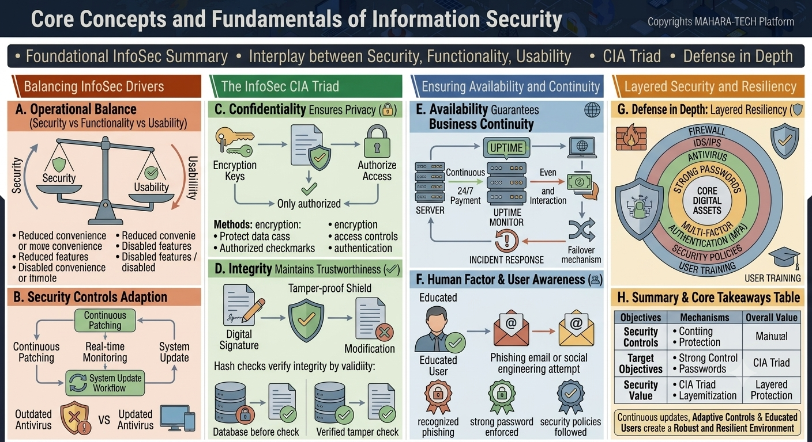

# Core Concepts and Fundamentals of Information Security

A visual overview of foundational Information Security (InfoSec) concepts — balancing security with usability, the **CIA Triad**, ensuring availability/continuity, and building resilience through **Defense in Depth**.



Core themes:
- Foundational InfoSec summary.
- The interplay between security, functionality, and usability.
- The CIA Triad.
- Defense in depth.

---

## ⚖️ A. Operational Balance (Security vs. Functionality vs. Usability)

Security and usability sit on opposite ends of a balance — improving one often comes at the cost of the other.

| More Security | More Usability |
|---|---|
| Reduced convenience | More convenience |
| Reduced features | Disabled features |
| Disabled convenience or features | Disabled convenience or features |

Organizations must continuously tune this balance based on their risk tolerance and user needs.

## 🔄 B. Security Controls Adoption

Maintaining strong security requires ongoing effort, not a one-time setup:

- **Continuous Patching** – Regularly applying security patches.
- **Real-time Monitoring** – Watching systems for issues as they occur.
- **System Update Workflow** – A structured process for rolling out updates.
- **System Update** – Keeping systems current, e.g., moving from an **Outdated Antivirus** to an **Updated Antivirus**.

---

## 🔒 C. Confidentiality — Ensures Privacy

Confidentiality ensures that data is only accessible to those authorized to see it.

- **Encryption Keys** → protect data → **Authorize Access** → **Only authorized** users/systems can view the data.
- **Methods:**
  - Encryption – protects data in transit/at rest.
  - Authorized checkmarks / access controls – verifying who can access what.
  - Authentication – confirming identity before granting access.

## ✅ D. Integrity — Maintains Trustworthiness

Integrity ensures data has not been tampered with or altered without authorization.

- **Digital Signature** → **Tamper-proof Shield** → protects against unauthorized **Modification**.
- **Hash checks** verify integrity by validity — comparing a stored/database hash **before check** against a **verified tamper check** to confirm data hasn't changed.

---

## 🌐 E. Availability — Guarantees Business Continuity

Availability ensures systems and data remain accessible when needed.

- **Uptime** is continuously monitored (**Uptime Monitor**) to confirm systems are up **24/7**.
- Supports continuous payment processing and interaction, even under changing conditions.
- If an issue occurs, an **Incident Response** process kicks in, potentially triggering a **Failover Mechanism** to maintain continuity.

## 👤 F. Human Factor & User Awareness

People are a critical part of the security chain — an **educated user** is far less likely to fall victim to attacks.

- An educated user can recognize a **phishing email or social engineering attempt** and avoid falling for it.
- Key user-side defenses:
  - **Recognized phishing** – ability to identify suspicious emails.
  - **Strong password enforced** – following good password practices.
  - **Security policies followed** – adhering to organizational security guidance.

---

## 🛡️ G. Defense in Depth — Layered Resiliency

Defense in Depth protects **core digital assets** using multiple, overlapping layers of security controls, including:

- **Firewall**
- **IDS/IPS** (Intrusion Detection/Prevention Systems)
- **Antivirus**
- **Strong Passwords**
- **Multi-Factor Authentication (MFA)**
- **Security Policies**
- **User Training**

Each layer adds an additional barrier, so that if one control fails, others still protect the core assets.

## 📊 H. Summary & Core Takeaways

| Objectives | Mechanisms | Overall Value |
|---|---|---|
| Security Controls | Continuous protection | Manual + automated safeguards |
| Target Objectives | Strong controls, passwords | CIA Triad |
| Security Value | CIA Triad, layered protection | Layered Protection |

**Continuous updates, adaptive controls, and educated users create a robust and resilient environment.**

---

## 📁 Repository Structure

```
.
├── README.md
└── infosec-concepts.png
```
