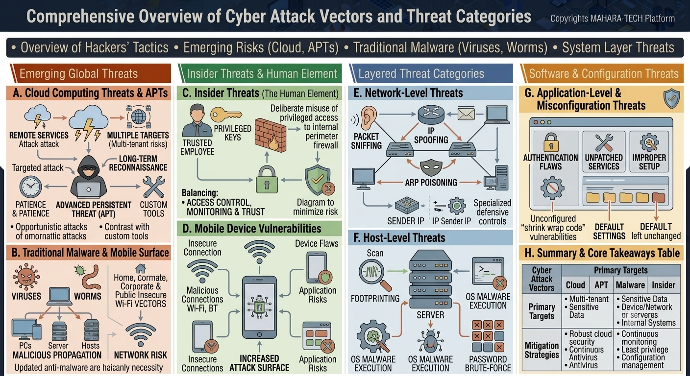

# Comprehensive Overview of Cyber Attack Vectors and Threat Categories

A visual breakdown of the major categories of cyber threats — from emerging global risks like cloud computing and APTs, through insider threats, network/host-level attacks, and application misconfigurations.



Core themes:
- Overview of hackers' tactics.
- Emerging risks (cloud, APTs).
- Traditional malware (viruses, worms).
- System layer threats.

---

## ☁️ A. Cloud Computing Threats & APTs

- **Cloud Computing Threats** – Remote services attacks target shared infrastructure, creating **multiple targets / multi-tenant risks** where one weakness can expose many tenants.
- **Advanced Persistent Threat (APT)** – A targeted, patient attacker performs **long-term reconnaissance** using **custom tools**.
  - Contrasts with **opportunistic attacks**, which are broader and less targeted (vs. custom-tool-driven APT campaigns).

## 🦠 B. Traditional Malware & Mobile Surface

- **Viruses** and **Worms** spread via **malicious propagation** across PCs, servers, and hosts.
- Common vectors: home, corporate, and public **insecure Wi-Fi**, creating ongoing **network risk**.
- Keeping anti-malware **updated** is described as a basic necessity for defense.

---

## 🕴️ C. Insider Threats (The Human Element)

- A **trusted employee** with **privileged keys/access** can **deliberately misuse** that access to bypass the internal perimeter firewall.
- Defense requires balancing:
  - **Access Control**
  - **Monitoring**
  - **Trust**
- A layered diagram approach helps minimize this risk by limiting how much any single privileged account can expose.

## 📱 D. Mobile Device Vulnerabilities

- **Insecure Connections** – Malicious connections over Wi-Fi or Bluetooth (BT).
- **Device Flaws** – Underlying flaws in the device itself increase **application risks**.
- Together, insecure connections and device/application flaws lead to an **increased attack surface** on mobile devices.

---

## 🌐 E. Network-Level Threats

- **Packet Sniffing** – Intercepting network traffic to read data in transit.
- **IP Spoofing** – Disguising the **sender IP** as a trusted source (**IP Sender IP** manipulation) to bypass trust-based defenses.
- **ARP Poisoning** – Corrupting ARP mappings to intercept or redirect traffic between devices.
- Defense requires **specialized defensive controls** designed specifically to detect and block these network-layer manipulations.

## 🖥️ F. Host-Level Threats

- **Footprinting** – Scanning a server to gather information before an attack.
- **OS Malware Execution** – Running malicious code directly on the host operating system.
- **Password Brute-Force** – Repeatedly guessing credentials to gain unauthorized access.
- These threats often chain together: reconnaissance (scan) → exploitation (malware execution) → credential compromise (brute-force).

---

## 🧩 G. Application-Level & Misconfiguration Threats

- **Authentication Flaws** – Weaknesses in how users/systems are verified.
- **Unpatched Services** – Running outdated software with known, unfixed vulnerabilities.
- **Improper Setup** – Poorly configured applications or services.
- **Unconfigured "shrink-wrap code" vulnerabilities** – Default, out-of-the-box software left without proper hardening.
- **Default settings left unchanged** – Failing to update manufacturer/vendor default configurations, a common and easily preventable weakness.

## 📊 H. Summary & Core Takeaways Table

| Cyber Attack Vectors | Primary Targets | Mitigation Strategies |
|---|---|---|
| **Cloud** | Multi-tenant, sensitive data | Robust cloud security |
| **APT** | Sensitive data | Continuous monitoring |
| **Malware** | Devices/network/servers | Continuous antivirus |
| **Insider** | Internal systems | Least privilege, configuration management |

---

## 📁 Repository Structure

```
.
├── README.md
└── attack-types.png
```
