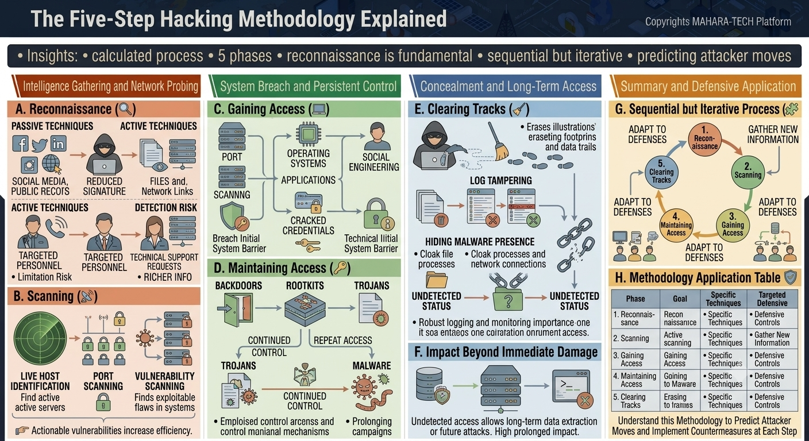

# The Five-Step Hacking Methodology Explained

A visual walkthrough of the classic five-phase hacking methodology — a calculated, sequential-but-iterative process used to understand and predict attacker moves.



Key insights:
- A calculated process.
- 5 phases.
- Reconnaissance is fundamental.
- Sequential but iterative.
- Understanding it helps predict attacker moves.

---

## 🔍 A. Reconnaissance

Gathering information about a target before any direct interaction with its systems.

- **Passive Techniques** – Gathering information without directly engaging the target:
  - Social media, public records (e.g., LinkedIn, Twitter, Facebook)
  - Results in a **reduced signature** (harder to detect) but relies on files and network links already publicly available.
- **Active Techniques** – Direct engagement with people or systems, carrying **higher detection risk**:
  - Targeting personnel directly (e.g., phone calls)
  - Technical support requests to extract richer information
  - Comes with **limitation risk**, since active engagement is more likely to be noticed.

## 📡 B. Scanning

Actively probing the target's live systems to find exploitable weaknesses.

- **Live Host Identification** – Finding active servers on the network.
- **Port Scanning** – Identifying open ports/services on those hosts.
- **Vulnerability Scanning** – Finding exploitable flaws in the systems discovered.
- Actionable vulnerabilities discovered here increase the efficiency of the later attack phases.

---

## 🔓 C. Gaining Access

Breaching the target's initial system barrier using information gathered so far.

- **Port scanning** → identifies **Operating Systems** and **Applications** running.
- Leads to **Social Engineering** and/or **Cracked Credentials**.
- The combination of technical scanning and social engineering helps **breach the initial system barrier**, overcoming the target's **technical initial system barrier**.

## 🔑 D. Maintaining Access

Ensuring continued, repeatable access to the compromised system.

- **Backdoors**, **Rootkits**, and **Trojans** are installed to enable **continued control** and **repeat access**.
- Attackers may deploy additional **Trojans** and **Malware** to maintain and prolong control.
- This stage focuses on **employing control access and control maintenance mechanisms**, enabling **prolonging campaigns** over time.

---

## 🧹 E. Clearing Tracks

Concealing evidence of the intrusion to avoid detection and preserve long-term access.

- Erasing illustrations/footprints and data trails left behind during the attack.
- **Log Tampering** – Altering or deleting logs that would reveal the attacker's activity.
- **Hiding Malware Presence** – Cloaking files, processes, and network connections so tools remain **undetected**.
- Emphasizes the importance of **robust logging and monitoring** as a defense — since attackers specifically target logs to erase evidence of their presence.

## 💥 F. Impact Beyond Immediate Damage

- Undetected, long-lasting access allows continued **data extraction** or **future attacks**.
- The longer an intrusion goes undetected, the **higher the prolonged impact** on the organization.

---

## 🔄 G. Sequential but Iterative Process

The five phases don't necessarily happen once in strict order — attackers often loop back through them as defenses adapt:

```
1. Reconnaissance → 2. Scanning → 3. Gaining Access → 4. Maintaining Access → 5. Clearing Tracks → (adapt to defenses) → back to 1/2...
```

- After each phase, the attacker may need to **adapt to defenses** and **gather new information**, cycling back through earlier phases as needed.

## 📋 H. Methodology Application Table

| Phase | Goal | Approach | Targeted Defensive Focus |
|---|---|---|---|
| 1. Reconnaissance | Recon / information gathering | Specific techniques | Defensive controls |
| 2. Scanning | Active scanning | Specific techniques | Gather new information |
| 3. Gaining Access | Gaining access | Specific techniques | Defensive controls |
| 4. Maintaining Access | Continued access ("going to malware") | Specific techniques | Defensive controls |
| 5. Clearing Tracks | Erasing traces ("erasing to traces") | Specific techniques | Defensive controls |

**Understanding this methodology helps predict attacker moves and implement countermeasures at each step.**

---

## 📁 Repository Structure

```
.
├── README.md
└── hackeing-lifecycle.png
```
