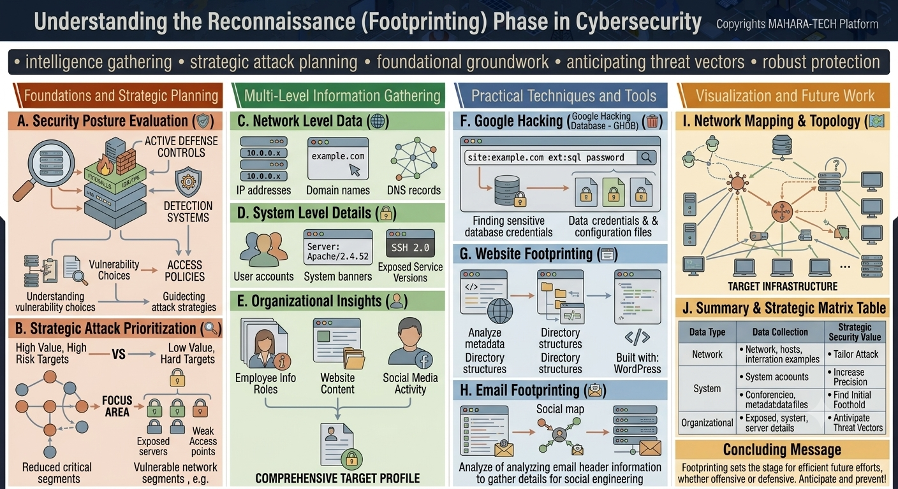

# Understanding the Reconnaissance (Footprinting) Phase in Cybersecurity

A visual deep-dive into the **Reconnaissance / Footprinting** phase — the intelligence-gathering foundation that shapes strategic attack planning (or, from a defensive view, helps anticipate threat vectors and build robust protection).



Key insights:
- Intelligence gathering
- Strategic attack planning
- Foundational groundwork
- Anticipating threat vectors
- Robust protection

---

## 🛡️ A. Security Posture Evaluation

Understanding a target's existing defenses helps shape how an attack (or defense) should be planned.

- **Active Defense Controls** – Firewalls and IDS/IPS (Intrusion Detection/Prevention Systems) that actively guard the environment.
- **Detection Systems** – Systems designed to notice suspicious activity.
- **Vulnerability Choices → Access Policies** – Understanding which vulnerabilities exist helps guide which access policies are worth targeting (or defending), which in turn helps **guide attack strategies** and defensive planning alike.

## 🎯 B. Strategic Attack Prioritization

Not all targets are equal — attackers (and defenders assessing risk) prioritize based on value and difficulty.

- **High Value, High Risk Targets** vs. **Low Value, Hard Targets** — a trade-off between reward and effort/detection risk.
- **Focus Area** narrows down to the most promising targets, such as:
  - **Exposed servers**
  - **Weak access points**
  - **Vulnerable network segments**
- The overall goal is **reduced critical segments** exposure — minimizing what's exposed and vulnerable.

---

## 🌍 C. Network-Level Data

Basic network-level information forms the first layer of reconnaissance:

- **IP addresses** (e.g., `10.0.0.x`)
- **Domain names** (e.g., `example.com`)
- **DNS records** — showing how systems and services are interconnected.

## 🖥️ D. System-Level Details

Deeper technical details about specific systems:

- **User accounts** – Who has access to a system.
- **System banners** – Version details revealed by servers (e.g., `Server: Apache/2.4.52`).
- **Exposed Service Versions** – Specific software versions in use (e.g., `SSH 2.0`), which can reveal known vulnerabilities.

## 🏢 E. Organizational Insights

Human and organizational context that rounds out the picture:

- **Employee Info Roles** – Who works there and what they do.
- **Website Content** – Public-facing information published by the organization.
- **Social Media Activity** – Public posts and interactions that can reveal useful details.

Combining network-level, system-level, and organizational insights builds a **comprehensive target profile**.

---

## 🔎 F. Google Hacking (Google Hacking Database — GHDB)

Using advanced search operators to find sensitive information indexed by search engines.

- Example query: `site:example.com ext:sql password`
- Used for **finding sensitive database credentials** and **data credentials & configuration files** unintentionally exposed online.

## 🌐 G. Website Footprinting

Analyzing a website's structure and metadata for useful clues.

- **Analyze metadata / Directory structures** – Reviewing how a site's files and folders are organized.
- Can help identify the underlying technology (e.g., a site **built with WordPress**), which may point to known vulnerabilities in that platform.

## 📧 H. Email Footprinting

Extracting information from email communications and metadata.

- **Analyzing email header information** to gather details for **social engineering** purposes.
- Can help build a **social map** of who communicates with whom within an organization.

---

## 🗺️ I. Network Mapping & Topology

Visualizing the discovered systems and their relationships builds a picture of the **target infrastructure** — showing hosts, servers, and their interconnections, which supports both attack planning and defensive analysis.

## 📊 J. Summary & Strategic Matrix Table

| Data Type | Data Collection | Strategic Security Value |
|---|---|---|
| **Network** | Network, hosts, interaction examples | Tailor attack (or defense) strategy |
| **System** | System accounts, configuration/metadata files | Increase precision |
| **Organizational** | Exposed system/server details | Find initial foothold / anticipate threat vectors |

### 📝 Concluding Message

**Footprinting sets the stage for efficient future efforts, whether offensive or defensive. Anticipate and prevent!**

---

## 📁 Repository Structure

```
.
├── README.md
└── reconnaissance.png
```
