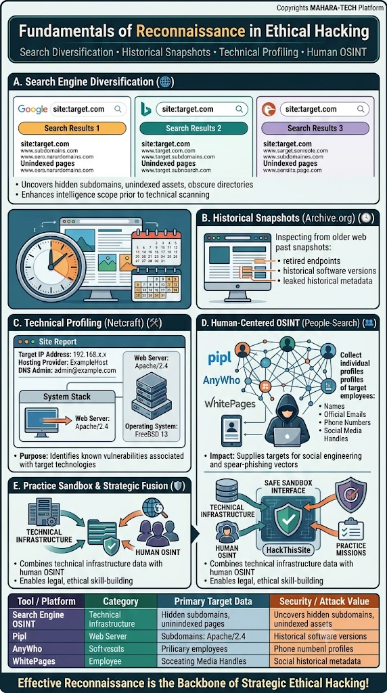
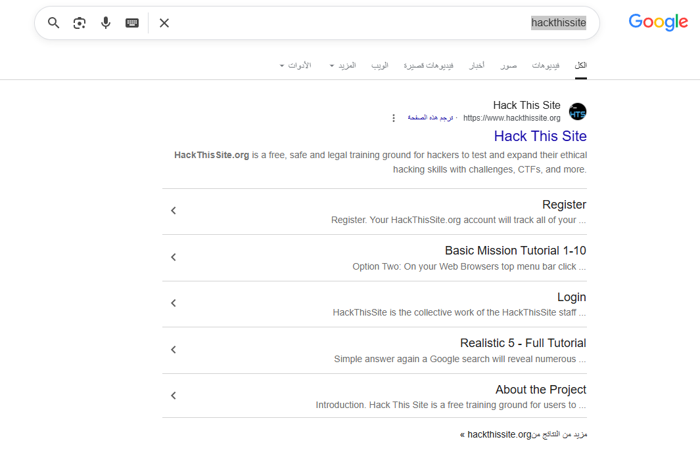
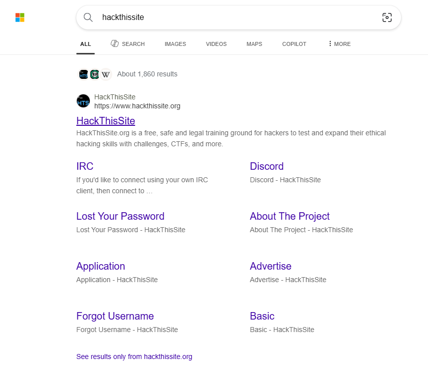
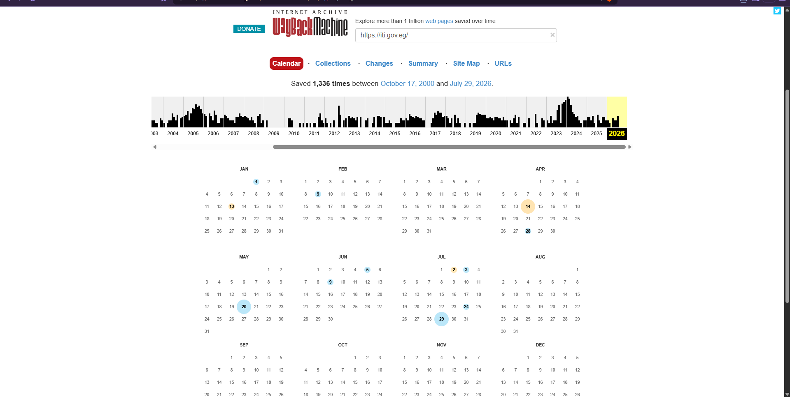
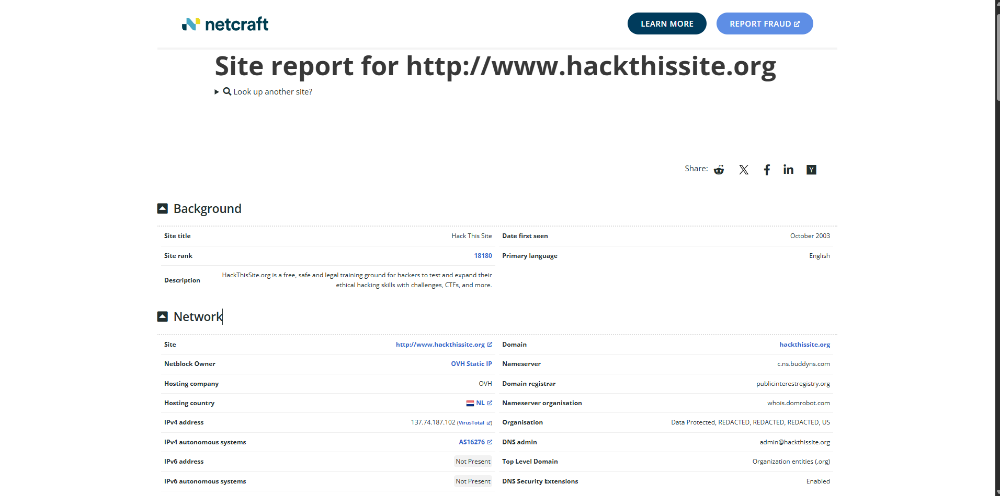
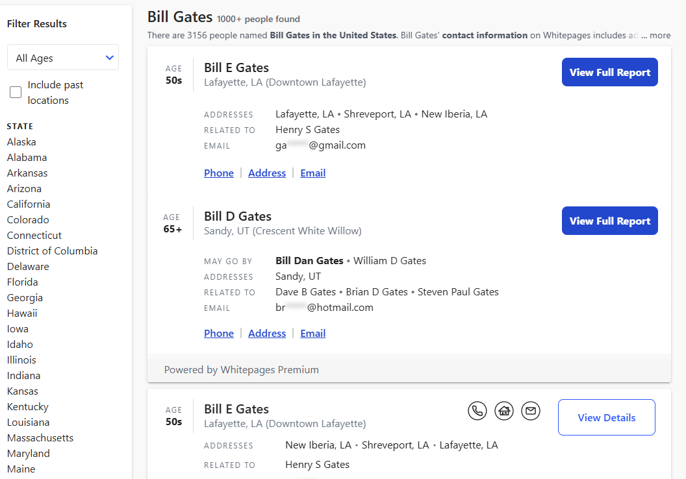

# Fundamentals of Reconnaissance in Ethical Hacking

A visual breakdown of core reconnaissance techniques used in ethical hacking — **search engine diversification**, **historical snapshots**, **technical profiling**, and **human-centered OSINT** — paired with real tool screenshots demonstrating each technique in practice.



Core themes: Search Diversification • Historical Snapshots • Technical Profiling • Human OSINT

---

## 🌐 A. Search Engine Diversification

Running the same query (e.g., `site:target.com`) across **multiple search engines** surfaces different results — hidden subdomains, unindexed pages, and obscure directories that a single engine might miss.

- Uncovers hidden subdomains, unindexed assets, obscure directories.
- Enhances intelligence scope prior to technical scanning.

**Example: Google search**



**Example: Bing (Microsoft) search**



Both searches for the same target term return different result sets/snippets — illustrating why diversifying across engines gives a broader intelligence picture than relying on one.

---

## 🕰️ B. Historical Snapshots (Archive.org)

Inspecting a target's **older web page snapshots** via the Internet Archive's Wayback Machine can reveal:

- Retired endpoints
- Historical software versions
- Leaked historical metadata

**Example: Wayback Machine calendar view**



A target domain (e.g., `iti.gov.eg`) can be saved thousands of times over many years — each snapshot is a potential source of information no longer visible on the live site.

---

## 🛠️ C. Technical Profiling (Netcraft)

Tools like **Netcraft** generate a **Site Report**, revealing infrastructure details about a target:

- Target IP address, hosting provider, DNS admin.
- **System stack** — web server software (e.g., Apache/2.4) and operating system (e.g., FreeBSD 13).
- **Purpose:** Identifies known vulnerabilities associated with the target's specific technologies.

**Example: Netcraft site report**



A real report includes background info (site title, rank, description), plus detailed network data — domain, nameserver, hosting company/country, IPv4/IPv6 addresses, and DNS security extensions.

---

## 👤 D. Human-Centered OSINT (People-Search)

People-search platforms (e.g., Pipl, AnyWho, Whitepages) collect individual profiles of target employees — names, official emails, phone numbers, and social media handles.

- **Impact:** Supplies targets for social engineering and spear-phishing vectors.

**Example: Whitepages people search**



A single common name can return thousands of matching profiles, each with associated addresses, related persons, and (partially redacted) contact emails — illustrating the volume of personal data these platforms can expose.

---

## 🧪 E. Practice Sandbox & Strategic Fusion

Combining **technical infrastructure data** with **human OSINT** builds a complete picture of a target, but should be practiced only in **safe, legal sandbox environments** (e.g., HackThisSite) rather than against real, unauthorized targets.

- Combines technical infrastructure data with human OSINT.
- Enables legal, ethical skill-building via practice missions in a safe sandbox interface.

---

## 📊 Tool / Platform Summary Table

| Tool / Platform | Category | Primary Target Data | Security / Attack Value |
|---|---|---|---|
| Search Engines (Google, Bing) | Technical Infrastructure | Hidden subdomains, unindexed pages | Uncovers hidden subdomains, unindexed assets |
| Archive.org (Wayback Machine) | Web Server History | Retired endpoints, past snapshots | Historical software versions |
| Netcraft | Web Server / Infrastructure | System stack, hosting, DNS details | Reveals known vulnerabilities in target technologies |
| Pipl / AnyWho / Whitepages | Employee / Human OSINT | Names, emails, phone numbers, social handles | Social engineering and phishing metadata |

**Effective reconnaissance is the backbone of strategic ethical hacking!**

---

## 📁 Repository Structure

```
.
├── README.md
├── reconnaissance.jpg
├── reconnaissance-google.png
├── reconnaissance-bing.png
├── reconnaissance-archive.png
├── reconnaissance-netcraft.png
└── reconnaissance-whitepages.png
```
