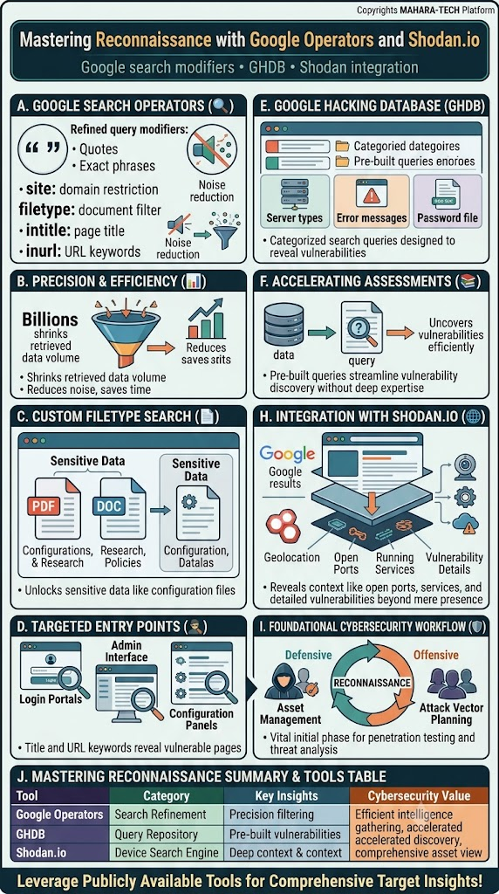
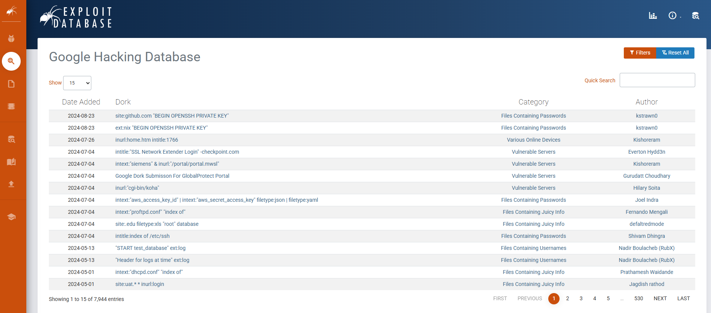
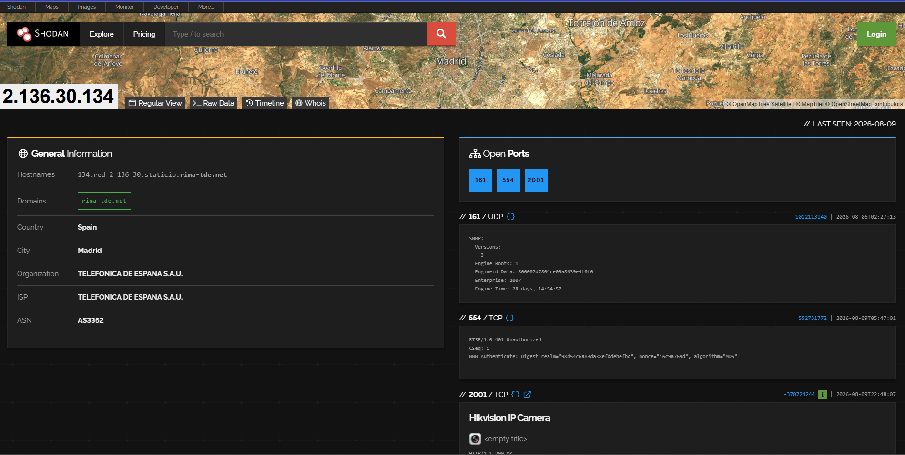

# Mastering Reconnaissance with Google Operators and Shodan.io

A visual guide to using **Google search operators**, the **Google Hacking Database (GHDB)**, and **Shodan.io** to accelerate reconnaissance — paired with real screenshots of both tools in action.



Core themes: Google search modifiers • GHDB • Shodan integration

---

## 🔍 A. Google Search Operators

Refined query modifiers narrow down search results dramatically:

- `"quotes"` – Exact phrase matching.
- `site:` – Restrict results to a specific domain.
- `filetype:` – Filter by document type (e.g., PDF, DOC).
- `intitle:` – Search within page titles.
- `inurl:` – Search for keywords within URLs.

These operators cut through **noise reduction**, filtering billions of pages down to a precise, relevant set.

## 📉 B. Precision & Efficiency

- Search operators **shrink the retrieved data volume** from billions of pages down to a manageable set.
- This **reduces noise and saves time** during the intelligence-gathering phase.

## 📄 C. Custom Filetype Search

Restricting searches to specific file types (e.g., `PDF`, `DOC`) can unlock **sensitive data** such as:

- Configurations & research documents
- Policies
- Configuration data files

## 🎯 D. Targeted Entry Points

Combining `intitle:` and `inurl:` keywords can reveal vulnerable pages such as:

- **Login Portals**
- **Admin Interfaces**
- **Configuration Panels**

---

## 🗄️ E. Google Hacking Database (GHDB)

A categorized repository of **pre-built Google search queries ("dorks")** designed to reveal vulnerabilities, organized by:

- Server types
- Error messages
- Password files

**Example: Exploit-DB's Google Hacking Database**



Real GHDB entries include dorks like `site:github.com "BEGIN OPENSSH PRIVATE KEY"` or `intext:"aws_secret_access_key" filetype:json`, each categorized (e.g., "Files Containing Passwords", "Vulnerable Servers") and attributed to a contributing researcher — with thousands of entries available (7,944+ at time of writing).

## 📚 F. Accelerating Assessments

Pre-built GHDB queries let analysts **uncover vulnerabilities efficiently**, streamlining vulnerability discovery without requiring deep manual query-crafting expertise.

---

## 🌐 H. Integration with Shodan.io

While Google indexes web *pages*, **Shodan.io** indexes internet-connected *devices* — revealing far deeper context:

- Geolocation
- Open ports
- Running services
- Vulnerability details

**Example: Shodan device lookup**



A single IP lookup can reveal the hosting organization/ISP, geolocation, and a list of **open ports** (e.g., 161/UDP for SNMP, 554/TCP for RTSP, 2001/TCP) — in this example even identifying an exposed **Hikvision IP Camera** device directly from its service banner.

## 🔄 I. Foundational Cybersecurity Workflow

Reconnaissance sits at the center of both **defensive** and **offensive** cybersecurity work:

- **Defensive** → Asset Management (understanding what's exposed).
- **Offensive** → Attack Vector Planning (identifying what could be exploited).

Reconnaissance is described as a **vital initial phase** for both penetration testing and threat analysis.

---

## 📊 J. Mastering Reconnaissance — Summary & Tools Table

| Tool | Category | Key Insights | Cybersecurity Value |
|---|---|---|---|
| **Google Operators** | Search Refinement | Precision filtering | Efficient intelligence gathering |
| **GHDB** | Query Repository | Pre-built vulnerabilities | Accelerated discovery |
| **Shodan.io** | Device Search Engine | Deep context & control | Comprehensive asset view |

**Leverage publicly available tools for comprehensive target insights!**

---

## 📁 Repository Structure

```
.
├── README.md
├── Using-Google-Hacking-and-Shodan.jpg
├── google-hacking-db.png
└── shadon-search-engine.png
```
