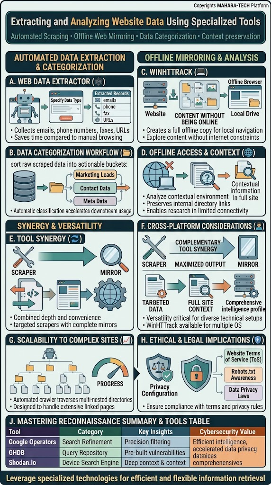
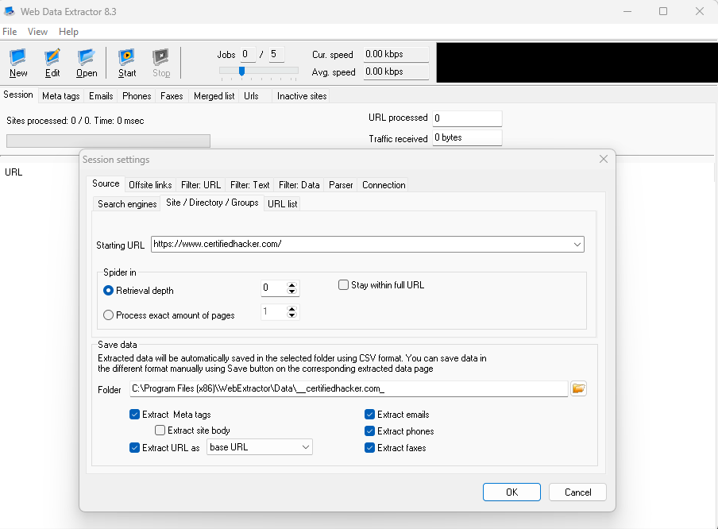
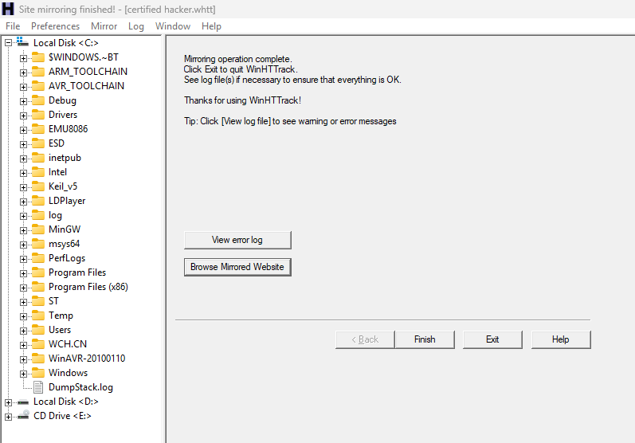

# Extracting and Analyzing Website Data Using Specialized Tools

A visual guide to **automated web data extraction** and **offline website mirroring**, paired with real screenshots of two popular tools: **Web Data Extractor** and **WinHTTrack**.



Core themes: Automated Scraping • Offline Web Mirroring • Data Categorization • Context Preservation

---

## 🤖 A. Web Data Extractor

Automatically scrapes a target website for specific data types, saving significant time compared to manual browsing.

- Collects **emails**, **phone numbers**, **faxes**, and **URLs** directly from a specified site.

**Example: Web Data Extractor 8.3**



- **Starting URL:** the target site to scrape (e.g., `https://www.certifiedhacker.com/`)
- **Spider settings:** control retrieval depth or an exact number of pages to process.
- **Extraction options:** meta tags, site body, emails, phones, faxes, and URL format.
- Extracted data is automatically saved to a specified folder in **CSV format** for later analysis.

## 🗂️ B. Data Categorization Workflow

Raw scraped data is automatically sorted into actionable buckets:

- **Marketing Leads**
- **Contact Data**
- **Meta Data**

Automatic classification accelerates downstream usage of the collected data.

---

## 🖥️ C. WinHTTrack (Offline Mirroring)

Creates a **full offline copy** of a target website for local navigation, allowing an analyst to explore site content without an active internet connection.

**Example: WinHTTrack — mirroring complete**



- Once mirroring finishes, the tool confirms: *"Mirroring operation complete."*
- Users can **View error log** (to check for warnings/issues) or **Browse Mirrored Website** to explore the downloaded copy locally.
- The mirrored site is saved to a local drive/directory structure for offline browsing.

## 🌐 D. Offline Access & Context

Working with a mirrored copy offers several analytical advantages:

- Analyze the site's contextual environment without needing live internet access.
- Preserves **internal directory links**, keeping the site's structure intact.
- Enables research in environments with limited connectivity.

---

## 🔄 E. Tool Synergy

Combining a **scraper** (targeted data extraction) with a **mirror** (full offline copy) provides both depth and convenience — targeted scrapers paired with complete mirrors give a more complete intelligence picture than either tool alone.

## 💻 F. Cross-Platform Considerations

- **Complementary tool synergy:** pairing a scraper's **targeted data** with a mirror's **full site context** produces a more **comprehensive intelligence profile**.
- Versatility is critical for diverse technical setups — tools like WinHTTrack are available across multiple operating systems.

## 📈 G. Scalability to Complex Sites

Automated crawlers can traverse multi-nested directory structures, designed to handle extensive, deeply linked pages without manual navigation.

## ⚖️ H. Ethical & Legal Implications

Before extracting or mirroring a website, ensure compliance with:

- **Website Terms of Service (ToS)**
- **Robots.txt Awareness** – respecting the site's crawling permissions.
- **Data Privacy Laws** – ensuring collected data is handled legally and ethically.

Proper **privacy configuration** should always be reviewed before running these tools against any target.

---

## 📊 Mastering Reconnaissance — Summary & Tools Table

| Tool | Category | Key Insights | Cybersecurity Value |
|---|---|---|---|
| Web Data Extractor | Automated Scraping | Precision data extraction (emails, phones, URLs) | Efficient intelligence gathering |
| WinHTTrack | Offline Mirroring | Full site context, preserved directory structure | Comprehensive, data-privacy-aware reconnaissance |

**Leverage specialized technologies for efficient and flexible information retrieval.**

---

## 📁 Repository Structure

```
.
├── README.md
├── Website-Reconnaissance-Tools.jpg
├── web-data-extractor.png
└── HTTrack.png
```
