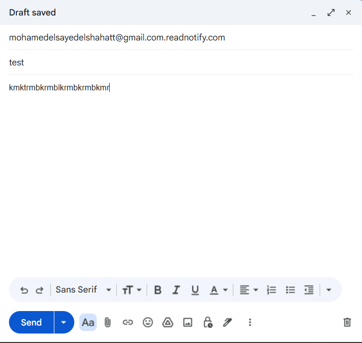
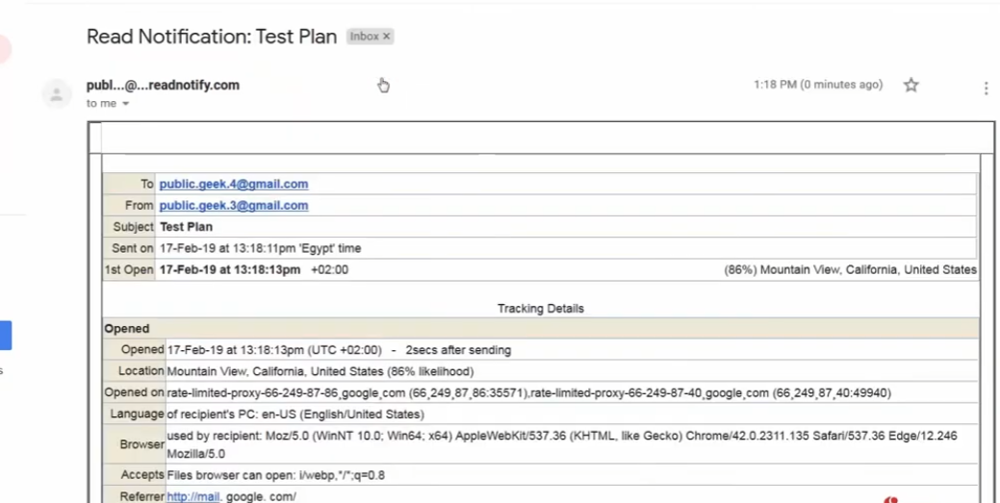
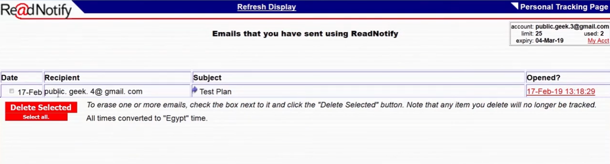

# Email Tracking with ReadNotify

A step-by-step walkthrough of using **ReadNotify** to track whether a sent email has been opened, when, and from where — a technique commonly used in reconnaissance and social engineering awareness training.

---

## 1️⃣ Compose a Tracked Email

Append `.readnotify.com` to the recipient's email address when composing the message. ReadNotify intercepts this addressing convention to enable tracking on delivery.



- **To:** `recipient@example.com.readnotify.com` (here shown as `mohamedelsayedelshahatt@gmail.com.readnotify.com`)
- Compose the subject and body as normal, then click **Send**.
- ReadNotify strips its own suffix before actual delivery, so the recipient sees a normal-looking email in their inbox.

## 2️⃣ View Sent & Tracked Emails (Personal Tracking Page)

Log into your **ReadNotify Personal Tracking Page** to see a list of all emails sent through the service and whether each one has been opened.



- Shows **Date**, **Recipient**, **Subject**, and **Opened?** status/timestamp for each tracked email.
- Account details (usage limit, emails used, expiry date) are shown in the top-right corner.
- Tracked emails can be deleted via **Delete Selected**, which also stops tracking for that item.

## 3️⃣ Receive a Read Notification

Once the recipient opens the tracked email, ReadNotify sends a **Read Notification** email back to the sender with detailed tracking information.



The notification includes:
- **To / From / Subject** of the original email.
- **Sent on** and **1st Open** timestamps (with time zone).
- **Tracking Details**, including:
  - Exact time opened (and how soon after sending).
  - **Location** of the recipient when opened (with likelihood percentage).
  - **Opened on** — the proxy/server info from which the email was accessed.
  - **Language** of the recipient's PC.
  - **Browser** used by the recipient (full user-agent string).
  - **Referrer** — the page/context the email was opened from.

---

## ⚠️ Notes on Use

- This technique reveals real, identifying information about a recipient (approximate location, browser, OS) simply by opening an email.
- It's commonly demonstrated in cybersecurity/OSINT training to illustrate how much metadata email tracking pixels can expose — and why caution is warranted before opening emails from unknown senders.

---

## 📁 Repository Structure

```
.
├── README.md
├── test-mail.png
├── mail-report.png
└── readnotify-message.png
```
