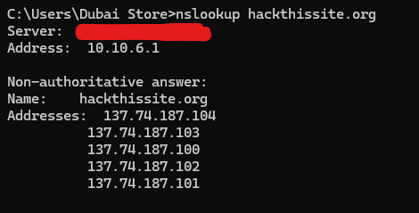
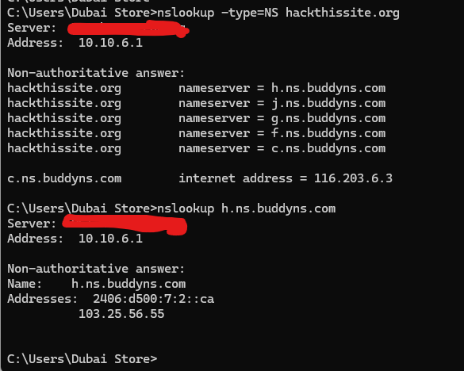
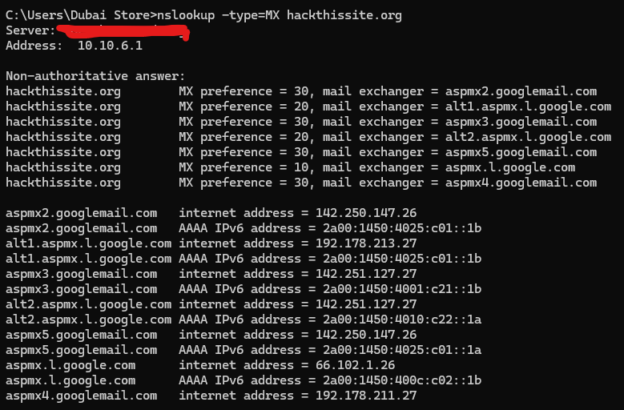
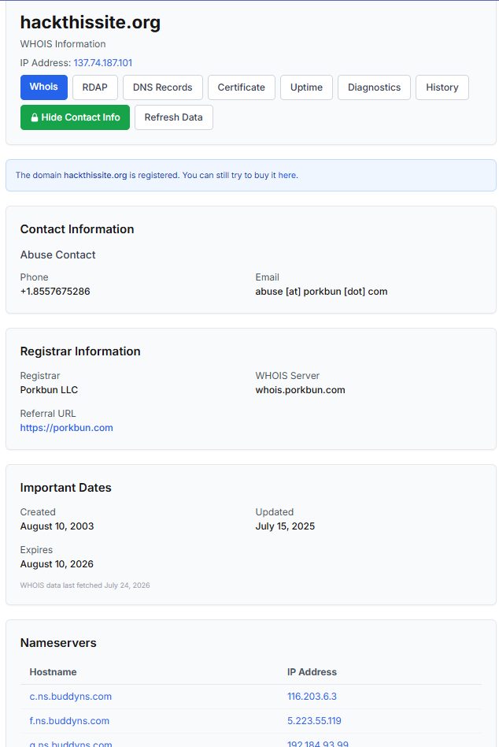

# DNS & WHOIS Reconnaissance with `nslookup` and WHOIS

A hands-on walkthrough of using the `nslookup` command and a WHOIS lookup tool to gather DNS and domain registration intelligence on a target domain (`hackthissite.org`).

---

## 1️⃣ Basic `nslookup` — Resolve A Records

Running a plain `nslookup` against a domain resolves its IP address(es) (A records).



```
C:\Users\Dubai Store>nslookup hackthissite.org
Server:  ...
Address:  10.10.6.1

Non-authoritative answer:
Name:    hackthissite.org
Addresses:  137.74.187.104
            137.74.187.103
            137.74.187.100
            137.74.187.102
            137.74.187.101
```

- The domain resolves to **multiple IP addresses**, suggesting load balancing or multiple front-end servers.

## 2️⃣ `nslookup -type=NS` — Discover Name Servers

Querying for **NS (Name Server) records** reveals which servers are authoritative for the domain's DNS.



```
C:\Users\Dubai Store>nslookup -type=NS hackthissite.org
...
Non-authoritative answer:
hackthissite.org        nameserver = h.ns.buddyns.com
hackthissite.org        nameserver = j.ns.buddyns.com
hackthissite.org        nameserver = g.ns.buddyns.com
hackthissite.org        nameserver = f.ns.buddyns.com
hackthissite.org        nameserver = c.ns.buddyns.com

c.ns.buddyns.com        internet address = 116.203.6.3
```

- Following up with `nslookup h.ns.buddyns.com` resolves that specific nameserver to its own IPv4/IPv6 addresses, confirming the infrastructure behind the domain's DNS hosting (BuddyNS).

## 3️⃣ `nslookup -type=MX` — Discover Mail Servers

Querying for **MX (Mail Exchanger) records** reveals which mail servers handle email for the domain, along with their priority.



```
C:\Users\Dubai Store>nslookup -type=MX hackthissite.org
...
Non-authoritative answer:
hackthissite.org    MX preference = 30, mail exchanger = aspmx2.googlemail.com
hackthissite.org    MX preference = 20, mail exchanger = alt1.aspmx.l.google.com
hackthissite.org    MX preference = 30, mail exchanger = aspmx3.googlemail.com
hackthissite.org    MX preference = 20, mail exchanger = alt2.aspmx.l.google.com
hackthissite.org    MX preference = 30, mail exchanger = aspmx5.googlemail.com
hackthissite.org    MX preference = 10, mail exchanger = aspmx.l.google.com
hackthissite.org    MX preference = 30, mail exchanger = aspmx4.googlemail.com
```

- **Lower preference values are tried first** — here `aspmx.l.google.com` (preference 10) is the primary mail exchanger.
- The MX records confirm the domain uses **Google Workspace / Gmail infrastructure** for email delivery.
- Each mail exchanger's IPv4 and IPv6 addresses are also resolved for full technical mapping.

## 4️⃣ WHOIS Lookup — Domain Registration Details

A WHOIS lookup reveals the domain's registration and ownership metadata.



Key details revealed:
- **IP Address:** 137.74.187.101
- **Registrar:** Porkbun LLC (WHOIS server: `whois.porkbun.com`)
- **Abuse Contact:** phone and email for reporting abuse.
- **Important Dates:**
  - Created: August 10, 2003
  - Updated: July 15, 2025
  - Expires: August 10, 2026
- **Nameservers:** listing hostnames and their IP addresses (e.g., `c.ns.buddyns.com`, `f.ns.buddyns.com`), corroborating the NS records found via `nslookup`.

---

## 🧩 Putting It Together

| Technique | Reveals |
|---|---|
| `nslookup` (default) | Domain's resolved IP address(es) |
| `nslookup -type=NS` | Authoritative name servers for the domain |
| `nslookup -type=MX` | Mail servers and their delivery priority |
| WHOIS | Registrar, registration dates, abuse contact, nameservers |

Combining DNS enumeration (`nslookup`) with WHOIS registration data builds a fuller picture of a target's infrastructure — the hosting provider, DNS provider, email provider, and domain ownership/registration timeline.

---

## 📁 Repository Structure

```
.
├── README.md
├── nslookup-Reconnainance.png
├── nslookup-dns-type-Reconnainance.png
├── nslookup-MX-type-Reconnainance.png
└── WHOIS-Reconnainance.png
```
