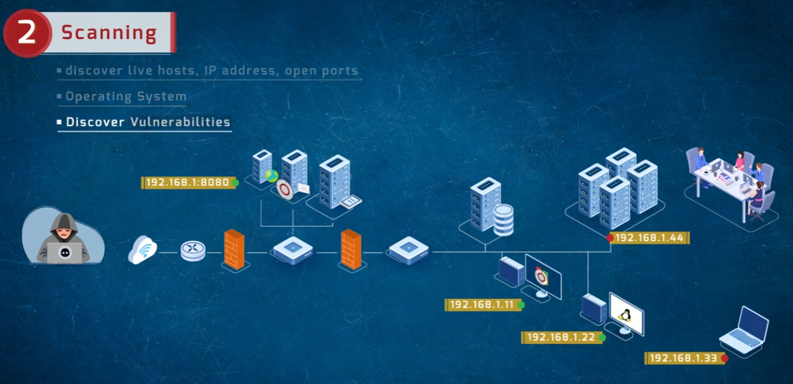
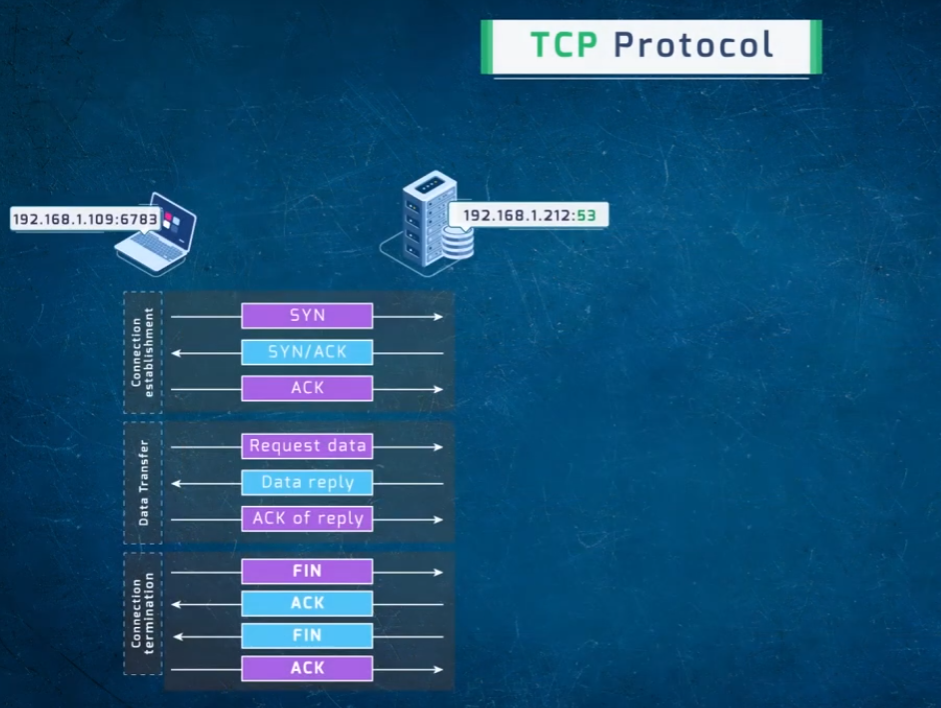
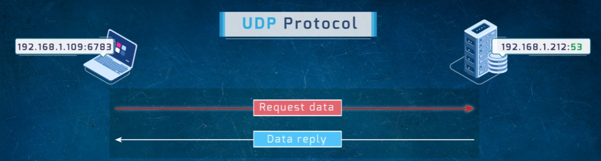
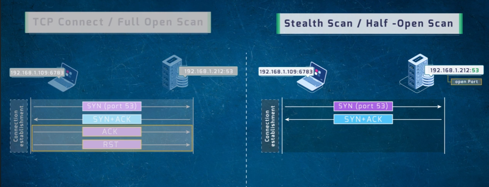
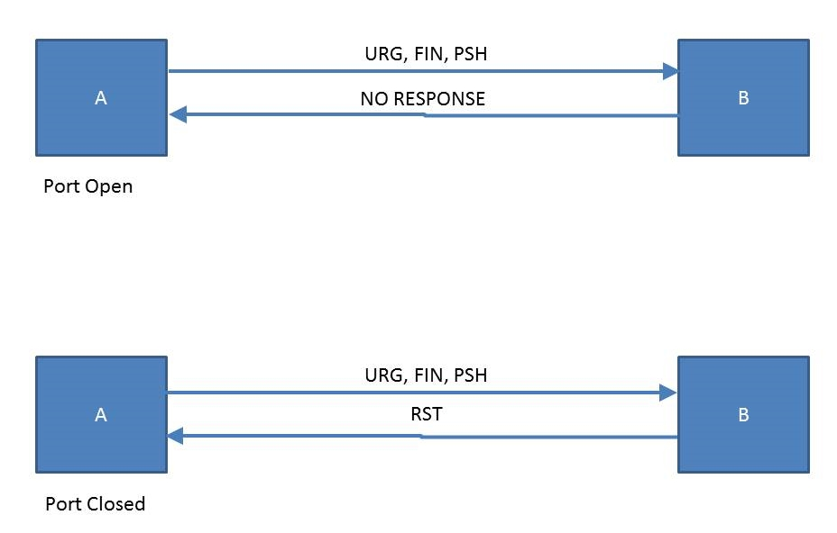

# Scanning: TCP/UDP Protocols and Port Scan Techniques

A visual walkthrough of the **Scanning** phase of ethical hacking — how TCP and UDP actually behave on the wire, and how that behavior is exploited by different port scanning techniques (Full Open / TCP Connect, Stealth / Half-Open, and XMAS scans).

---

## 🖧 2. Scanning — Phase Overview

Scanning follows reconnaissance and focuses on actively probing the target's live infrastructure.



Goals of the scanning phase:
- Discover **live hosts**, **IP addresses**, and **open ports**.
- Identify the **Operating System** running on target hosts.
- **Discover vulnerabilities** associated with what's found.

The diagram shows an attacker probing through firewalls/routers into an internal network, identifying specific hosts by IP (e.g., `192.168.1.11`, `192.168.1.22`, `192.168.1.33`, `192.168.1.44`) and even a specific open service (`192.168.1.8080`).

---

## 🔄 TCP Protocol — Full Connection Lifecycle

Understanding the underlying TCP behavior is the foundation for every TCP-based scan technique.



TCP communication happens in three stages:

1. **Connection Establishment** (3-way handshake)
   - `SYN →`
   - `← SYN/ACK`
   - `ACK →`
2. **Data Transfer**
   - `Request data →`
   - `← Data reply`
   - `ACK of reply →`
3. **Connection Termination**
   - `FIN →`
   - `← ACK`
   - `← FIN`
   - `ACK →`

Example shown: client `192.168.1.109:6783` communicating with server `192.168.1.212:53`.

## 📡 UDP Protocol — Connectionless Exchange

UDP skips the handshake entirely — there's no connection setup or teardown, just a direct request and reply.



```
192.168.1.109:6783  --- Request data --->  192.168.1.212:53
192.168.1.109:6783  <--- Data reply ----   192.168.1.212:53
```

This simplicity is why UDP-based services (like DNS, shown here on port 53) respond faster but offer no built-in reliability or ordering guarantees.

---

## 🕵️ TCP Connect (Full Open) Scan vs. Stealth (Half-Open) Scan

Both scan types rely on the same TCP handshake mechanics, but differ in how far they let the handshake proceed — which affects how detectable the scan is.



### TCP Connect / Full Open Scan
```
Client → SYN (port 53) → Server
Client ← SYN+ACK ← Server
Client → ACK → Server        (connection fully established)
Client → RST → Server        (immediately torn down)
```
- Completes the **full 3-way handshake**, establishing a real connection before tearing it down.
- Reliable and accurate, but easily **logged by the target** since a full connection is completed — making it more detectable.

### Stealth Scan / Half-Open Scan
```
Client → SYN (port 53) → Server
Client ← SYN+ACK ← Server    (port confirmed open — scan stops here)
```
- The scanner sends a `SYN` and, upon receiving `SYN+ACK`, already knows the port is open — it **never completes the handshake** with a final `ACK`.
- Because no full connection is established, it's far less likely to be logged by many systems — hence "stealth" or "half-open" scan.

---

## 🎄 XMAS Scan

An XMAS scan sends a packet with the **URG, FIN, and PSH** flags all set (lighting up like a "Christmas tree") to determine port state based on the target's response — or lack of one.



| Port State | Response |
|---|---|
| **Open** | No response at all |
| **Closed** | `RST` (reset) response |

- This technique relies on how compliant TCP/IP stacks are expected to respond (or not respond) to unusual flag combinations on open vs. closed ports.
- Like the stealth scan, it's designed to be less detectable than a full TCP connect scan.

---

## 📊 Scan Technique Summary

| Technique | Handshake Completed? | Detectability | Port Open Indicator | Port Closed Indicator |
|---|---|---|---|---|
| TCP Connect (Full Open) | Yes (then RST) | High (logged) | Full handshake succeeds | Connection refused |
| Stealth (Half-Open) | No (stops after SYN/ACK) | Low | SYN+ACK received | RST received |
| XMAS Scan | N/A (non-standard flags) | Low | No response | RST received |

---

## 📁 Repository Structure

```
.
├── README.md
├── scanning.png
├── tcp-protocol.png
├── udp-protocol.png
├── half-and-full-tcp-connect.png
└── xmas-scan.png
```
