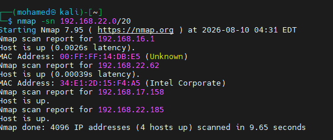
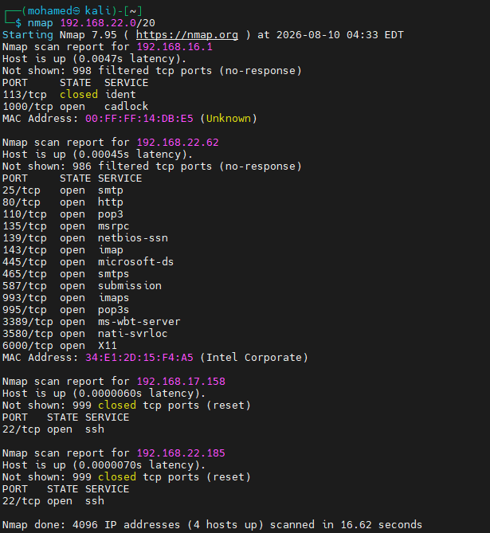
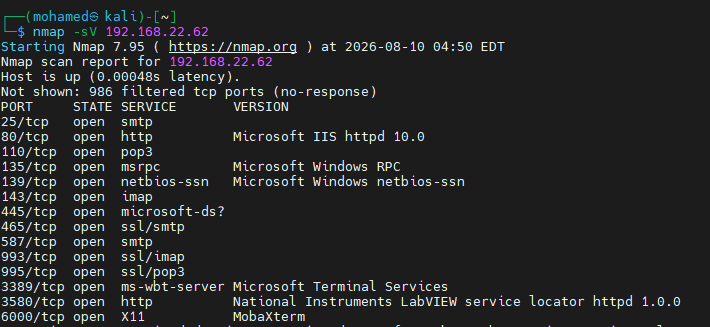
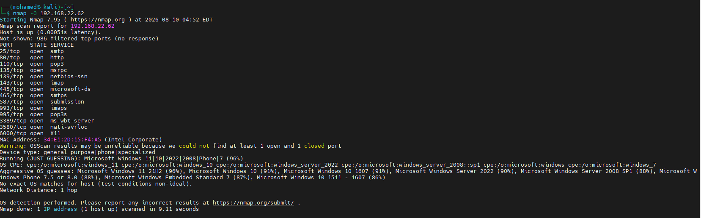
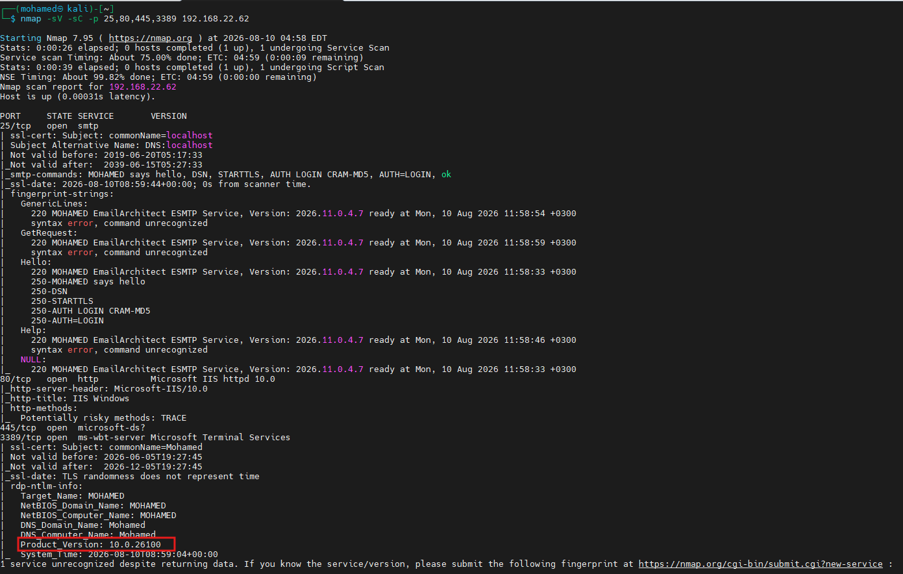

# Nmap Scanning Walkthrough — Live Hosts, Ports, OS, and Service Versions

A hands-on walkthrough of using **Nmap** to progressively scan a target network — from discovering live hosts, through enumerating open ports, to fingerprinting the operating system and service versions.

---

## 1️⃣ Discover Live Hosts (`nmap -sn`)

A **ping scan** (`-sn`) sweeps a network range to identify which hosts are currently up, without scanning any ports.



```
$ nmap -sn 192.168.22.0/20
Starting Nmap 7.95 ( https://nmap.org ) at 2026-08-10 04:31 EDT
Nmap scan report for 192.168.16.1
Host is up (0.0026s latency).
MAC Address: 00:FF:FF:14:DB:E5 (Unknown)
Nmap scan report for 192.168.22.62
Host is up (0.00039s latency).
MAC Address: 34:E1:2D:15:F4:A5 (Intel Corporate)
Nmap scan report for 192.168.17.158
Host is up.
Nmap scan report for 192.168.22.185
Host is up.
Nmap done: 4096 IP addresses (4 hosts up) scanned in 9.65 seconds
```

- Scanned **4096 IP addresses** across the `/20` range, finding **4 hosts up**.
- Each live host's **MAC address** (and vendor, where identifiable) is also shown.

## 2️⃣ Full Network Port Scan (Default Scan)

Without `-sn`, Nmap performs its default scan against every live host in the range — checking common TCP ports on each.



```
$ nmap 192.168.22.0/20
...
Nmap scan report for 192.168.16.1
Not shown: 998 filtered tcp ports (no-response)
PORT     STATE  SERVICE
113/tcp  closed ident
1000/tcp open   cadlock

Nmap scan report for 192.168.22.62
Not shown: 986 filtered tcp ports (no-response)
PORT     STATE SERVICE
25/tcp   open  smtp
80/tcp   open  http
110/tcp  open  pop3
135/tcp  open  msrpc
139/tcp  open  netbios-ssn
143/tcp  open  imap
445/tcp  open  microsoft-ds
465/tcp  open  smtps
587/tcp  open  submission
993/tcp  open  imaps
995/tcp  open  pop3s
3389/tcp open  ms-wbt-server
3580/tcp open  nati-svrloc
6000/tcp open  X11

Nmap scan report for 192.168.17.158
Not shown: 999 closed tcp ports (reset)
PORT   STATE SERVICE
22/tcp open  ssh

Nmap scan report for 192.168.22.185
Not shown: 999 closed tcp ports (reset)
PORT   STATE SERVICE
22/tcp open  ssh

Nmap done: 4096 IP addresses (4 hosts up) scanned in 16.62 seconds
```

- Each host shows a different open port profile — e.g., `192.168.22.62` looks like a **mail/web/RDP server**, while `192.168.17.158` and `192.168.22.185` only expose **SSH (22/tcp)**.

---

## 3️⃣ Service/Version Detection (`nmap -sV`)

Adding `-sV` tells Nmap to probe open ports further and attempt to identify the actual **service and version** running behind each port.



```
$ nmap -sV 192.168.22.62
...
Not shown: 986 filtered tcp ports (no-response)
PORT     STATE SERVICE      VERSION
25/tcp   open  smtp
80/tcp   open  http         Microsoft IIS httpd 10.0
110/tcp  open  pop3
135/tcp  open  msrpc        Microsoft Windows RPC
139/tcp  open  netbios-ssn  Microsoft Windows netbios-ssn
143/tcp  open  imap
445/tcp  open  microsoft-ds?
465/tcp  open  ssl/smtp
587/tcp  open  smtp
593/tcp  open  ssl/imap
995/tcp  open  ssl/pop3
3389/tcp open  ms-wbt-server Microsoft Terminal Services
3580/tcp open  http         National Instruments LabVIEW service locator httpd 1.0.0
6000/tcp open  X11          MobaXterm
```

- Reveals specific software behind ports: **Microsoft IIS 10.0** on port 80, **Microsoft Terminal Services** (RDP) on 3389, and **MobaXterm's X11** implementation on port 6000.

## 4️⃣ Operating System Detection (`nmap -O`)

The `-O` flag attempts to fingerprint the target's **operating system** based on subtle differences in how its TCP/IP stack responds to probes.



```
$ nmap -O 192.168.22.62
...
Device type: general purpose|phone|specialized
Running (JUST GUESSING): Microsoft Windows 11|10|2022|2008|Phone|7 (96%)
OS CPE: cpe:/o:microsoft:windows_11 cpe:/o:microsoft:windows_10 ...
Aggressive OS guesses: Microsoft Windows 11 21H2 (96%), Microsoft Windows 10 (91%),
Microsoft Windows 10 1607 (91%), Microsoft Windows Server 2022 (90%),
Microsoft Windows Server 2008 SP1 (88%), Microsoft Windows Phone 7.5 or 8.0 (88%),
Microsoft Windows Embedded Standard 7 (87%), Microsoft Windows 10 1511 - 1607 (86%)
No exact OS matches for host (test conditions non-ideal).
Network Distance: 1 hop
```

- Nmap couldn't find an exact match (a warning notes it needs at least 1 open **and** 1 closed port for ideal accuracy) but produced a ranked list of likely OS guesses — most confidently **Microsoft Windows 11 21H2 (96%)**.

---

## 5️⃣ Targeted Service Scan with Scripts (`nmap -sV -sC -p <ports>`)

Combining version detection (`-sV`) with the **default script scan** (`-sC`) against specific ports extracts much deeper service metadata.



```
$ nmap -sV -sC -p 25,80,445,3389 192.168.22.62
...
PORT     STATE SERVICE       VERSION
25/tcp   open  smtp
| ssl-cert: Subject: commonName=localhost
| _smtp-commands: MOHAMED says hello, DSN, STARTTLS, AUTH LOGIN CRAM-MD5, AUTH=LOGIN, ok
| fingerprint-strings:
|   GenericLines / GetRequest / Hello / Help / NULL:
|     220 MOHAMED EmailArchitect ESMTP Service, Version: 2026.11.0.4.7 ready at ...
80/tcp   open  http          Microsoft IIS httpd 10.0
| http-server-header: Microsoft-IIS/10.0
| http-title: IIS Windows
| http-methods:
|_  Potentially risky methods: TRACE
445/tcp  open  microsoft-ds?
3389/tcp open  ms-wbt-server Microsoft Terminal Services
| ssl-cert: Subject: commonName=Mohamed
| rdp-ntlm-info:
|   Target_Name: MOHAMED
|   NetBIOS_Domain_Name: MOHAMED
|   NetBIOS_Computer_Name: MOHAMED
|   DNS_Domain_Name: Mohamed
|   DNS_Computer_Name: Mohamed
|   Product_Version: 10.0.26100
|   System_Time: 2026-08-10T08:59:04+00:00
```

Key findings from this deeper scan:
- **Port 25 (SMTP):** Identifies the exact mail server software — **MOHAMED EmailArchitect ESMTP Service, Version 2026.11.0.4.7** — along with its SSL certificate and supported SMTP auth mechanisms.
- **Port 80 (HTTP):** Confirms **Microsoft-IIS/10.0**, and flags a **potentially risky HTTP method (TRACE)** enabled on the server.
- **Port 445:** Identified as `microsoft-ds`, but the service itself remains unconfirmed (`?`).
- **Port 3389 (RDP):** Reveals the target's **NetBIOS/DNS computer name (MOHAMED)** and Windows build (**Product_Version: 10.0.26100**) via RDP NTLM info — a highly detailed fingerprint useful for identifying the exact OS build.

---

## 📊 Nmap Scan Types Used

| Command | Purpose |
|---|---|
| `nmap -sn <range>` | Host discovery (ping scan) — no port scanning |
| `nmap <target>` | Default TCP port scan |
| `nmap -sV <target>` | Service/version detection on open ports |
| `nmap -O <target>` | Operating system fingerprinting |
| `nmap -sV -sC -p <ports> <target>` | Version detection + default scripts on specific ports for deep enumeration |

---

## 📁 Repository Structure

```
.
├── README.md
├── live-hosts-scan.png
├── ping-scan.png
├── application-version-scan.png
├── OS-scan.png
└── OS-version.png
```
